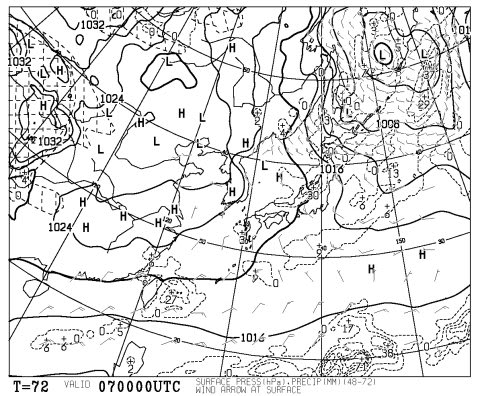
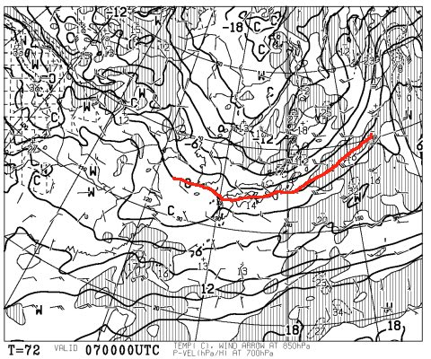
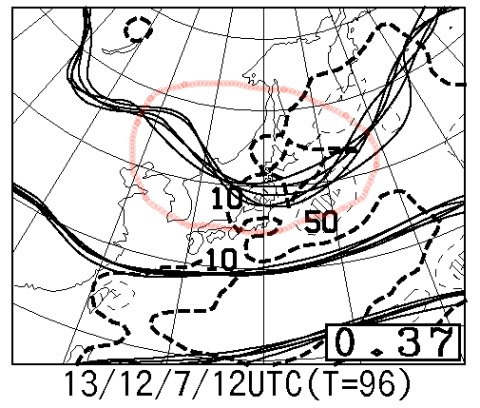
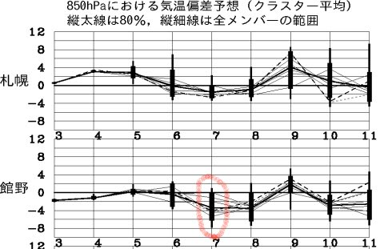
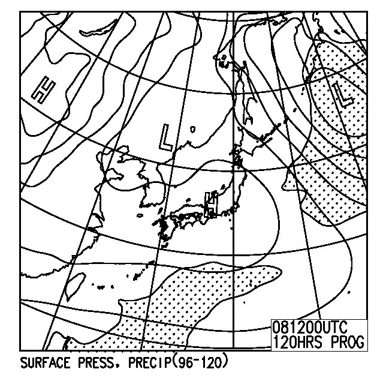
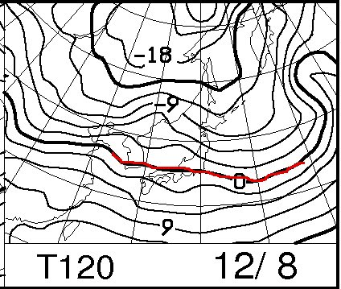

# 今シーズンもスタート！今週末の志賀高原の天気は…

📅 投稿日時: 2013-12-05 00:00:48

えー．

昨シーズン，志賀高原を滑っているとき．

何人かの方に．

「Blog読んでますよ～！」

…と，声をかけてもらったのですが．

＃いったいどうやって，私だとわかるんだろう？？

そのような読者の方から，だいたい言われるのが．

「天気予報，参考にしてますよ～」

という一言だったので．

…私の天気予想，意外と参考にしてくれてる人

多いんですねぇ…

ということで．

焼額がオープンする今週末から，

私の恒例の志賀高原通いが始まるので．

恒例，志賀高原の天気予想．

今シーズンもスタートです！

＃今シーズン，これまでも天気予想してたけど…

＃まぁ，志賀高原の予想はこれが第1回ということで．

で．

今週末の志賀は，だ．

…

…

金曜夜から土曜にかけて．

降りますね．

雪が．

大量に降るか，ちょぼちょぼしか降らないか．

まだ微妙ですが…

こいつが，7日土曜日の朝9時の予想天気図ですが．

見事な冬型の気圧配置ですね～．

日本海側に降水が予想されており，降りそうです．

そして，850hpaの気温を見てみると…

うむ．0度線は日本の南に下がって，

北陸には-6度線がかかってます．これは，冷えます．

山で降れば，間違いなく雪ですね．

…ということで．

この天気図を見てみると，金曜の夜から土曜の夜にかけて，

雪が降りそうな気配が高いんですが．

…んですが．

FZCX50のクラスタ間ばらつきを見てみると…

うむ．

赤く囲った部分，等圧線の予測のばらつきが大きいですね…

この等圧線が南に下がれば降りそうですが，

等圧線が北に行く可能性もある…という感じで，

まだ予想精度がそれほど高くないようです．

850hpa気温予想も…

こんな感じで，7日の予想気温のばらつきがかなり大きい状態です．

ってことで．

本当に雪が積もってくれるかどうか．

あと1-2日またないと分からない状況です．

で．

日曜は．

これは，晴れそうです．

地上天気図もこんな感じで高気圧に覆われてます．

気温は…

こんな感じで，0度線が信州にぎりぎりかかっている程度なので．

朝は冷えますが，昼間はまぁ0度近くまであがるでしょう．

ということで．

まとめると．

・日ごろの行いがよければ，金曜夜から土曜にかけて，

　雪が結構積もってくれるはず！

・日ごろの行いが悪ければ，土曜は曇り，時々雪がちらつく程度．

　ゲレンデ状況は人工雪メイン．

・日曜は，運が良くても悪くても晴れ．

という感じですので．

今週末，志賀高原に行く方は．

言動に気をつけて，良い行いをするように心がけましょう．

また後日，直前予想します…

## 💬 コメント一覧

### 💬 コメント by (ゆうこ)
**タイトル**: 今週末シーズンイン
**投稿日**: 2013-12-05 23:29:23

私も今週末志賀高原行きます。

やっとシーズンインです。

Sさんに比べるとずいぶん遅いですが、ワクワクしてます。

今シーズンもよろしくお願いします。

### 💬 コメント by (Skier_S)
**タイトル**: よろしくお願いします～！
**投稿日**: 2013-12-05 23:40:32

おお！

ゆうこさんはいきなリ

志賀高原でシーズンインですか？

またゲレンデでおあいするかもですね！

今シーズンもよろしくです～

