# 2015年8月　子連れでモアルボアルでダイビングその28…ダイビングが終わっても，イワシシュノーケリング！

📅 投稿日時: 2016-08-02 03:16:41

この週末．

久しぶりに日曜は家でのんびりして．

13時間ほど寝てしまったSkier_Sです．

…人間，やっぱり寝ないとダメですね（笑）

＃と言っておきながら，今日もこんな時間…（泣）

とりあえず．

今は夏シーズンなので．

今日もダイビング日記，続きます～！

---

ということで．

モアルボアルのラストダイブは終わったけど．

今度は，娘を連れてのイワシシュノーケリングだっ！！

一旦ショップに戻り，娘にウェットを着せて，

3点セットを持って，海へ戻ってきます…

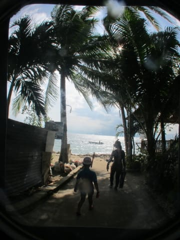

では，行きますか～

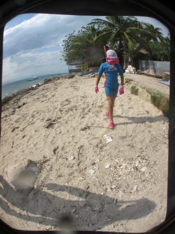

ってことで．

こういう感じの，ショップの目の前の海．

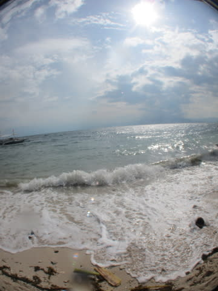

ここを，わずか20mくらい泳ぐだけで…

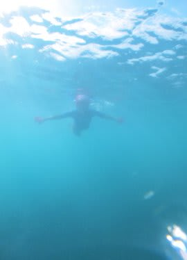

なんと．

すぐにシュノーケリングで見えちゃう，こんな

イワシの群れっ！！

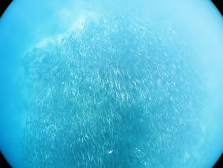

この黒いのがみんなイワシ！

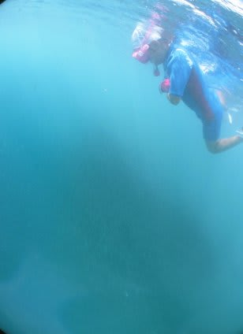

すごいよ！

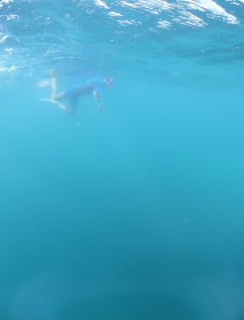

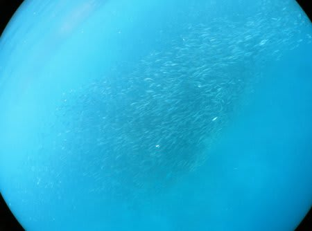

こんなのが簡単にシュノーケリングで見れるんだから…

すごい．

＃解像度が低い写真だと，この下の方がみんなイワシだとわからない…

娘～．

お前，ホントにゼイタクだな～．

分かってるのか～？？？

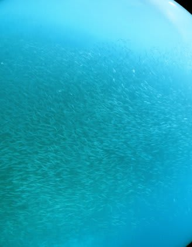

で．

このとき．

娘にはウェットを着せて泳がせたというのに．

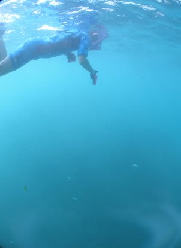

…なぜか，私はウェットを着ずに潜ったわけで．

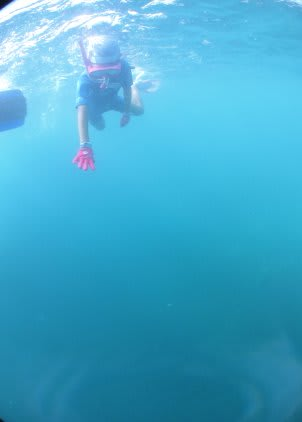

で，持って行ったカメラが．

[むちゃくちゃ重く，マイナス浮力が異常に大きい（すごく沈む）ワイドコンバージョンレンズ](ed31cd510d06c71af213a49742d6aed1a.md)を付けた

[S120](ef11ac71ee3b5519e80ea4b1221ba57ee.md)のカメラ．

ちょっと重いな～，と思いつつ，

泳いでたわけですが．

こんな写真を撮ろうと，潜ってみると．

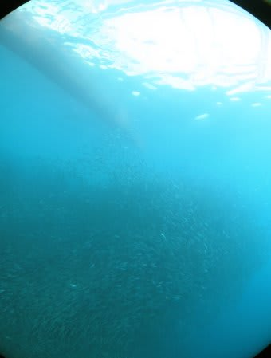

うがぁ！

お，重いっ！！

潜ったあと，フィンキックを止めると…

水中で停止できない！

水中に引きずり込まれる！

フィンキックしないと浮上できない！！

うおおお！

…ってことで．

何回か潜ってみたけど．

水中重量がかなりあるウェイトを持って素潜りするのは，

かなり怖いことを学びました（＾＾；

みなさん．

このワイコンを付けたカメラで素潜りするときは．

カメラにフロートつけるか，ウェット＋ウェイトで

わずかなプラス浮力に調整して潜ることを

おススメします（笑）
