# 2019/2/9(土)，3連休初日の志賀高原スキー場は…曇り時々雪，冷え冷えなれどバーンはツルツル（涙）

📅 投稿日時: 2019-02-09 23:06:08

というわけで．

3連休の初日となる本日ですが．

…先週までふわふわ最高雪質だった志賀高原．

月曜日に降った雨のせいで．

かなり残念な感じの雪質でした…（涙）

まず．今日の朝．

2月というのに，中野の町中から

湯田中にかけては雪がなく…

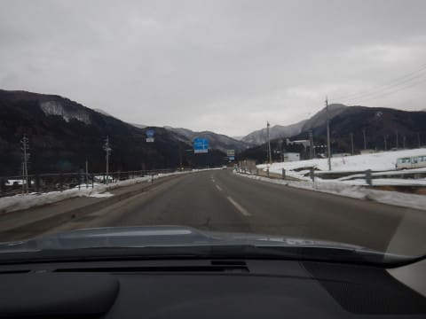

登り坂をしばらく登ってから，やっと本格雪道に．

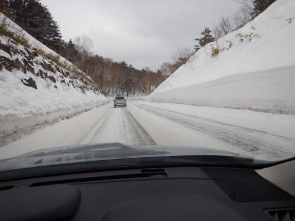

うーむ．

月曜の雨でゲレンデはガリガリになったはずなので．

あんまり雪が積もってないと，アイスバーンが

隠れなくてつらいんじゃなかろうか…（心配）

で．

本日は，朝早めに志賀高原に着いたので．

8時半営業開始の焼額ではなく．

30分スタートが早い，8時営業開始の

奥志賀でスタート！

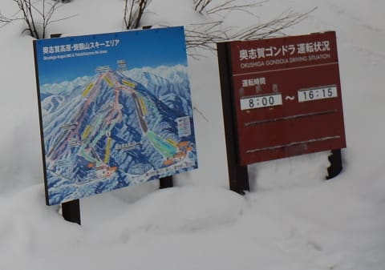

…今日の天気は，予想通りの曇り～小雪がぱらつく

感じでしたが．

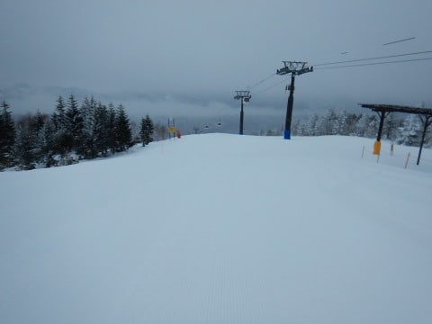

朝イチは，昨晩表面にうっすら積もった雪が

圧雪された，やわらか圧雪！

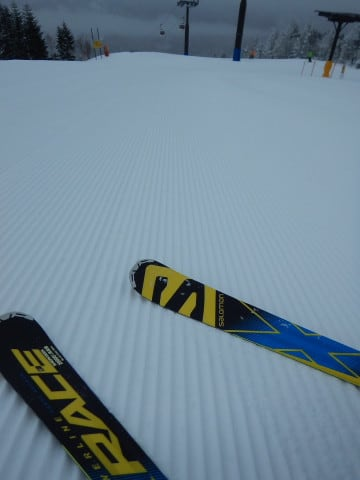

昨晩，

　いい感じの圧雪で朝はスタート．

と予想した通りの，かなりやわらかくて

いい感じの圧雪で，かっ飛ばせるよ！！

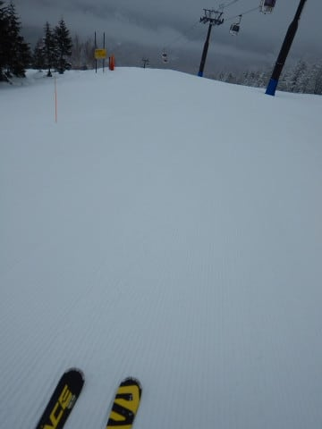

うはーーー！

朝イチ最高！

アイスバーンじゃなくて，最高っ！！

…って感じで，朝イチ奥志賀のシマシマを堪能

した後は，8時半に焼額に向かって移動し…

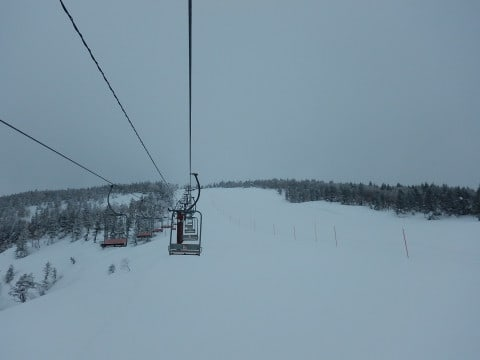

焼額の営業開始とほぼ同時に，焼額山頂へ到着！

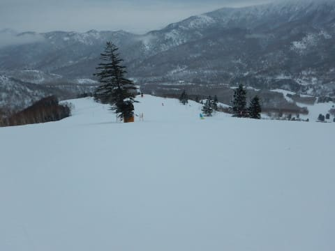

焼額山頂は，大体予想通りの-10℃と，

かなり冷え冷えですね～！

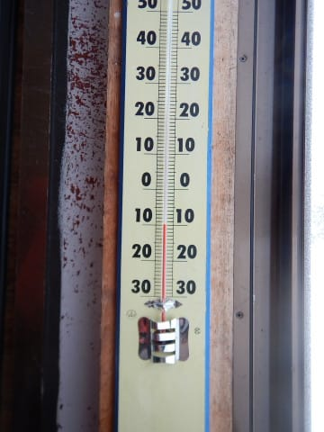

そして．

奥志賀に続いて．

焼額オープンのシマシマを

いただきま～す！！

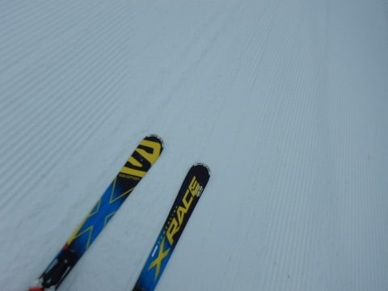

ふはははは！

本日2度目のシマシマだっ！

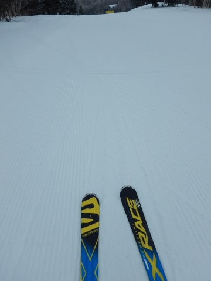

あぁ…シアワセ…

と．

やわらか新雪のシマシマを，

思いっきり堪能していたら…

…やはり，今日は3連休ですから．

コースの人口密度が，なんだかいきなり

すごいことになって来たんですけど…！！（涙）

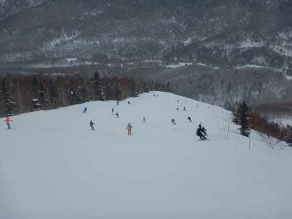

いつもならまだそれほど混まない，

朝9時半の段階で．

…もう，自由なラインを取るのは無理な

感じ…（泣）

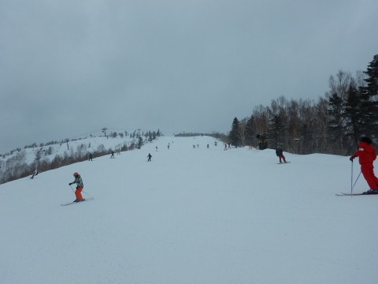

そして．

大勢の人間で蹴散らされたバーンは…

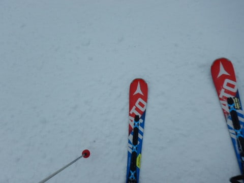

うぎゃーーー！！！

コース全面，コロコロが大量発生

してたんですけど（泣）

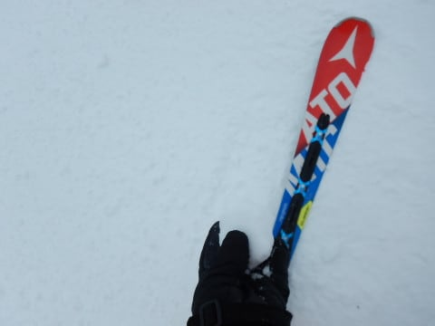

（わかりにくいけど，手に氷をもってます）

そして．

リフトもゲートの外までかなりの列がつくほど

並びましたし．

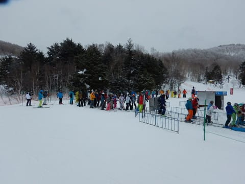

ゴンドラもちょいと並びましたが…

でも，輸送力の高い焼額第1ゴンドラ．

もう少し混むかと思ったけど．

ピークでもせいぜいこの程度で．

ゲートからちょっとはみ出す程度の混雑

だったのが，救いかな…

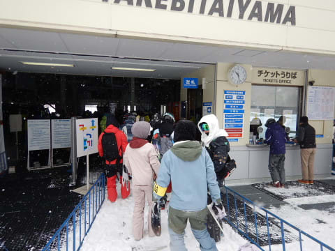

ただ．

本日は，意外とオリンピックコースが

激烈に良かった！！

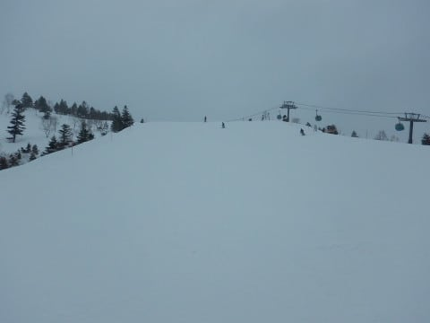

硬めではあるものの．

適度にエッジが利く下地の上に，

軽い新雪が乗っていて．

スピード派にはたまらん感じ…！！

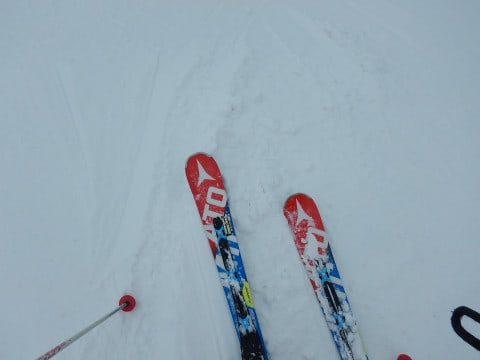

…そして．

硬めの急斜面だからか．

人が全くいないんですが！

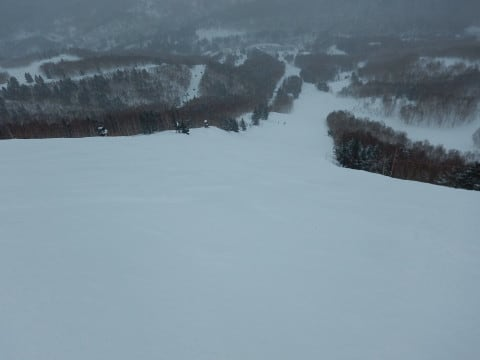

ってな感じで．

オリンピックコースをひたすら

トップスピードでかっ飛ばしつづけて

いたわけですが．

昼休みタイムはゴンドラもガラガラで．

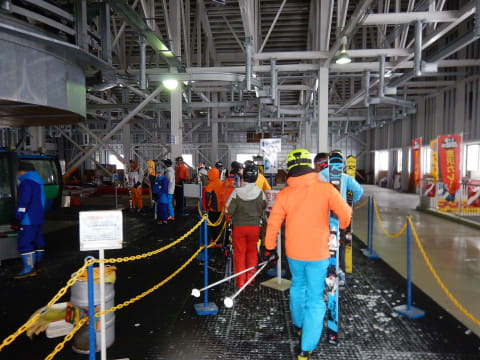

もう，オリンピックコースは

ホントに貸し切り状態！

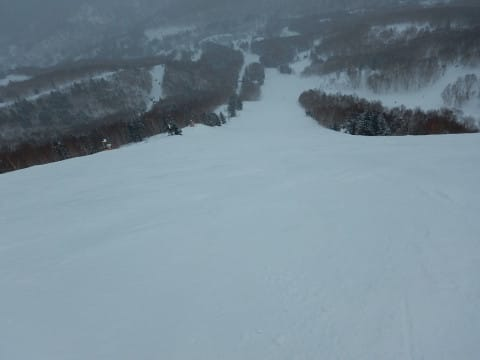

…ただ．

オリンピックコース以外は．

午後になっても人が多く…

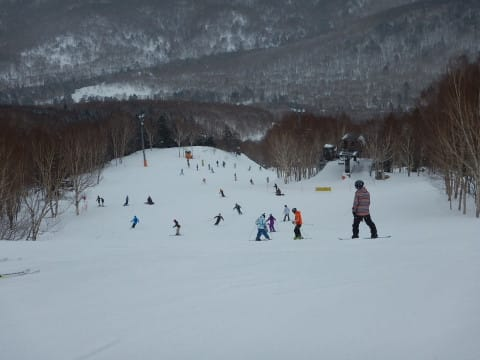

さらに昼休みタイムが終わると．

またゴンドラもちょっと混みだしてきて…

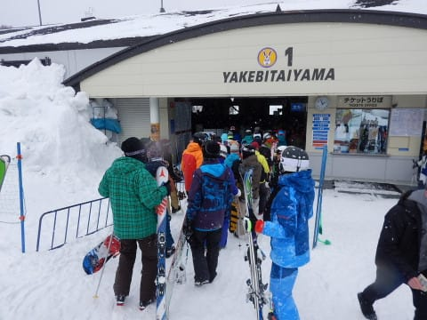

そして．

大人数が滑ったコースは，

上に乗ったやわらかい雪がはがされ．

月曜の雨で固まった，ツルツル氷が

顔を出してきてました…（かなり涙）

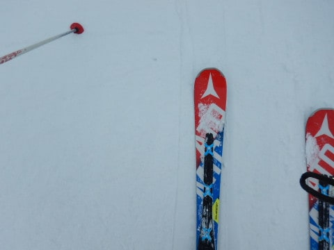

さすがに3連休初日だけあって．

いつもなら人が減る夕方4時近くに

なっても，ゲレンデの人は多めでしたね～．

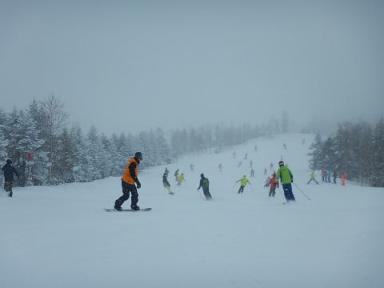

で．

結局．今日の天気は，

時折雪が降りつける時もあれば…

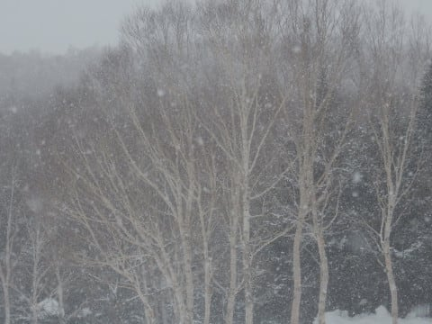

うっすら明るくなる時もあったけど．

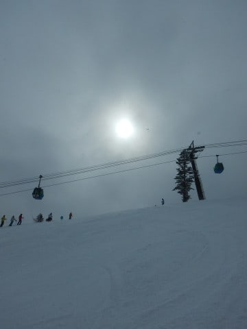

基本的に曇り空で．

最高気温も-8℃程度と，かなり寒い

一日でしたね～．

ってな感じで．

リフト終了直前には．

予想通り，ところどころ下地の氷が出た，

凸凹バーンになってしまったゲレンデを．

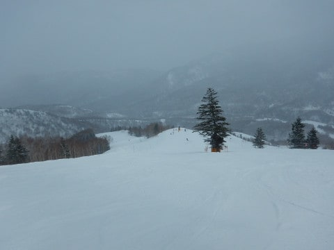

お約束通り，リフト営業終了の

16:20まですべりつづけたのでした…

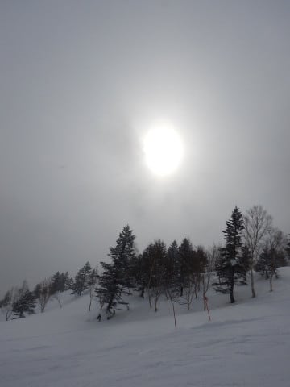

という感じの本日．

ほとんどのコースは，昼前の早い段階から

アイスバーンか氷のコロコロバーンになっちゃったけど．

オリンピックコースは，営業終了直前までフラットで．

快適大回りができたから．

まぁ，良かったかな～．

…

…と，書いたものの．

当然，終わらない．

まだ，終わらない．

当然のごとく，ナイターに出動っ！！

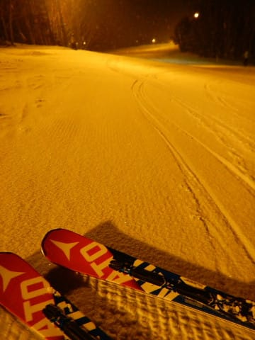

…それも．

宿の17:30からの夕食を，わずか20分で

必至に掻き込み（流し込み？），

18時スタートの焼額ナイターに参戦です！！

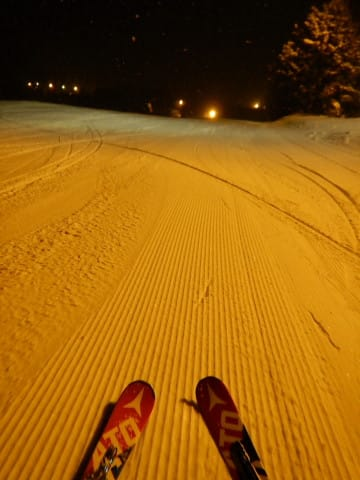

今日のナイターは．

なんと！うっすら新雪が積もり．

予想外に，やわらかシマシマ圧雪！！

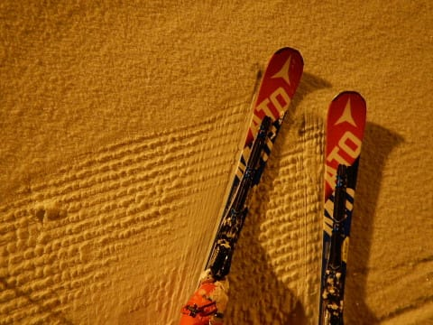

まさか．

こんなやわらかシマシマの最高バーンを．

それも，こんなガラガラバーンを楽しめるとはっ！！

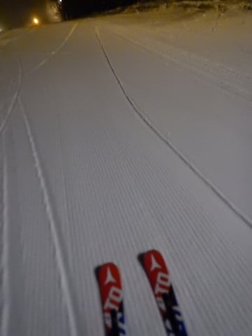

いや…最高っ！！！

…ってな感じで．

今日もお約束の，ナイターストップまで

滑り続けたのでした…

しかし．

ナイター中も，結構雪が降っていたので．

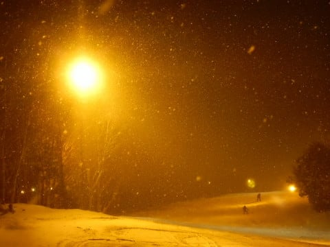

明日朝までには，予想通り10㎝くらいの新雪が

積もりそうですね…！

昨日，

　あさイチの圧雪コースは柔らかめで，いい感じ！

って予想した通り．

いい感じの圧雪でスタートできそうです．

…でも．

10㎝じゃなく．

10mくらい積もって，アイスバーンを完全に

隠してほしいなぁ…←10m積もったら，リフトもゴンドラもみんな埋まって

スキーできないから

## 💬 コメント一覧

### 💬 コメント by (ほっぽ)
**タイトル**: 昨日
**投稿日**: 2019-02-10 06:20:44

Ｓさん

昨日は少しだけご一緒させて頂きありがとうございました。

高速出口で渋滞していたせいか、お客さん少な目でしたね。

結局私もヤケビ＆奥志賀で１日過ごしました。

今日も麓から通勤？しますのでお会いできたらよろしくお願いします。

http://www2.tokai.or.jp/nana_hoppo/

### 💬 コメント by (Skier_S)
**タイトル**: ほっぽさま
**投稿日**: 2019-02-10 23:38:27

今日はすごい混みましたね…

こちらはヤケビ→奥志賀→ヤケビと移動しましたが，

お会いしませんでしたね…

しかし．きょうは楽しくなかったです（涙）

また明日も焼額スタートで，おそらく焼額グルグル

していると思います～！

