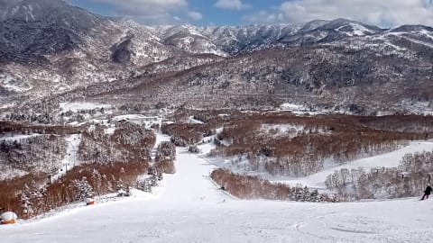

# 今週末の志賀高原は，土曜は気温が上がりそうだけど晴れ！日曜は曇ったり晴れたり雪が舞ったり…

📅 投稿日時: 2022-02-26 00:18:20

🏷️ カテゴリ: [日記](cc4b5682fb7b8b144980957a978653fb0.md)

えー．

今週末の志賀高原ですが．

しばらく営業休止していた寺子屋が，

土曜から営業再開するようです！

…ただ．

焼額山は相変わらず，第3高速リフトが運休

のようですが，

でも，ファーストトラックとナイターは

営業してくれるようですね．

（[焼額山スキー場ホームページ](https://www.princehotels.co.jp/ski/shiga/winter/)より．以下同じ）

…あれ？

でも，よく見ると…

なんと！

明日土曜のナイター，

午後6時営業開始で

午後6時営業終了！？？

…明日の焼額ナイター，秒で営業終わるようです（涙）

まぁ，いつも通り午後8時までの営業を，

単に書き間違えただけだと思いたいのですが．

今シーズンラストの焼額ナイター，

秒で終わったら悲しすぎる…

そして．

本日の志賀高原ですが．

特派員からの写真を見ると…

あさイチは－11度と，大体予想通りの

冷え込み！！

そして…

あさイチから最高のシマシマ！

ぐあぁ…滑りたい…

ちょっと雲が多めだったものの，

天気はいい感じに晴れてくれたようで．

でも，最高気温は－5℃程度までしか

上がらず，終日雪質もよく．

ラストまで全くバーンが荒れない，

いい感じのコンディションだったようです…

あぁ…

うらやましい…

うらやましいぞっ！！

そして．

明日，明後日の週末の志賀高原の天気ですが…

概ね水曜の予想通りです．

26日(土)：終日晴れ！

　朝は-6～7℃程度と暖かめ．

　あさイチはトップシーズンの雪が

　いい感じで締まった，

　最高シマシマバーン！！

　昼間は晴れて気温が0℃近くまで

　上がるので，日当たりがいい

　バーンはちょっと雪が重めになるかも．

27日(日)：おそらく朝は曇り．

　朝の気温は－6℃程度．

　あさイチはしっかり締まった

　スピードが出るシマシマ！

　天気は基本的に終日曇り．

　午後に向かって気温が冷えて

　行くので，雪は終日緩まない．

　時折薄日が射したり，

　雪が舞ったりという天気．

　ちょっと風が強くなる時もあり，

　ゴンドラが減速する時もあるかも．

…ってな感じでしょうか．

日曜は残念ながらすっきり晴れとは

行きませんが．

雪は悪くなさそうだし，

楽しめる週末だと思います！

で．

23日に滑れなかった私は，

その憂さを晴らすべく，この週末も

志賀高原に繰り出しますが…

また，いつも通りあと3時間半後に出発です．

3時間しか寝れない（涙）

ってか．

ホントはスキーに行ってるどころじゃ

ないんだけど…

スキーに行って大丈夫なのか？？

## 💬 コメント一覧

### 💬 コメント by (ikkun)
**タイトル**: Unknown
**投稿日**: 2022-02-26 19:47:49

へこみですよ  一日前に決めたテクニカル受験 事前講習でめげたりして❗情けない小学生小学生女の子の滑りに折れました(笑) マイナスな言葉に後輩にさとされました自分にがっかりでした❗楽しむって難しいのですね

### 💬 コメント by (Skier_S)
**タイトル**: ＞ikkunさま
**投稿日**: 2022-02-26 23:33:12

テク受験せず，事前講習でリタイヤしたんですか？

そして，小学生の女の子もテクの事前講習受けてたんですか？

どんな凄い滑りだったのか見てみたいです…

