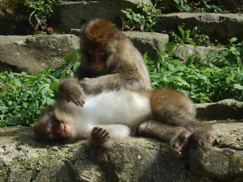
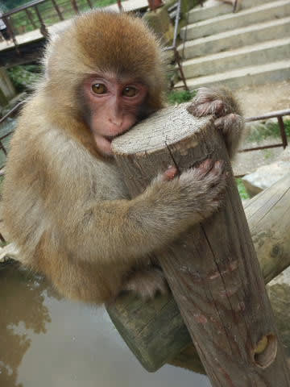

# 夏の志賀高原に行ってみた2…初日の午後は野猿公苑へ

📅 投稿日時: 2017-09-01 02:43:36

ということで．

今日も志賀高原レポートが続きますが…

ゆっくり記事を書く時間がないので．

事実の羅列の，ちと面白くない記事に

なってる気が…（涙）

すいませんが，面白くなくても

我慢して読んでください．

ええ．

読んでください．←読まなくていいとは決して言わないのね

---

ってなわけで．

お昼にお蕎麦を食べ終わったら．

今度は，野猿公苑に，サルでも

見に行きましょうか…

ここ，娘が前回来てかなり

気に入っていたみたいなので，

また今年も再訪することにしたわけですが．

途中，こんな温泉が噴き出しているところを

眺めつつ…

野猿公苑の入口へやってきます．

…うーむ．

入場料大人800円はちと高い…

で．

中に入ると，さっそくそこかしこに，

お猿さんが大量にくつろいでます．

というより．

なんだか，ダレてます（笑）

こーんな感じの，くつろいだサルが

そんな猿が大量に転がっている道を

進んでいくと…

冬の間は，サルが浸かるので有名な

温泉が登場！

…でも．

暑いので，サルは全く温泉に入ろうと

する気配なし…

温泉の周りでくつろぐサルたちを眺めますが…

子ザルや赤ちゃんサルには癒されますね～！！

そして，娘もサルとお近づきになれて．

なんだか，かなりご満足のようです…

なかなか帰ろうとしない娘．

結局，ここで2時間以上過ごした気が…

お猿をたっぷり堪能した後は．

こんな道を15分ほど歩いて，駐車場に戻ると，

もう4時過ぎ．

ここで，小布施まで移動して…

そう．

小布施と言えば，栗．

前回も寄った，「栗の木テラス」でお茶タイム！

有名店なので，20分ほど待ちましたが，

ここは雰囲気も良く，お値段も安くて

コストパフォーマンスも高いので，

来る価値はありますね～！

まずは外せない，モンブラン．

こちらは，栗クリームのシュークリーム．

…前回，190円だった気がするけど．

220円に値上がりしてた…（ちょっと涙）．

それでも十分安いですけどね～！！

そして，季節限定品，

ブルーベリーのタルト．

このブルーベリーのタルトがかなり

美味しかった…

スキーシーズンは，

リフトが動いている限り滑り続けなくてはならない宿命

を背負っている私．←20000mクラブのゴールドメンバーにかけられている，

ある種の呪いのような気が…

だもんで．スキーシーズンにこのお店が空いている

時間に小布施に来ることは不可能で．

夏にしか来れませんが．

志賀高原に滑りに来た人で，早めにスキーを切り上げる

ことがあれば．

ここに立ち寄ってもいいかも…

そして，ここの経営元である，すぐそばの和菓子屋，

桜井甘精堂．

ここにも立ち寄って，和菓子を買い込み…

ちょいとお値段が張りますが，ここの栗のお菓子も

なかなかイケます．

って感じで．

小布施を満喫したら，もうそろそろいい時間．

そろそろ，志賀高原にかかっていた雲も

貼れたみたいだし．

大蛇祭りをやっている志賀高原に戻りますか…！

## 💬 コメント一覧

### 💬 コメント by (Goku)
**タイトル**: Unknown
**投稿日**: 2017-09-02 20:34:02

そう、小布施に行ったら『栗の木テラス』は外せません。

紅茶も珈琲もポットで出てくるのでゆっくりくつろぎながらケーキを味わえるのが良いですね。

あと、小布施と言ったら『栗おこわ』これも絶品ですよ。

### 💬 コメント by (Goku)
**タイトル**: Unknown
**投稿日**: 2017-09-02 20:36:56

もうひとつ忘れてました。

栗の木テラス横、茶蔵の『モンブランソフト』もおススメでーす。

### 💬 コメント by (Skier_S)
**タイトル**: Gokuさま
**投稿日**: 2017-09-03 11:17:09

栗の木テラスは外せませんよね～．

今回，うう府2人で1ポットのお茶を頼んだら，

カップをちゃんと2個持ってきてくれました（笑）

ポットサーブのお茶って，一人だと多いなぁ…

と思っていたので，うれしいサービスでした．

栗おこわも大好きです～．

今回も，お昼をそばか栗おこわか

悩んだんですが，今回はおそばにしました．

高度はモンブランソフトも試してみます～！！

