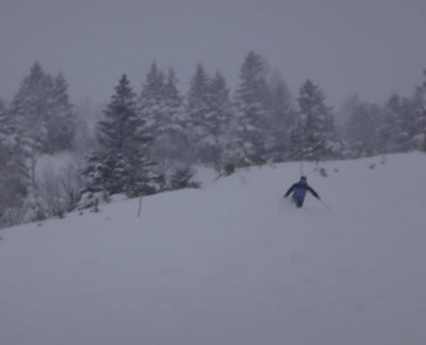
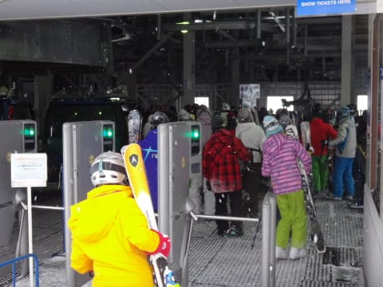
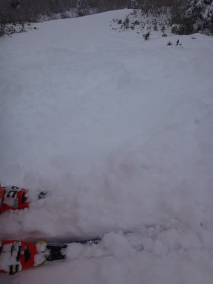
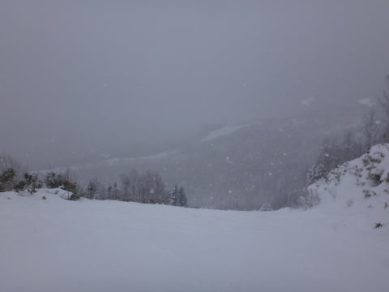
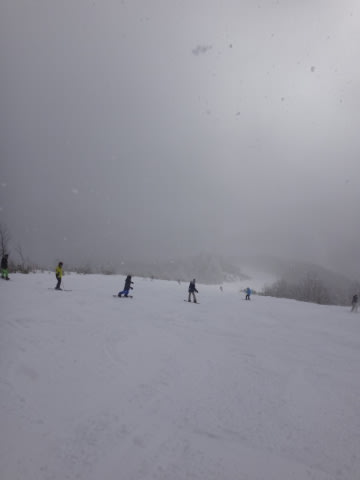

# 12月30日の志賀高原は…膝パフパウダーデー！ちょっと混んだけど，良かったよ！

📅 投稿日時: 2016-12-30 22:05:33

えー．

本日．

中一日で，また志賀高原に舞い戻ってきた

Skier_Sです．

ということで．

どうやら昨晩から，結構な勢いで雪が積もったらしい

志賀高原．

本日の朝，志賀高原へ上る道は…

中野の町中から，すでに積雪状態！

これは，ゲレンデコンディションに期待大…っ！！

と，やってきた焼額第1ゴンドラ．

山頂の気温は…

昨日，

　朝の山頂は，-12℃レベルです．

…と，書いた通りの．マイナス12度！

ふははは！見よ！

わが天気予想の精度の高さを！（自慢）

で．

朝，山頂は雪が降り続いており…

そして．

　朝は冷え冷えパウダー！非圧雪コースは

　スネパフ程度のパウダー！

　圧雪コースは，柔らかい圧雪の上に5～10cmパウダー．

　冷え冷えの最高雪質！

と，書いた通り…

圧雪コース上は，圧雪の上に10㎝ほどの積雪！

そして，昨日からオープンした，

オリンピックコースに行ってみると…

うほ！

パウダーっ！

予想通りの脛パフパウダー！

…超ふわふわパウダーに比べると，

わずかに重めではあったけど．

気持ちいいパウダーだよ！！

ってことで．

オリンピックコースをグルグルしていると…

10:30ごろには…

うぎゃーーー！

来ました．今シーズ初の，駅舎の外まで出る

ゴンドラ待ち…（涙）

でも．

これでも5分も待たず．

さらに，次の1本では，すでに待ち時間が解消されて，

こんな感じになってました…

…まぁ，この日の平均ゴンドラ待ちはこの程度．

空席待ちレーンでは，搬器2-3台待つかな…

っていう感じで，10:30の一回を除き，

それほどひどい待ちはなかったです．

コースは，昼近くになっても．

スーパージャイアントスラロームコースは

新雪パフパフだし．

人も少なくて，結構よかったな～．

でも．

この日．

1ゴン沿いのGSコースや，2ゴン沿いの

パノラマ-サウスコースは．

…何だこれは．

まるでバブルのころ並みの混雑…

いつもは待たない第2高速や第3高速も，

意外と混みましたね～．

…さすが，正月休み…

で．

天気は，昼頃までは，結構激しく雪が

降っていたものの

昼にはうっすら日も差し…

午後は雪が降ったり，日が差したりを

目まぐるしく繰り返す天気に．

とはいえ，昼も雪質はいいままでキープしたし…

午後になっても，プチパウダーも残っていたり

結構恵まれたかな…

…と，思いつつも．

コースの急なところ．

一部アイスバーンが顔を出すところもあり．

＃急斜面のオリンピックコースは昼前にコブ溝が完全アイスバーン化（涙）

うーむ．

やっぱり，もう一降りほしいかな…

といったところ．

午後になると，ちょっとコースは荒れ気味に

なって来たけど．

夕方まで，そうそうひどい荒れ荒れバーンになることもなく．

ゴンドラ営業終了の16時まで，たっぷり滑ったのでした…

うーむ．

しかし．

これで志賀高原，おおむね全面滑れるように

なりましたが．

ひどいブッシュが出る…というほどではないものの．

まだ「雪が薄いな，もう少し掘れたら石が出てきそう…」

というところもあるので．

もう一降りほしいところ．

…でも．

明日もほとんど積もらなさそうなんだよな～．

正月休みにもう一回，今日くらいの

パウダーデーが欲しいなぁ…

＃今のところその可能性は低い…（涙）

PS.今日は第3高速が16:15までやっていたようです…

## 💬 コメント一覧

### 💬 コメント by (Goku)
**タイトル**: ありがとうございました
**投稿日**: 2016-12-31 00:36:16

今日は色々といただきありがとうございました。

一緒にナイター滑れなくて残念でしたが、また年明けヤケビで一緒に滑りましょう！

では、ご家族の皆様によろしくお伝えください。

### 💬 コメント by (FCAMEL)
**タイトル**: お久しぶです。
**投稿日**: 2016-12-31 11:04:31

一昨日よりシーズンインしました。

今日はイチゴン午前中何本か回したのですが、残念ながらお見かけしませんでした。人多いですね。

イチゴン乗り場で突っ込んで来たオバサンに板を傷つけられて気分が悪くなったので今日は引き揚げます（笑 ）

今シーズンもよろしくお願いします！

### 💬 コメント by (Skier_S)
**タイトル**: 今年もお世話になりました
**投稿日**: 2016-12-31 22:42:39

＞Gokuさま

今年もたくさんお世話になりました～！

＃最後に家族ごとお世話になりました…

また来年もよろしくお願いします！

＞FCAMELさま

あ，午前中いらっしゃったのですね．

お久しぶりです…

午前中は混んでいたので，10時ごろから

第3高速に逃げてました（＾＾；

板が傷つけられたのは痛いですね…

また今シーズンもよろしくお願いします！

