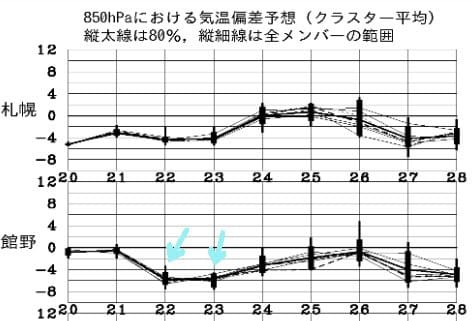

# 今週末も志賀高原…天気が良くて，冷えそう！

📅 投稿日時: 2017-04-21 22:52:29

えー．

この週末ですが．

なんと．

22，23日と．

平年比-5℃～6℃の冷え込みになりそうです！

冷え冷えです！

22日は昼間も山頂でぎりぎりプラス気温，

せいぜい+2℃程度くらいにまでしか上がらないんじゃないかな？

23日も，それほど気温は上がらなさそうで．

太陽が出ているのに，冷えて締まったバーンという，

この時期としてはかなりいい感じで滑れそう…！

天気＆雪質は，水曜予想の通り．

土曜は午後雲が多そうで，朝のうち太陽がかくれてるか

もしれないけど，晴れ．

日曜も晴れでしょう．

土日とも，朝はしっかり硬めのアイスバーン気味．

昼間も硬めの下地が残り，表面が日差しで緩んでいく…

という程度の，割としっかりしたバーン状況が続きそう．

逆にこの時期としては冷えすぎるので，土曜は

昼間に緩んだ雪が夕方に凍っていき，ちょっと

手ごわくなる可能性も…

とりあえず，この時期としては冷えたバーン状況で，

硬めのバーンが好きな人は大喜びのコンディションじゃ

無いでしょうか…

では，また今週も志賀高原でお会いしましょう～！
