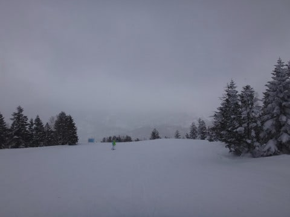

# 3月26日（日）の志賀高原詳細モード…ちょっと吹雪気味だったけど，雪は冷え冷えトップシーズンのコンディション！

📅 投稿日時: 2017-03-28 06:46:15

ということで．

本日．帰宅後倒れるように熟睡してしまったので．

ちょいと朝早起きして．

日曜の志賀高原，詳細モードです…

えー．

まず．

朝，気が付くと．

あれ？なんでいつもの第1ゴンドラじゃなくて

第2ゴンドラ前にいるんだろう？？

それも、時計が朝6時半を指してる気がするのは

なんでだろう？

昨日は朝4時に家を出て．ナイターラストまで滑って．

たしかBlog更新したら日付が変わっていたはずなのに…

疲れて寝ぼけていたのか，5時間しか寝てないというのに…

なんと，間違って早朝スキーに来てしまったようです！！！←いや，間違って来たんじゃないはずだから

ということで．

6:30営業開始の，焼額第2ゴンドラでの早朝スキー．

朝の気温は-5℃と，放射冷却が入らず．

思ったより高めの気温でしたが…

朝イチゲレンデはシマシマっ！！

それも，最高の締まった圧雪バーン！

…これは，トップシーズンの最高の雪では

無いですか！！

そして，ガラガラっ！

1本目のみ，駅舎の外にわずかに出るくらいの列が

ついてましたが．

1本目以外，当然ゴンドラ待ちは全く無し！

朝の2時間．

んもう，最高のガラガラフラットピカピカ超快適圧雪バーンを

大回りやりたい放題！

天気は小雪がぱらつくものの．

ゲレンデはしっかり見える状態で．

いやーーーー．

シアワセ…

そして．

8時半からは通常営業開始で，第1ゴンドラ営業開始！

またまた誰も滑ってないシマシマバーンを

いただきま～す！！

うはーー．

雪質最高！

エッジが噛んでスピードが出せて，

どこまでも傾いていける，シアワセなコンディション…

天気がすっきり晴れてはいないのが残念だけど．

でも，人もいなくてガラガラで．

3月末というのに．

なんと恵まれてるんでしょう…

てか．

普通なら2月でもここまでいいコンディション，少ないかも？？

…と，思っていたら．

9時を過ぎると，時折雪が激しく降って…

そして，ゲレンデ上の人も増えて来ました（ちと残念）

でも…

まぁ，早朝からもう3時間以上滑ってるから，

許す．

ゲレンデはちょっと人が多くても．

ゴンドラ待ちはこの程度で…

ほぼ待ちなしだったので，許す．←なぜ，上から目線？？

…しかし．

11時過ぎになると．

あり？？

ちと風雪が激しくなってきたのですが…

とても3月末と思えない吹雪になってきたのですが！？？？

おかげで，とても3月末と思えない

フレッシュパウダーがゲレンデの上に乗り，

雪質はありえないほどいいのですが…

しかし．

その吹雪のおかげで．

あいや～！

奥志賀ゴンドラ，運休ですか！

焼額ゴンドラは、減速ながらも運転継続！

…奥志賀ゴンドラが止まったので，焼額が混みそうなものの．

人が減る日曜の午後だったからか…

あら？意外とガラガラのまま．

そして，昼間も気温は朝とほとんど変わらず，

-4℃と，3月末の昼間にしてはかなり気合の入った冷え込みで．

それで，雪が降ってるもんだから…

…これ．

完全にトップシーズンの雪ですね．

ホントに来週から4月なんですか！？？？

昨シーズンの今の時期は．

もうゲレンデに穴が開きかけていたというのに…

今年はこうだ！

3月最終週の，日曜日でこうだ！

こんなに雪が良くて．

そしてガラガラだっ！！！！

あぁ…

去年の今の時期に．

この雪を半分分けてあげたい…

そして．

この日は．

なんと．

かねてよりお会いしたいと思っていた，[奥志賀のキレキレカービング娘さん](https://www.youtube.com/channel/UCdeK4rOu5gO_jbO2IJDyhtQ)が

焼額に登場！

そして，わが娘のコラボが実現！

…だったんだけど．

私のトップスピードと変わらぬスピードで，

焼額1ゴンをノンストップで滑り切る

スーパー少女

ですから．

…わが娘，全くついて行けず（涙）．

こ、これで小学4年生！？

わが娘も，スピードは決して遅い方では

ないんだけど…

本人の滑りを直接とっくりと見せてもらって．

とてもわが娘と1歳しか違わないとは信じられない

という思いを強くしたのでした…

娘と一緒に滑ってくれてありがとう！＞Sちゃん

…って感じで．

夕方に天才少女とお別れした後は．

雪も止み，穏やかな天気になってきた焼額を

ゴンドラストップまで滑り続けます…

雪質も最高で，

人が少なかったからか，夕方まで驚くべきフラットさ！

午前早い時間のゲレンデ状況と変わらないくらいの，

フラットであれていないバーン．

こんなフラットバーンが，誰もいない，貸し切り状態とはっ！！

雪質最高，フラット，ガラガラのバーンを．

最後まで，チョーーーーきもちいい大回りを楽しみつつ．

…ゴンドラが終わるまで，しっかり

滑り切ったのでした…

いやーーー．

しかし．

今シーズンは雪も多いし．

コンディションもよくて，うれしいなぁ…

そして．

娘も朝8時半の通常営業開始から，

4:15のゴンドラストップまで．

丸一日私と一緒に滑り続けて．

標高差10000m滑ったという…

天才少女を見てても思ったんだけど．

いずれは娘に抜かれる日が来るのかなぁ…

と，思ったSkier_Sだったのでした．

## 💬 コメント一覧

### 💬 コメント by (たろ)
**タイトル**: 驚くべきスピード
**投稿日**: 2017-03-28 09:06:52

私も、キレキレ少女の親子様と、ブーツに金のお札を装着した神セブンと思われる方と搬器が一緒になりましたので、ブログの記事を見て納得しました。スタートが女の子と一緒だったのですが、ターンするたびに「ターボチャージャーでも付いてるの?」と言うくらいの圧倒的な加速力で全くついて行けず。しかも、なんと所々遊びながら滑っているし・・・。一般レベルでは全く敵いません。高速道路でスーパースポーツにあっと言う間に置いていかれる、あの感じでしたよ。

### 💬 コメント by (Skier_S)
**タイトル**: たろさま
**投稿日**: 2017-03-29 09:10:27

いや～、すごかったでしょ。

あれで小学校4年生ですから…

もう、実際にみると驚きですよね。

ちなみに、ブーツにゴールドお札を貼っているのは、

このblogでちょくちょく登場するGokuraku_Skierさんです～！

