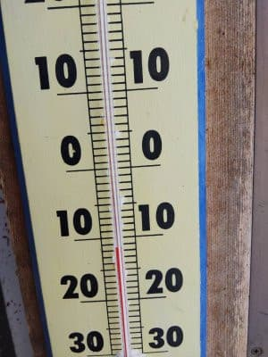
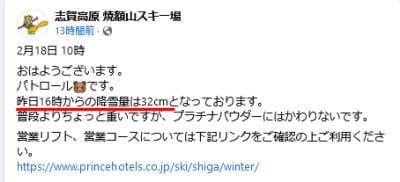
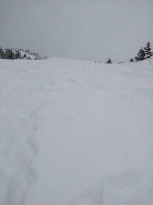
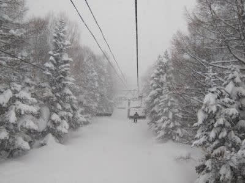

# そろそろ2023シーズンモデルのスキー板の情報が出てきたよ…そして，来シーズンモデルスキーの試乗会の情報も！

📅 投稿日時: 2022-02-19 00:15:12

えー．

本日も志賀高原特派員から写真が

送られてきましたが…

今日のあさの気温は-11℃と，

予想の-12℃はほぼ正解！

そして，焼額のFacebookによれば．

朝までの積雪は32cmだったらしく．

30~40cm以上という予想のうち

少ない方ではあったものの，

まぁ当たりですね！

([焼額山スキー場Facebook](https://ja-jp.facebook.com/yakebitaiyama/)より）

新雪コースは膝パフくらいだったのかな？

ちょい重めの雪だったようで．

そして，昼過ぎの2時ごろまでかなりの

雪が降ってたようですが，

そのあとは雪も止んだようで．

　昼を過ぎてしばらく経つと，ちょっと

　雪が弱まっていくが，夕方まで

　降り続けそう…

という予想よりちょっと早めに雪が

止んだものの，まぁ大体当たりかな…

ってなことで．

今日の予想も大体当たりですね！！

すばらしい！！（いつもの自画自賛）

ってなことで，この土日の予想ですが…

19日(土)：朝は-10℃程度．

　朝の積雪は無し．

　朝は晴れて，やわらか圧雪の

　シマシマバーン！

　…でも，じきに雲が増えて，

　昼ごろには曇り空になり，

　そのまま最後まで曇りの一日．

　午後は曇るけど，雪は降らず

　気温もそこまで寒くないので，

　まぁまぁのスキー日和．

20日(日)：未明からみぞれっぽい

　湿った雪が降り始め，朝は吹雪に．

　朝は重めの積雪が10cmほど．

　あさイチバーンはモサモサで

　ちょっと快感度が低いかも．

　この日は風も強く，奥志賀

　ゴンドラは止まる危険性も．

　終日雪が降ったりやんだり．

　時折強く吹き付ける．

　朝は-5℃程度だけど，昼間

　だんだん気温が冷えて行き，

　降る雪がだんだん冷えたいい

　雪になっていく．

　昼間も雪が積もりそうだけど，

　水曜に予想した，コース全面

　プチパウダーになるほどは積もら

　ないかな？

　踏まれないコース脇に積もり，

　圧雪コースはちょっとモサモサ

　した感じになる程度かな．

　根性の無いスキーヤーはくじける天気．

…って感じでしょうか．

うーん．日曜は荒れ気味の天気になりそう…

ってなことで，本題へ．←というか，ここまでが本題だったのでは？

そろそろ2022シーズンも後半に入り．

2023シーズンモデルの情報が

入ってくるようになりました…！！

ATOMICの2023シーズンモデルは

Youtubeの[ここ](https://www.youtube.com/watch?v=d5-Co88GgCE)で紹介されてますが．

トップモデルのビンディングが

ICONビンディング

とやらに変わるようですね…！

板は昨シーズンのRevoshockがそのままで，

見た目は変わりませんが…微妙に

シェイプが変わったりしてるようです．

SALOMONの来期モデルは，Youtubeの

[ここ](https://www.youtube.com/watch?v=p5sGZYsdSjU)で紹介されてますが．

SALOMONは来期はフルモデルチェンジですね．

BLADE TECHNOLOGYとかいう，

ビンディングから伸びた板のような

モノがついて，見た目が全く

変わってます．

ROSSIGNOLの来期モデルも同じくYoutubeの

[ここ](https://www.youtube.com/watch?v=lhmE57e_eZc)で紹介されてます．

来シーズンもSUPER VIRAGE Ⅶ LTD/TECHと

モデル名が変わらないので，継続かな？

とおもったら．

中身は結構変わってるとのこと…

ってな感じで．

いろいろ来期モデルの情報が出てくると，

当然試乗もしたくなるわけですが…

そんなときはスキー試乗会です！！

アルペングループのスキー試乗会の案内が，

[ここ](https://www.alpen-group.jp/media/ski-snowboard/2022-2023-ski/)に載ってます．

いつも通り，3月18日から4日間，

アサマ2000で試乗会がありますし．

例年は4月だった志賀高原の試乗会も，

3月26，27日になりました！！

ちなみに，アルペン試乗会は無料です．

カンダハーの試乗会の情報は[こちら](https://www.kandahar.co.jp/21208/)．

3月19日，20日に鹿沢スノーエリアにて

開催で，参加費1000円．

石井スポーツの試乗会の案内は[こちら](https://www.ici-sports.com/lp_ski/skinewmodel/)．

3月5，6日で岩岳，

4月2，3日で菅平など．

こちらは参加費1日1100円．

タナベスポーツの試乗会の案内は[こちら](https://www.tanabesports.jp/event/2022/02/03/49334/)．

関東から行くような場所で

開催されるのは…

3/19　開田高原マイア

3/20　白馬五竜

3/21　鹿島槍スキー場

3/26、27　横手山・渋峠スキー場

あたりですね．

このほかの場所でも開催されるので，

案内を見てみてください．

こちらは半日で1000円．

各会場50人限定のようです…

とりあえず，私は例年通りアルペンさんの

試乗会に参加しようかな～←そして．物欲との新たな戦いが始まるわけだな…

いや．

今回は勝利する．

今度こそ，物欲との戦いに見事勝って

みせるぞっ！！←買ってみせる，の間違いでは？？

## 💬 コメント一覧

### 💬 コメント by (yumi)
**タイトル**: Unknown
**投稿日**: 2022-02-19 06:00:34

Sさぁ～ん🎉🎿💸

ははは・・・😂

買う気❗満々じゃぁ～ないですかぁ～😅

気持ちよく🥰大負けしてくださいませ😅

ちなみに この日は やや重めと言うより かなり重めでしたぁ～😢😢😢

### 💬 コメント by (Skier_S)
**タイトル**: ＞yumiさま
**投稿日**: 2022-02-19 22:49:54

いや…買う気マンマンじゃないですよ．

今度は我慢するはず…（自信なさげに）

金曜，そんなに雪重かったんですね…

