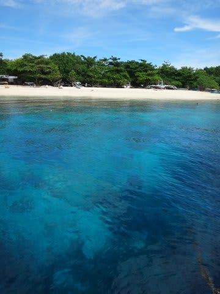
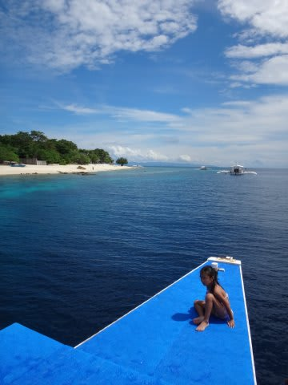

# 2014年8月　オスロブagain…再び，子連れでジンベエザメと泳ぐぞ！　エピローグ

📅 投稿日時: 2014-10-25 02:52:39

これまで．

子連れダイビングの行先を決めるにあたって．

いろいろ，制限をつけていた．

ボートで潜りに行く際に．1本ごとに港に帰ってきて，

陸上で，夫婦で交代して娘の面倒を見ることができる

場所が，基本．

座間味セーリングさんが，唯一の例外で．

娘を一日中乗りっぱなしにさせるけど．

海が穏やかで，ダイビングポイントでは

どこでも泳いで遊ぶことができるし．

休憩時間に，無人島に上陸して遊べたり．

さらに，ショップのスタッフの誰かが子供と

一緒に泳いだり，遊んだりしてくれる…

という，娘が退屈せずに済むところ．

…そういう海を，選んできたわけだけど．

昨夏．

いきなり，

「突発性ジンベエを見たくてガマンできない病」

を発症した，妻．

これらのルールは深く考えず．

ジンベエが見れるという，タイ・タオ島に．

「子供乗船可，基本的にお昼は一旦ホテルに戻ってくる」

というショップがあったことで，

「これなら娘を船に乗せて，ジンベエを見に行ける！

　娘が退屈して嫌がるようなら，

　最悪，昼以降，両親どっちかが娘と

　ホテルに残ればいい！」

ということで．

ジンベエを優先して，タオ島を目的地に決めたわけだが．

…実際行ってみると，海が荒れてて泳げない日も多く．

さらに，当然，外洋ポイントでは波や流れで

泳ぐことは無理…

だもんで．

予想通り，午後は娘が船に乗ってくれなかったりしたけど．

…でも，この時．

何回か内湾で泳ぐチャンスがあった時．

娘が，驚くべきシュノーケリング能力を

身に着けていることに気づき．

「あのシュノーケリング能力なら，

　娘はジンベエシュノーケリング，できる！

　家族でそろってジンベエを見に行ける！」

と．

リベンジ先として，ジンベエシュノーケリングができる

フィリピン・オスロブを目的地に選んだ妻．

基本的に，1回目のフィリピンでは．

ホテルから20分くらいのポイントにしか行かなかったし．

海も穏やかで，娘も思う存分泳ぐことができて．

終日，船に乗っていても全然苦にならなかった

わが娘だったわけだけども．

これに味を占めた，フィリピン2回目の今回．

片道1時間半という遠征ボートに娘を連れ出し，

一日中船の上で過ごして．

…なんだか，泳げないところでも，大好きな船の上で，

お絵かきしたりして過ごせるようになってるよ…

と，気づいて．

船の上で南国のきれいな海を見て，

のんびり過ごせるようになったなんて．

…娘も，大人になったもんだなぁ…

って，感動したんだけど．

…ちょっと待てよ．

これは．

要するに，もう，娘と一緒に行く場所の制限が

なくなった，ってことじゃないか？？

ボートで1時間以上の遠征も．

まったく上陸することなく，小さいボートの上で一日過ごすことも．

泳げないようなポイントがあるところでも．

大丈夫，ってことだよな．

これは．

もしかすると．

かねてより，ずーっと再訪したいと思っていたけど．

子連れでは，絶対行くことはできないだろうな…

と，完全にあきらめていた．

そう．

あの，パラオに．

もしかすると，行けるかも…

と，いうことで．

「ジンベエも見たし，次の目的地は，

　パラオだっ！！！！！」

と．

これまでは完全にあきらめていた，

娘を連れてのパラオへの再訪を．

帰国の飛行機の中で，誓ったのだった…

＃まさか，今年のうちに行くとは思ってなかったけど
