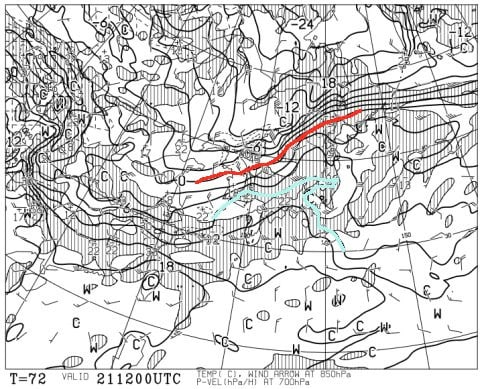
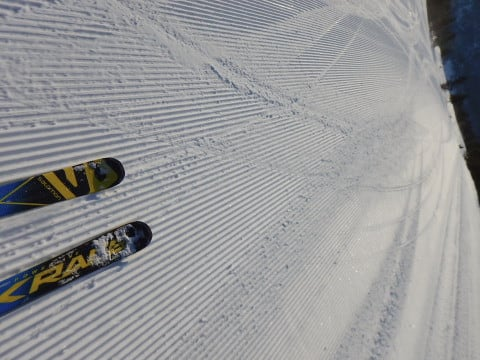
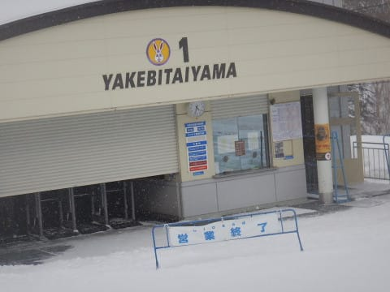

# 2019/3/17(日)志賀高原スキー場，詳細レポート…2月よりいいコンディション！トップシーズンの雪＆ガラガラ！早朝晴天，その後曇り～冷え冷え雪．

📅 投稿日時: 2019-03-19 02:13:23

🏷️ カテゴリ: [2019スキー滑走日記](c3e4496fc0fb7f9c17ff21214a35b1ace.md)

どうやら．

本日の志賀高原．

終日晴天＆冷え冷えで，

最高だったようです…

あぁ…日曜もすっきり晴れてくれれば…

でも，この土日も雪は良かったし．

ゼイタクは言わないでおこう…

しかし．

しかーーし．

予告した通り．

明日以降は気温がぐぐぐっと

上がります（涙）

まぁ，19日（火），20日（水）とも．

気温は上がるものの，何も降らずに

いてくれるので．

雪はちょっと緩むものの．

まぁ，ひどいことにはならないかな…

今のところ．

21日も，リフト営業中は降らなさそうな

雰囲気…

ヤバいのは．

21日の夜から22日の朝にかけて．

21日祭日の夜9時の850hpa図を見てみると…

ふぎゃーーー！！

赤線の0℃は北海道より北だし．

水色で示したのは…+9℃線！？？？

志賀高原に，+9℃線がかかってるって…

志賀でも+10℃近くまで気温が

上がるってこと！？？（涙）

そして．

地上天気図は．

ヤバい…降水域が志賀高原に

かかってるよ…

とりあえず，21日の昼間は降らなさそう

ですが．

21日夜は…

降りそうですね．

このままだと．

液体が…

でも．

それほど量は降らなさそうな感じに

見える…

うむ．

21日夜から22日朝にかけて．

雨になりそうですが．

思ったほど壊滅的に雪が解けずに

済むかな？？

でも．

その後，23，24日は冷えるので．

雨で融けた雪が固まった，

アイスバーンを覚悟してください…（泣）．

ってな感じで．

前フリが長くなりましたが．

日曜の志賀高原，詳細レポートです！

えー．

この日も．

前日早朝4時出発，さらにナイターのあと

に飲み屋に飲みに行ってた

という，行動時間22時間の

ご無体日程だったにもかかわらず．

焼額の早朝から参加したわけですが．

まだ薄暗いうちからゴンドラに乗り…

山頂にやってくると．

山頂の温度計は-12℃！！

いやーーー．

冷え冷えですよ～！！

山頂の天気はすっきり晴れで．

ゲレンデは当然，冷え冷えシマシマっ！！！

ふはははははははは．

おいしそうな冷え冷えシマシマ，

いただきまーす！！！

いや．

最高！

今日も最高！

これだよ！

この最高冷え冷えシマシマを

味わうために，スキーに来てるんだよ！！

もう，最高雪質で．

早朝は人も少ないので．

やりたい放題，好きなラインで

大回りし放題っ！！！

人が少ないから．

数本滑っても．

まだ全然シマシマが残ってます！

最高っ！！！

早朝最高！

こんなバーンコンディションを2時間

ひたすら滑り続けられるんだから…

もう，早朝だけで超満足！！

早朝だけで，普段の数日分の

シマシマを滑れる気がする…

去年から，第1ゴンドラで早朝営業に

なり．

オリンピックコースも早朝で滑れるように

なりましたが…

早朝のオリンピックコースも，

いい感じで締まったフラットバーンで．

人もいなくて．

もう，語彙力が消失してますが．

最高

の一言しか出てこない…

早朝営業終了のころは．

コースはシマシマではなくなってきますが．

でも，快楽のフラットバーンを

まだまだ飛ばしたい放題！

こんなバーンを2時間おなか一杯

滑ったら．

やっと通常営業開始タイム…

通常営業開始時には，早朝営業をやっている

GSコースとオリンピックコース

以外に移動すれば…

また，シマシマが思う存分

味わえるのだ！

…でも．

なんだか．

通常営業開始のころには，

うっすら雲が出てきて．

太陽が隠れてきたのですが…（ちょいと残念）

とりあえず．

子連れでやってきた今回．

娘のリクエストもあったので．

ホームゲレンデの焼額を脱出して，

サンバレー方面にまで移動してみることに…

ってなわけで．

一の瀬ファミリーにやってきましたが．

正面バーンも，雪質最高！

…3月中旬とは思えない．

1，2月並みの，いい雪質の雪が

しっかり硬めにパックされた

滑りいいコンディション！

そして，高天ヶ原を通過して…

東館にやってきますが．

ここもいい雪ですね～．

さらにブナ平，ジャイアントと

通過して．

蓮池までやってくると…

日曜というのに，ゲレンデはほぼ

無人状態なんですが…

おかげで昼近いのに，

まだバーンにシマシマが

残ってますよ…！

そして，サンバレーまでやって

きました～！

この時期のサンバレーとしては，

信じられないほど雪質が最高で．

人も滑ってないので，まだ

シマシマが残っている，傾きたい

放題の感激超フラットバーン！

いや…

今日は早朝・通常営業スタート，

そして昼前のサンバレーと．

3回，最高のシマシマフラットバーンを

滑れましたよ…

しかし．

なぜか昼ごろになると，

雪が結構強く降りはじめて

来たんですが…！

雪の降る中，志賀高原ツアーを

続けますが．

西館も，今日は雪質最高ですね…

ってか，志賀高原どこ行っても

今日は最高の冷え冷え雪ですね．

昼過ぎには，結構な雪が降り積もり．

ゲレンデ上にも新雪が積もって

来ましたよ…

それも，冷え冷えのいい感じの

軽い雪！

だけど．

一の瀬にやってきた，午後2時ごろには

一旦雪も止み…

今度は日が射してきましたよ！？？

さっきまで降り積もっていた雪は，

あくまで軽く．

うっすらとゲレンデをコートしてくれて…

これに日が射して，超気持ちいい

バーンなんですけど！？？

そして．

午後2時過ぎには．

すっきり晴れ！

…いや．

予想なら，このまま晴れ続けて

くれるはず…！

最高の雪，最高の天気．

いいじゃないですか！！

と，喜んでいたのもつかの間．

なぜか，焼額に戻ってきた3時ごろには．

再び雪＆ガスが…（涙）

で．

今日はさらに，奥志賀まで遠征

しましたが．

奥志賀も，雪は良かったけど．

冷え冷えの本日．

夕方になってくると寒すぎて．

奥志賀は早々に脱出…

ってなことで．

最後は当然のごとく．

ホームゲレンデの焼額で締める

わけですが．

焼額も，夕方まで最高雪質の

フラットバーンでしたよ～！

ってなわけで．

どこに行っても最高雪質だった本日．

お約束通り，日が暮れかけるまで

滑り続け…

しっかり早朝からラストゴンドラまで，

滑り倒したのでした…

いやーー．良かった．

この週末，3月中旬としては，

これ以上ないほどのいい雪に

恵まれましたね～．

2月よりずっといいよ…

この雪質がいつまでも続いて欲しい…

あぁ…今週の木曜日．

予想が外れて，-10℃の冷え冷え雪が

降らないかなぁ…←予想の+10℃より20℃冷えるって…そこまで予想が外れたらある意味すごい

## 💬 コメント一覧

### 💬 コメント by (Goku)
**タイトル**: Unknown
**投稿日**: 2019-03-19 07:28:31

日曜日はお疲れ様でした～‼

ほんとに最高コンディションで幸せな１日でしたね。

しかし、あれだけの人数での遠足で標高差13000m越えって、全員終わった人達の集まりですよね(笑)

### 💬 コメント by (若杉勲71)
**タイトル**: Unknown
**投稿日**: 2019-03-19 17:01:51

志賀高原情報

本火曜日、私はヤケビ券の妻とオリンピック以外で１日を過ごしましたが、レインボークラブ員は奥志賀を十二分に堪能しました。ダウンヒル、エキスパートともに三十丸だったそうですよ。悔しいけれど妻もやる気になってくれたし、大満足です。

レインボーのあと、たかまは6ど、蓮池9ど、上林が14どでした。

### 💬 コメント by (若杉勲71)
**タイトル**: Unknown
**投稿日**: 2019-03-19 17:02:52

三重丸でした。

### 💬 コメント by (yumi)
**タイトル**: Unknown
**投稿日**: 2019-03-19 17:51:44

Ｓさぁ～ん😇⛷️💨

語彙力、有りすぎでぇ～す✌️

Ｓさんの頭の上音符マーク🎵～

口もとにはよだれ🤤が見えてます😅

日曜日、こっそり追い掛けようかなぁ～

・・・・・

なんて思ったのは、やっぱり😚

間違いでした😅

KIDSたち、スゴすぎ😲😲😲

### 💬 コメント by (Skier_S)
**タイトル**: 木曜は志賀高原に行きます～！
**投稿日**: 2019-03-20 01:56:34

＞Gokuさま

日曜はお世話になりました～！

いや…なかなかあれだけの人数は集まりませんよね．

そしてみんなすごい滑ること…！！

＞若杉さま

火曜は，気温がかなり上がっちゃったので．

雪はゆるんだんじゃないかと思ったんですが…

コンディション良かったんですね．

奥さんもやる気になってくれて，良かったですね～！

私は木曜に志賀参戦予定です～！

＞yumiさま

いや，あのキッズたちすごすぎますから．

ついて行けませんよ，もう…

