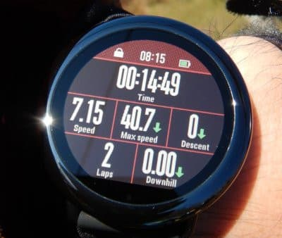
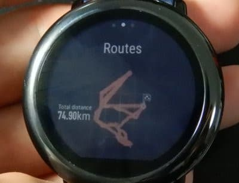

# スマートウォッチ，Amazfit PACEを買ってみた，その6…スキーのログを時計本体で確認．そしてGPXファイルの書出し＆Google Mapで見る！

📅 投稿日時: 2020-05-17 02:36:34

🏷️ カテゴリ: [PC,カメラ&小物](c0d8caed13e597efe97b661a8ae56bed0.md)

えー．

本日は，雨の天気予報だったということもあり．

特派員が誰も横手山に行っていない

という状況で．

志賀高原の写真は無いのですが…

本日の横手山＆渋峠．

雨が降ったのは早朝だけで，

後はそれほど雨が降らずに済んだようですね…

壊滅的に雪が解けてないようで，良かった…

ってなことで，本題へ．

[前回](e494f1a5f2dcecb6c986e7d9821c27fe4.md)，Amazfit PACEのスキーモードについて

紹介しましたが．

今回は，スキーモード時に取得した過去の

ログを，時計本体で確認するための

ログモードについてみていきます！

えー．

過去のスキーや登山，サイクリングなどの

活動記録を確認するのが，このActivities画面

時計画面から右側にスクロールしていくと，

6番目くらいに現れる画面です．

この画面をタップすると…

過去の活動記録の一覧画面が出てきます…

この画面をスクロールすると，過去の

記録が延々とたどれます．

Amazfit GTRだと，過去3-4回分の

記録しか本体に残っておらず，

それ以前の記録は

「スマホで見てね♡」

って感じなんですが，

Amazfit PACEは，メモリがデカいので，

過去20~30回分の記録が本体に残ってます…

で．

この，過去の記録のどれか一つタップすると，

その活動詳細が見られるわけなのですが．

例えば，ある日のスキー記録を見てみると…

この日の滑走本数は36本．

滑走距離は，74.9kmで…

活動記録時間は，8時間45分．

最大標高差，1243m←いや，志賀高原って標高差1200mもないけど…

一日滑走標高差，24185m←一日20000m越え？？

…なぜかこの時計，下り標高差が実際の2倍になるバグがあります．

実際は，最大標高差も一日滑走標高差も，

この半分です（笑）．

そして，最大滑走速度は時速75.70km/h，

平均滑走速度は34.78km/h．

平均速度は，ちゃんと下っている時だけ

の平均を記録するようで，リフトに乗ってる

時や止まっている時の速度は，ちゃんと無視されます…

さらに下にスクロールさせていくと．

最高標高が2382m，最低標高が1436ｍですか…

この日は焼額＆奥志賀を滑っていた

はずなので，最大標高2000m程度のはず

なんですが…

この時計，残念ながら

高度計が不正確という欠点

があります（涙）

で．

消費カロリーが4646kcal？？？

それは行き過ぎでしょう…

こいつも，下り標高差が2倍になるので，

それに引きずられて消費カロリーも

2倍になっちゃうバグがあるようです．

で．平均心拍数が108BPM．

さらにスクロールさせると．

心拍数がどの領域になってたかの

棒グラフが出てきて…

ふむ．

無酸素運動領域3%，

有酸素運動24%，

ちょっと負荷のある運動29%ですか…

さらにスクロールさせると，今度は心拍数の

時間推移のグラフが出てきて…

次には，速度のグラフ．

最後は，標高差のグラフが出てきます…

この標高差グラフ．

赤で囲った部分はリフトに乗って滑った

ギザギザがきれいに出てますが．

その左側は，時間とともに標高が登っていく

みたいなグラフになっていて…

ちょっとこの時計，高度測定が

ずれていくところがあるようです…（涙）

で．

まだまだありますよ～！

次は，GPS軌跡．

残念ながら，地図は出てきませんが，

志賀高原を滑っていると分かっていれば．

志賀高原マニアなら，「この形は…

奥志賀エキスパートと奥志賀ダウンヒル，

そして焼額第1ゴンドラを滑ってるな…」

と分かります！←それが分かるのは，よっぽどなマニアだよ…

これで終わりかと思いきや．

まだまだ続くログ画面．

次は…なんと．

1本ごとの詳細記録．

リフト1本回すのにかかった時間と，

1本あたり滑った距離＆最高速度が

1本1本出てきます！

スクロールさせていけば，その日滑った全本数

確認できるという…

これ，滑ってる時にリアルタイムで確認

出来れば，20000mチャレンジのペース配分

確認に使えそうですが．

残念ながら，滑ってる間のスキーモード時は

確認できず，

滑り終わった後，ログ確認のときに

しか見れないのが残念…

ってな感じで．

ログ確認モードは以上ですが．

見ての通り，なかなか盛りだくさんの

ログ記録確認モード．

これだけでも，かなり楽しめます…！

で．

次に，このログ確認画面を左に送ると．

今度はこんな感じで「Export」って

ボタンが出てきます．

このボタンを押すと，今，見ているログの

GPS軌跡を，GPXファイル形式で吐き出して

くれます…！

こんな感じで，本体の

/sdcard/gpxdata

フォルダにGPXファイルが書きだされるので．

充電用に付属してきたUSBケーブルでPCに

繋げば，GPXファイルが取りだせます！

GPXファイルは，Google mapなんかを使って

見ることができます．

Google mapでGPXファイルを見る場合は．

まず，Google mapのメニューから，

マイプレイスを選び…

次に，このマイマップを選んだら．

一番下の，「地図を作製」を選んで…

ここに出てくる，「インポート」を選びます．

そしたら出てくるこの枠に，

GPXファイルをドラッグ＆ドロップしましょう！

そうしたら，地図上にGPS軌跡が

プロットされますが…

この左のメニューの一番下，

「基本地図」

から，上の列真ん中を選べば

衛星画像にオーバーラップできます．

ってな感じで．

Amazfit GTRだと，GPS軌跡をGPXデータで

取りだせないので，スマホのAmazfitアプリで

見るしかなかったのですが．

このAmazfit PACEだと，GPXファイルが

使えるいろんなアプリで見ることができて，

便利ですよ～！

…後でまた別途詳細を書きますが．

Amazfit PACEのGPS精度，鬼のように

正確そうです…！！！

いや．

このAmazfit PACE．

むちゃくちゃ多機能で遊べますよ～！

…ってなことで．

まだ続く…（ホントに一体，何回の連載になるんだ…これ？？）
