# 志賀高原焼額山スキー場は5月3，4日の高温で雪が解け，5月5日でゴンドラ終了．田代も5月5日で営業ラスト．

📅 投稿日時: 2024-05-05 04:30:56

えー．

先ほど深夜2時過ぎ，関西某所から

500㎞運転して自宅へ帰ってきました…

荷物をかたずけてシャワーを浴びると

もう深夜3時過ぎ．

今日これから志賀高原にスキーに

行くのはあきらめました…←当たり前だ

でも．

なんと．

どうやら本日，5月5日（日）をもって

焼額のゴンドラが営業終了のようです（泣）

あぁ…

ゴンドラ営業最終日に滑っておきたかった…

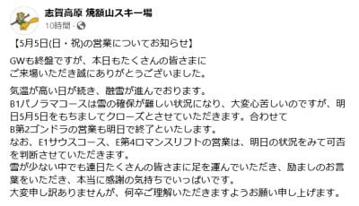

（[焼額山スキー場Facebook](https://www.facebook.com/yakebitaiyama/posts/pfbid0PAs2mqjpjnVvd69tXCDHAWk6bfSd4UKzMFfrihxxaPcQRV3oS189J5cPP1ex3BBtl)より）

そして．

5月6日のGW最終日に第4ロマンスで

営業するかどうかは5日の様子を見て

決めるとのことですが．

うーん…6日は雨は夕方まで降らなさそう

だけど．

かなり強い南風になりそうなので…

雪が残っても，リフトが動くか微妙（泣）

はたして私は焼額山スキー場の今シーズン

営業最終日に滑ることができるのか？？

とりあえず．

GW後半の4連休3日目となる5月4日(土)の

志賀高原の特派員からの写真によると…

さすが4連休の2日目だけあって．

かなり人が多かったみたいですね…！

夜中に氷点下まで冷えたようで，

朝はかなり硬い雪だったようですが，

日差しと高温ですぐに緩んだみたい

です．

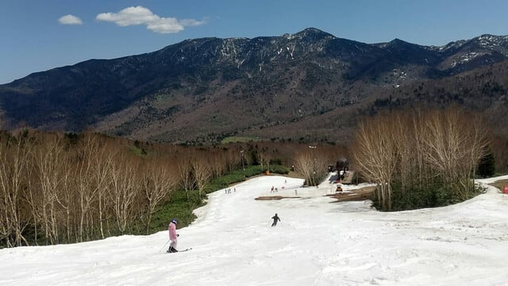

パノラマコースは一見まだ雪が

ありそうに見えますが…

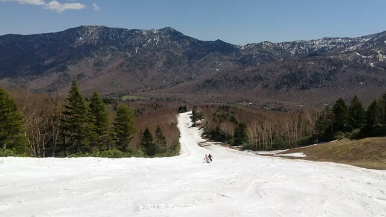

昼間にかなりに高温になったこともあり，

ところどころ土が出てきたようで．

本日5日まで営業するのがぎりぎり

いっぱいのようです…

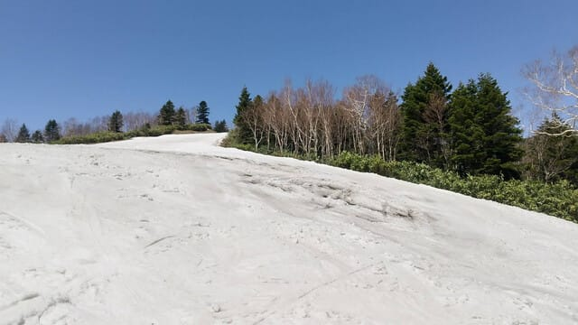

で．

下部のサウスコースですが．

一番最後の緩斜面の雪の薄い部分が

かなり増えたみたいで…

6日に第4ロマンスで営業できるかも

微妙な感じ（泣）

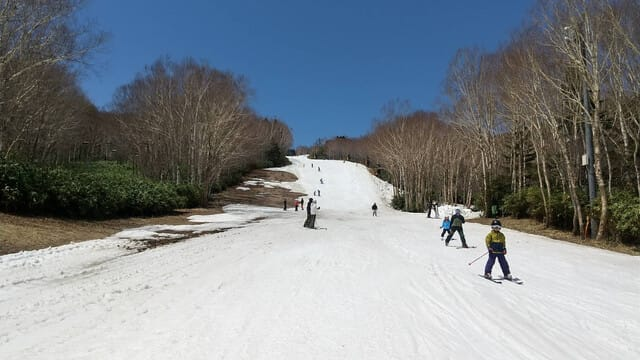

なんてったって．

ライブカメラを見ると

4日の朝6時前と午後6時過ぎを並べると…

1日でこれだけ雪が減ったのか！！という

感じです（涙）

昼間のピークの気温は異常高温といえる

20℃近かったようなので，それは雪も

解けますよね（泣）

異常高温が憎い…

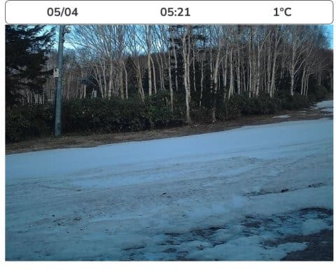

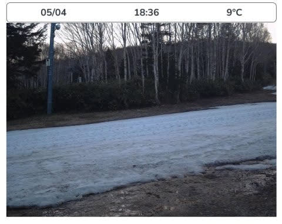

ちなみに．

4日の渋峠はこんな感じ．

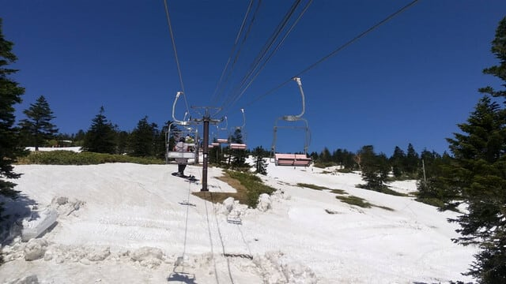

まだ雪は何とか残ってますが…

かなり混んだようです．

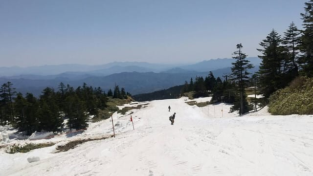

そして，横手山の第2ゲレンデは…

かなり幅が狭くなりましたが，

午前中は雪はそれほど汚れてない感じ．

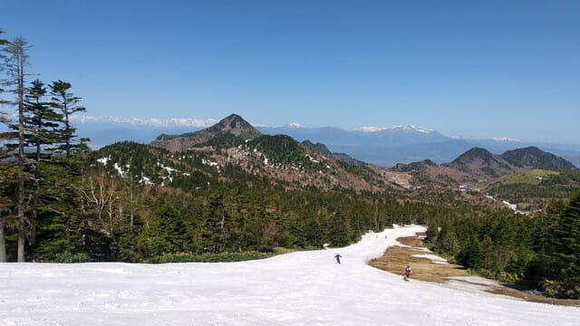

しかし．

この横手山も，5月6日で営業終了．

GW後も滑れるのは，渋峠だけとなります…

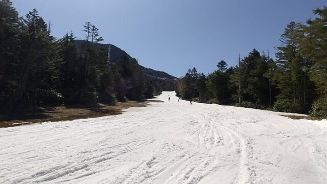

ということで．

どうやら一ノ瀬ファミリーも5月5日で営業終了する

ことになったようなので…

5月6日まで営業すると言っているのは，

志賀高原では

・横手山第1，第2，第3リフト

・渋峠

・奥志賀第3，第4

・（もしかしたら焼額第4ロマンスも）

という感じです．

ちなみに．

かぐらスキー場も，田代エリアは5月5日で終了．

5月6日は，かぐらメインバーンのみの営業と

なるようです…（泣）

…まぁ，この異常高温の4月&5月で，GW

最後まで滑れるリフトがこれだけ残った

だけでもすごいのかも．

とりあえず．

5月6日，強風でリフトが止まることが

なさそうなら，志賀高原へ滑りに行こうかと

思っています…
