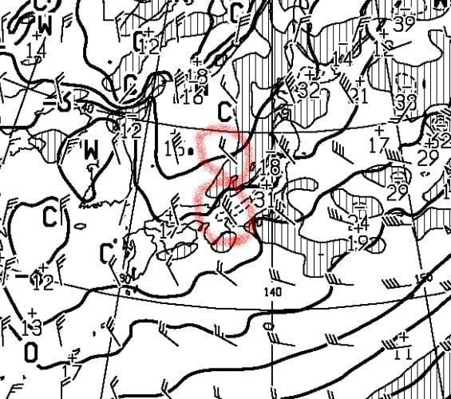

# 12月23日（金）の志賀高原スキー場は，晴れで雪は積もらず（涙）…でも，24，25日は雪が降る！積もる！そして寒いよ！

📅 投稿日時: 2022-12-24 00:25:51

🏷️ カテゴリ: [日記](cc4b5682fb7b8b144980957a978653fb0.md)

えー．

本日の志賀高原の写真が，特派員から

送られてきているのですが…

なんだか．

すっきり晴れ，ですね…（涙）

　昼間だけでも10cmくらい積もるかも？

　昼間の気温も-5℃を越えず，すごく

　寒くて雪が降ったり止んだりの一日．

という予想はどこへ行ったのだ？？？

すっきり晴れのシマシマデー

なんですが…！？？

夜中に数cmだけ積もったようですが．

その下地は昨日の雨で硬く固まった

バーンだったみたいで…

唐松コースはところどころコロコロも

出てきてるうえに．

人工降雪メインのアサマや車山クラスの

硬めのバーンだったようです…

とはいえ，そんなに滑りにくいバーン

ではなく．硬く締まったけどエッジが効く，

スピードが出るバーンで．

天気が良かったのもあり，そこそこ楽しめた

みたいですが…

ただ，天気は良かったものの．

風が強く，気温も-15℃程度と激烈に

寒かったとのこと…

ちなみに，横手山に行った特派員も

いたみたいですが．

横手山は，今日から第3と渋峠が

動き出しました～！！

天気は良かったものの，こちらもリフトが

時々止まるほどの強風だったようです…

これで横手は第1，2，3，4リフトと，

渋峠ペアが動いたので．

他のスキー場から一歩抜け出て，

ほぼすべてのリフトが動きましたね．

あと，一の瀬も今日からクワッドが

動き出し，明日は天狗コースも

滑れるようですが…

高天ヶ原クワッドも，ダイヤモンドも，

山ノ神も西舘も東館もブナもジャイアントも

サンバレーもまだ動きません…（泣）

あ，奥志賀もまだ営業開始案内が

出てないですね（涙）

しかし．

西風にもかかわらず激冷えなので，

根性のある雪雲が北アルプスを越えてくる

はずの本日．

なぜ雪が降らなかったかと言えば…

今日の雨雲レーダーを見ると．

西風どころか，西南西の風になって，

日本海を通った雪雲は北アルプスに

ぶつかるどころか，それより北に

ターンして山形方面に向かってますね…（涙）

…これは．

雪雲が北アルプスを越えるどころか．

北アルプスにすらぶつからず，さらに

北にターンしていって，

志賀にかすりもしてませんね（泣）

西南西の風では，激冷えになっても

雪が降るわけがないです（激泣）

ってなことで．

予想が外れて，全く積雪が無かった23日

ですが．

24日の土曜日は…

降ります．

降る．

これから降る！！

なんてたって．

24日の天気図はこんな感じで見事な縦縞の

等圧線！！

そして，風向きは北西～北北西に

変わっていきます！！

これなら降る！！

おそらく，皆さんがこのBlogを読んでいる

今日の明け方前には北風になり．

志賀高原はかなり降ります！！！

降り始めが明け方近くなのが惜しいけど．

営業開始までに，10cm以上，20cmくらい

積もってるかも？？？

そして．

営業中も激しく降り続け．

昼間だけで20cm以上積もるんじゃないかな？？

雪は25日の日曜もひたすら降り続けます．

25日朝までにも，20cm．多ければ30cmは

積もりそう！

多分，25日には焼額もゴンドラが動いて

くれるんじゃないかな…！！！

おそらく，25日から動くリフトが一気に

増えると思います…

この雪は，26日以降まで降り続けますよ～！！

…ってなわけですので．

この週末に志賀高原に行く皆さん．

太い板を持っている方は忘れずに

もっていきましょう！！！

…激寒大雪で，根性の無いスキーヤーは

間違いなくふるい落とされますが

ということで．

私はこれから2時間半後に出発です…

あと2時間しか寝られない（涙）←こんなBlog書いてないで早く寝ろよ

また明日，志賀高原でお会いしましょう！

PS.　明日の志賀の登り坂はすごい雪道に

　なってると思うので，注意してください…

## 💬 コメント一覧

### 💬 コメント by (なるなる)
**タイトル**: Unknown
**投稿日**: 2022-12-24 14:20:42

初滑りに来たのですが、スキーってどうやって滑るんだっけて人には厳し過ぎました。

ちょっと無理になって、宿に一旦戻って立て直そうとしたら、宿前の某リフトが

運休になり、もういいやと…

過去最短の2時間で見事に振り落とされましたw

### 💬 コメント by (新米パパさん)
**タイトル**: Unknown
**投稿日**: 2022-12-24 21:10:28

見事にふるい落とされましたね、

キッズのシーズンデビューにはツラい焼額山でした。

明日はイチゴンは動かすかもだけど、コースは開かないとホテルマンに言われました。

そんな事ってあるんすか？！

### 💬 コメント by (Skier_S)
**タイトル**: 今日はいい一日だった…
**投稿日**: 2022-12-24 23:56:46

＞なるなるさま

今日が初滑りですか…

それはちょっと厳しすぎたかも(笑)．

今日は根性の無いスキーヤーふるい落としデーですので，

初滑りはもう少し穏やかなコンディションの日が良かったのかも…

またリベンジしてください！

＞新米パパさま

見事にふるい落とされましたか…

私は最近新しく参加した小学校入学前のスーパーキッズたちと滑ってましたが，

この悪天候の中ナイターまで滑ってました…（すごすぎる）

明日はイチゴンは動きますが，パノラマコース側を回って滑ってくださいとのこと．

でも，白樺も動くので，明日は楽しめると思いますよ！！

