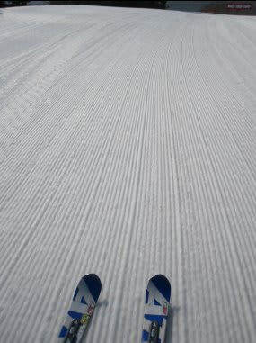
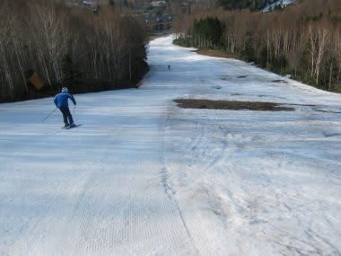

# GW最終日，5月6日の志賀高原はこんな感じ…

📅 投稿日時: 2012-05-06 23:36:48

🏷️ カテゴリ: [2012スキー滑走日記](cca3a0e9524e0203150f790b1fc3c71ad.md)

さてさてさて．

ついにやってきた…ゴールデンウィーク最終日．

このGW最終日の志賀高原はですねぇ．

志賀高原はですね…

悲惨でした(涙)．

焼額で早朝スキーをやっている間は，まだマシだったんですよ．

朝は気温も冷え，水溜りには氷も張るほど．

雪はちょっとやわらかめだけど，ぴかぴかの圧雪バーンです．

コース幅は一部狭くなってきているけど…

天気もよく，この時期としてはしっかりした高速バーン．

いやー．

やっぱりこの時期は早朝がいいなぁっ！！

と，喜んでいたところ…

早朝営業が終了すると．

風が強まり，焼額の第2高速，ゴンドラともに営業できないという

非情な案内が…（涙)．

というわけで．

通常営業時間からは，一の瀬ファミリーをすべることに．

いやー．

しかし．

よく今日まで雪がもった…

下半分は廊下状の通路になっちゃってます．

でも，正面上部はまだなんとか大回りで滑れますね～

意外と快適．

まぁ，ここ5年ほど雪が多かったですが，GW最終日まで

一の瀬正面上部が滑れない年もありますから，

良かったと言えるのかな…

と，思いきや．

なんだか9時過ぎから雨が…

その後，降ったりやんだり．

時々強く降るかと思えば．

なんと．

「ゴロゴロゴロ…」

…雷まで鳴り出しちゃったよ．

ということで，強風＆雷でリフトが11時ごろには

すべて止まっちゃいました(泣）．

12時過ぎに再度動き出しましたが…

今度はバケツをひっくり返したかと思うような豪雨．

今日は…今日は．

風，雷，そして豪雨かぁっ！！！！！

という感じで．

どうにも恵まれなかったGW最終日でした…(落胆)．

うーん．

日ごろの行いが悪かったかなぁ…
