# プロジェクトX2第2章…LEVORG E型にKENWOODナビ取り付け・車両コネクタへ配線繋ぎこみ

📅 投稿日時: 2018-08-22 01:04:08

🏷️ カテゴリ: [車](cba0e8330b3f2ded7c1addfacc75d4547.md)

ってなわけで．

ここしばらく，

徒然ドライバー日記ですらなく．

　徒然工作日記

と化している，この徒然スキーヤー日記．

「どこがスキーヤー日記なんだ？」という，いつものツッコミを

受けそうですが．

今日も徒然工作日記です．

では，どうぞ～！

---

ってなわけで．

ブラケットの取り付けが終わったので．

次は，配線作業にとりかかります．

現在，ナビスペースには．

元からナビスペースに配線されている車両コネクタ

・20ピン オーディオコネクタ（スピーカーケーブル，電源類）

・5ピン サービスコネクタ（車速・リバース・パーキング線）

・8ピン リアカメラ用先行配線コネクタ

の3種類のコネクタが来ていて．

さらに自分で取りつけた

・ETC車載器からのケーブル

・地デジアンテナケーブル

・GPSアンテナケーブル

の3種類のケーブルが引っ張られてきてますが．

あと1本，ナビスペースに引っ張ってこなくては

ならない線があります…

それは．

ルーフ上のシャークフィンアンテナにつながる

ラジオアンテナ線．

ラジオアンテナ線のつながるコネクタは，

助手席足元のこのあたりに来ています…

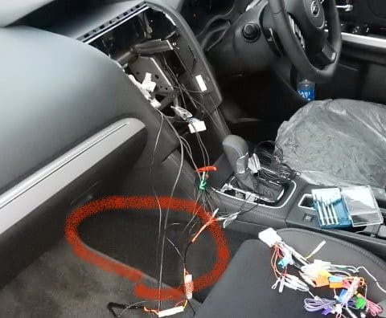

だもんで．

ここのカーペットを引っ張って，

センターコンソールに挟まっている

部分を引っ張り出して．

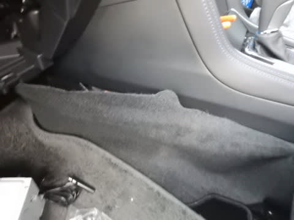

こんな感じでめくってやると…

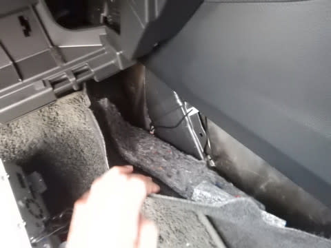

この部分にコネクタが隠れてます．

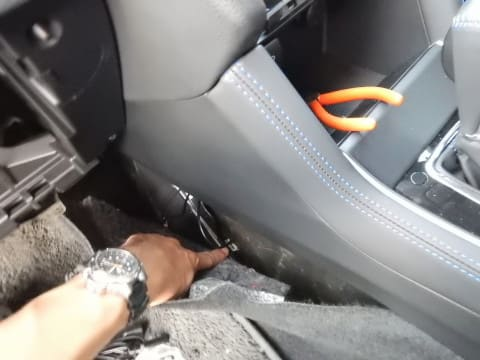

こいつもナビスペースに出しておいて

くれるといいのに．

なんでこんなところに隠すのか…

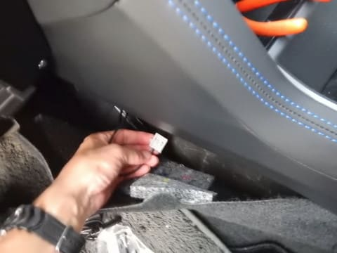

このアンテナコネクタを，インパネ後ろを

通して，ナビスペース下側に引っ張りこみます…

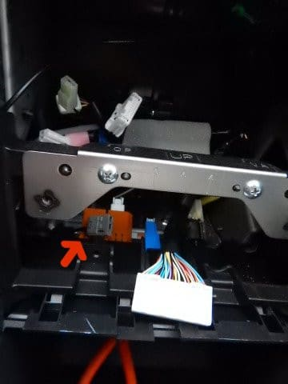

そして．

取り付けキットに入っていた，アンテナ線

接続ケーブル．

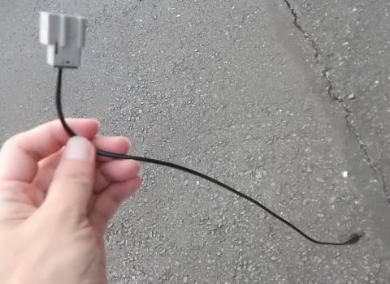

こいつをナビスペースから差し込んで…

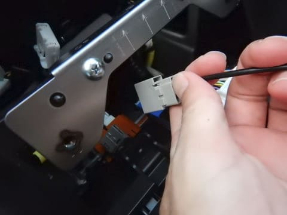

さっきのアンテナコネクタに繋ぎこみます．

これで，ラジオアンテナ線の接続が完了！

アンテナ線をナビに接続するための

こんな丸ピンコネクタが取り出せます．

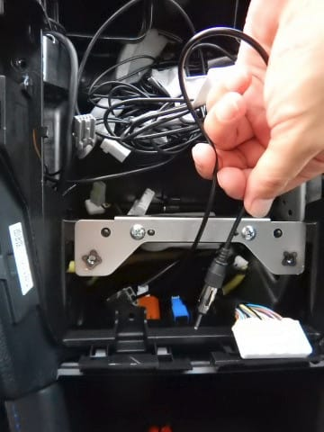

助手席足元のカーペットは

元通りにセンターコンソールの隙間に差し込んで

おきましょう．

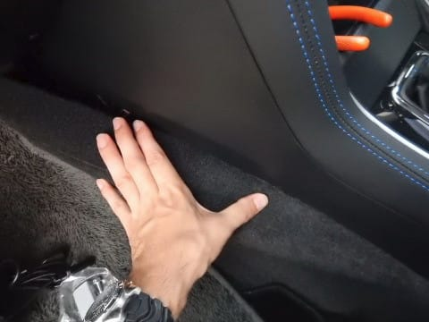

で．

ラジオアンテナ線を繋いだら．

次はメインの配線を繋ぎこむ作業に入ります．

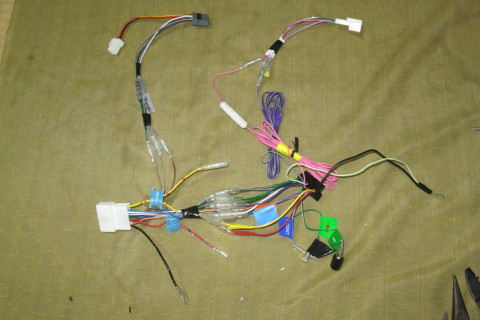

…さっき作っておいたこいつを，車両側

コネクタに繋ぎこんで行くわけですが．

まずは，この20ピンコネクタ．

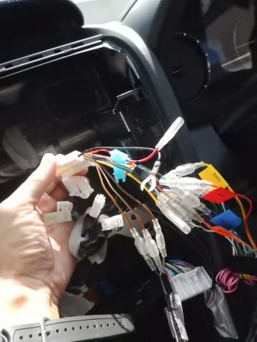

始めに，こいつを差し込んでから…

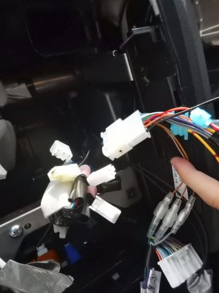

次は，いろいろ因縁の5ピン

コネクタを繋ぎます．

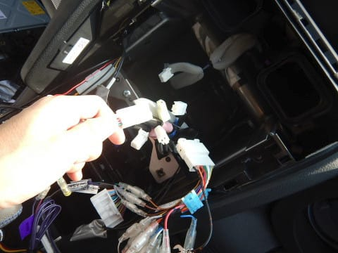

そして．

その次は．

事前に作ってあった，[純正リアカメラ用先行配線を利用できるようにする，
ナビ側ハーネス](e0ec12572486bf2ce78094e14c23332d5.md)．

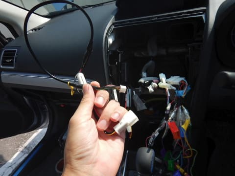

こいつを8ピンコネクタに差し込みます．

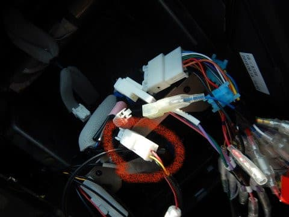

これで，車両側の４つのコネクタ，

・20ピンオーディオコネクタ

・5ピンサービスコネクタ

・8ピン純正バックカメラ用配線コネクタ

・ラジオアンテナ用コネクタ

に，全て繋ぐべき線が接続されました！

次は，ETC車載器からのケーブルを，

ハーネスのETC用コネクタに差し込んで…

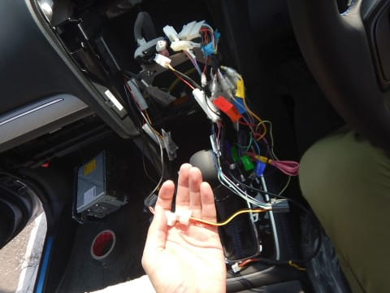

そして，[事前に準備した，電源を
分岐させておいた線のギボシ端子](e5fd2ac830a8d6aa2b3e45ec10b016f90.md)

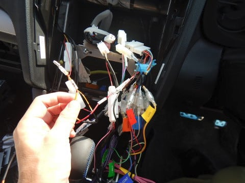

こいつにETCの電源ケーブルを繋ぎこみます．

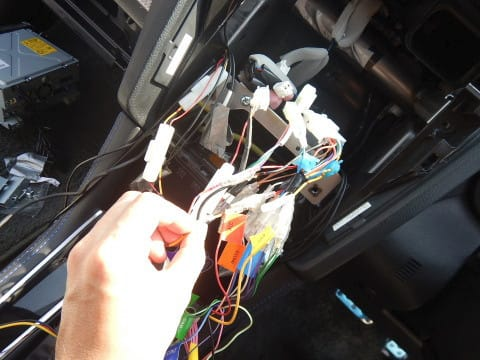

最後に．

アース線ですが．

一応，こんなアース端子がナビスペースに

来ていますが．

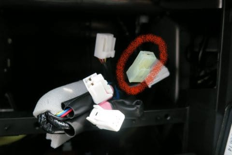

これには，ナビ付属ケーブルのアース線や，

20ピンケーブルのアース線に事前に取り付け

られていたY字端子がつけられないので．

Y字端子を適当にナビ横のこの場所にねじ止めしました…

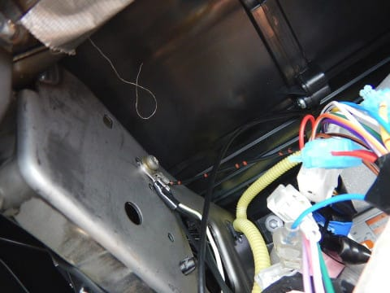

ここまで来たら，ナビ本体につなぐすべての

線が準備完了です！

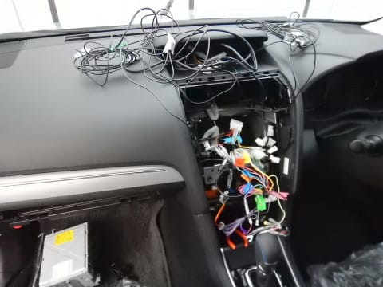

ただ，インパネ上部に置いてある

GPSやら地デジアンテナやらのアンテナ線．

こいつが長すぎるようなので．

適当に余長処理をしておきますか…

こんな感じでケーブルを緩く巻いて，

ナビ横の適当なスペースにテープで

貼りつけておきます．

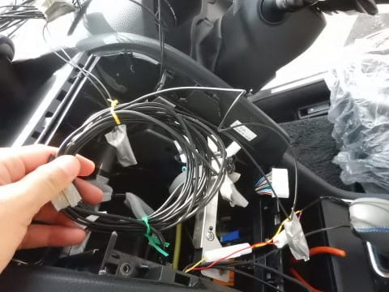

ちなみに．

こういうケーブル類を巻くときは，

こんな感じでまず8の字に巻いてから…

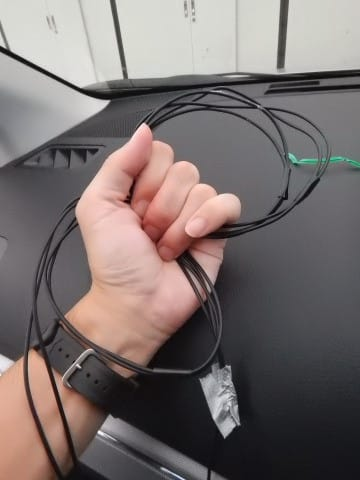

8の字を折り返して，一つの輪になるように

こうやってまとめると．

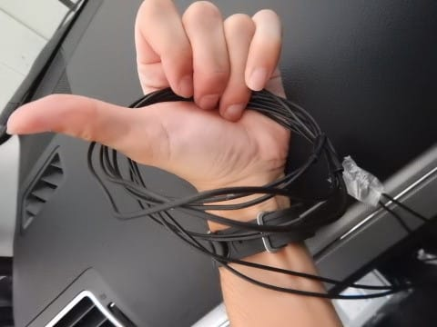

ケーブルがグルグルねじれなくて済みます．

ケーブルを巻くときの基本なので，

覚えておくと便利です．

ってな感じで．

アンテナ線がちょっとすっきりしたので←いや，まだかなりごちゃごちゃしてるけど…

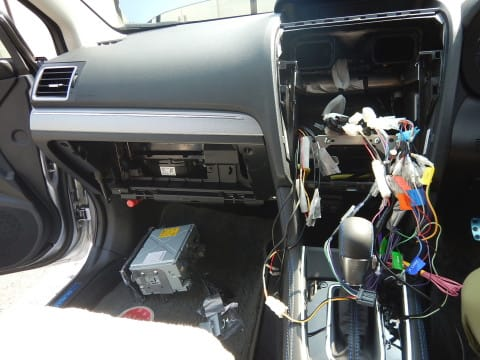

次は．

これらケーブルの，ナビへの繋ぎこみです！
