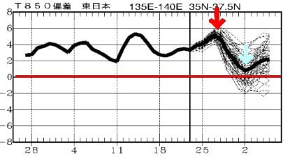

# GW前半3連休，4/27(土)，28(日)，29(祝)の志賀高原スキー場の天気と雪を予想してみる…まだ精度は低めだけど，3日とも曇り，気温は高く雪はザブザブ，夏タイヤでも行けそう

📅 投稿日時: 2024-04-25 02:32:40

えー．

本日の志賀高原は，かなりの雨＆風で，

リフトもほとんど動かなかったようですね…

雪もかなり融けちゃったんじゃないかと

心配（泣）

でも，志賀草津道が無事予定通り

オープンしたようです…！！

これで，首都圏からは草津経由で

志賀高原にアクセスできるように

なりますね…

で．

なんと．

今週末はもうGWじゃないですか！！！

GWというと，志賀高原のシーズンも

ほぼ終わり．

GWを過ぎると残るは熊の湯・横手山のみ

となる，悲しきラストスパート．

早い…シーズンが終わっていくのが

早すぎる…

とりあえず，今週末はGW前半の

3連休なので，3連休の志賀高原の

天気を予想するわけですが…

…難しい．

かなり予想が難しい天気図です…

特に日・月はまだ詳細天気図が

出ていないうえに，低気圧のわずかな

位置のずれで，晴れるか曇るか液体が

降るか，ぶれそうな天気図（涙）

その中で，とりあえず予想をしてみましたが…

今日もちょっとじっくり解説を書いている

余裕がないので，予想結果のみ書いてみると．

25日(木)：早朝が始まる直前くらいまで

　雨が残るかも．

　あさイチから雨を吸った重めの雪．

　気温も早朝から+3℃くらい，

　昼間は+10℃くらいまで上がる．

　天気は終日曇り，夕方に晴れるかも．

26日(金)：朝から晴れ．終日晴れそう．

　朝から信じられないくらい気温が高い．

　+10℃近い気温でスタート．

　早朝スタート時一瞬だけ雪が締まってる

　かもしれないけど，あっという間に緩む．

　昼間は+15℃を越えそうで，暑いくらい．

　ザブザブで板の滑りが悪い雪に

　なりそう．

27日(土)：朝から曇り空．終日曇り．

　運が悪ければ，昼間一瞬液体が

　ポツポツ落ちてくるかも．

　早朝から気温は+5℃．昼間も12℃

　くらいまで上がり，曇りでも

　ウェアのジャケットを着ると暑さを

　感じるほど．

　早朝最初の一瞬はちょっとだけ締まった

　雪かもしれないけど，早朝から雪は

　緩み，昼間はかなりザブザブの

　残念な感じの雪になり，午後は荒れ荒れ．

28日(日)：微妙…たぶん曇り．

　終日曇り．もしかすると日が射すかも？

　早朝から気温は高く，早朝のうちに

　雪は緩み切る．午前中に+10度を越え，

　雪は昼にはかなりザブザブに緩む．

　午後はバーンがかなり荒れる．

29日(月・祝)：この日も微妙…たぶん曇り．

　もしかすると日が射すタイミングもあるか？

　この日も悲しいほど気温が高く，

　午前中に+10℃を越えて，雪は早朝から

　緩くなり，通常営業のタイミングでは

　もうユルユルの雪になっている．

　日差しがなくても生ぬるい風が吹き

　ウェアのジャケットを着ていると暑い．

　午後は滑りが悪めのザブザブ荒れ荒れ

　雪になっていく

…という感じでしょうか…

幸い土砂降りになったり荒れた

天気にはならなさそうですが．

この3連休，気温が高すぎます(泣)

早朝勝負だと思うので，

早朝から滑ることをおススメ…

まぁ，逆に言えば気温が高すぎるので，

路面凍結や積雪の心配は全くなく，

この3日間，スキー場まで夏タイヤで

行けると思います．

しかし，この気温の高さで雪が解けて，

GW後半まで雪がもたない…

ということが無いように祈りたい

ところ．

うーん…何度も書くけど，平年並みの

気温なら問題なくGW後半まで行けそうな

積雪なんだけどなぁ…

赤矢印で示したあたりの，

25日～30日ごろまで平年比+4℃から

+6℃程度のあり得ない気温が

まだまだ続きそうだし(涙)

その後水色矢印で示した5月2日前後に

一瞬冷えそうだけど，それでも平年並みに

なるのが精いっぱい(泣)

いや…このグラフを見ると．

この4月の丸々一か月間，平年より

+2℃以上高い日が続いていて．

一か月で一度も平年比+2℃以下に

落ちた日がない

というのは異常すぎる…

この高温にもかかわらず，GWまで

雪がもったのは，3月にドカドカと

雪が積もってくれた，

3月の奇跡

として語り継がれていいかもしれない…

## 💬 コメント一覧

### 💬 コメント by (大阪のK)
**タイトル**: Unknown
**投稿日**: 2024-04-25 13:43:36

Sさん、ご無沙汰しております。

3月16日の大転倒でシーズンが終わってしまったKです。

昨年より沢山の雪が残っているのに、滑りに行けません。

毎日、悶々とした気持ちでblogを読んでいます。

志賀高原の皆様におかれましては、GWを楽しまれることを望みます。

私は。また来シーズンお目にかかれるよう、リハビリに励みたいと思います。

皆様、今シーズンはお世話になりましたm(_ _)m

### 💬 コメント by (Skier_S)
**タイトル**: ＞大阪のKさま
**投稿日**: 2024-04-26 01:54:30

あの日の大転倒，そこまでひどかったんですね…

まだリハビリしなくてはならないほどの大けがだったんですか！？？

とりあえず，早く治して来シーズンは無事にまた志賀高原に戻ってくることを

願ってます…

お大事にお過ごしください．

