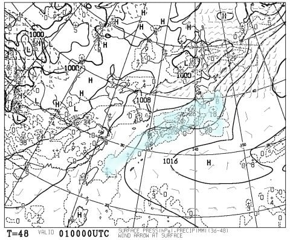
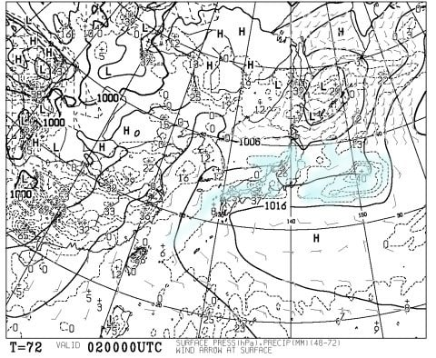

# ついに今シーズンのラストスキー！今週末の月山の天気は…土曜は雨だよ（涙）．日曜は回復傾向

📅 投稿日時: 2017-06-30 00:46:58

🏷️ カテゴリ: [スキー天気予想](c6554f5c3c106093b511a8daae23757e8.md)

そうです．

そうなんです．

どうやら．

今週末の月山にて．

今シーズン，私のラストスキーと

なるようです…←なぜに伝聞形？

自分でも信じられないのですが．

なんということか．

私のスキーシーズンが，ついに

終わってしまうようです…

いや，どうやら本日．

月山の沢コースがクローズしてしまったらしく．

ついに残るは大斜面のみ．

この一週間で，かなり雪が減ったようで…（涙）．

ってことで．

私にとってラストスキーになる今週末の，

月山の天気や，如何に…？？？

土曜の天気図を見ると…

…

…

…

ダメだ（涙）

朝9時の予想天気図で，すでに東北は

水色の降水域に覆われてます．

土曜は，朝から雨です（泣）．

ただ，ここに示さないけど，夜9時の予想図では，

山形が降水域から外れてます．

だもんで，雨が強いのは朝のうちだけで．

午後になると雨は止むか，ポツポツと

降る程度かな…

ただ，ガスで視界は悪い一日でしょう…（涙）．

そして．

日曜の天気図は…

この日も，月山付近，水色の降水域で

覆われてますが…

天気は回復傾向っぽいので．

雨が残ったとしても朝早いうちのみ．

運が良ければ…

昼ごろにはガスが上がるかも！？？

…しかし．

日曜の午後に回復してもなぁ…（涙）．

気温はどちらも，月山では昼間は20度を超える程度．

晴れれば暑く感じる気温ですけど，

雨が降ると肌寒く感じるかって感じですかね．

ってことで．

まとめると．

土曜は朝から雨．午後に雨は弱まり，時折ぱらつく程度になりそうだけど，

終日ガスは残りそう…

日曜は朝には雨が残るかもしれないけど，午前中には止んで，

午後は視界も回復するかも

って感じでしょうか．

しかし．

今シーズンのラストスキー．

せっかくなら，夏スキーらしいすっきり晴天で

滑りたかったものだけど，ちと残念．

まぁ，7月までリフトが滑れただけ，

良しとしてやろうか．←だから，どうしてそんなに上から目線？？？

ということで．

雨でガンガン雪が消えそうなこの週末．

ラストスキーに行ってきます～
