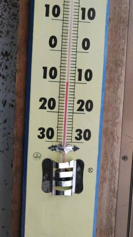
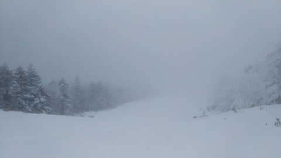
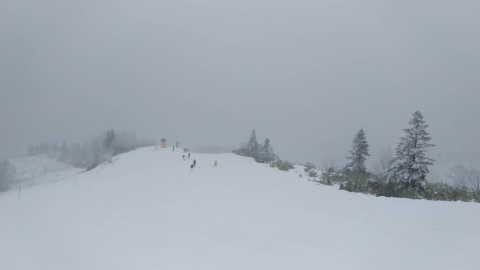
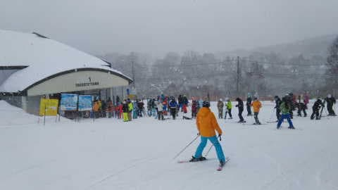
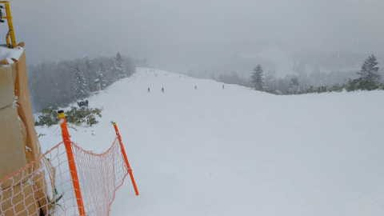
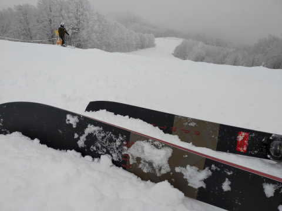
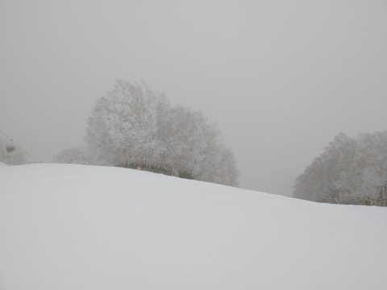

# 1月2日の志賀高原は，特派員によると雪は積もったけど少な目（涙）．まだ足りない感じ…

📅 投稿日時: 2023-01-03 04:16:53

🏷️ カテゴリ: [日記](cc4b5682fb7b8b144980957a978653fb0.md)

本日も，家で仕事をして過ごしてましたが…

終わらん．

仕事が終わらんよ…（涙）

ということで．

仕事が終われば，1月3日には志賀に

舞い戻ろうかと思ってましたが．

非常に残念ながら，明日も自宅で

仕事してます…（泣）

あぁ…

せっかくの正月休みなのに．

2日間しかスキーができなかった…

自分が怪我したり病気でもしない限り，

6日間の正月休みで2日間しか

滑らないなんてことが起こるとは

思わなかったよ…（激涙）

とりあえず．

本日の志賀高原ですが…

特派員によると，朝イチは-10℃まで

冷え込んだみたいで．

あさイチは雪降りだったみたいですが…

朝の積雪はそれほどなく．

せいぜい10～20cm程度だったみたいで…

残念ながら，

「雪は降るけどそれほど積もらなさそう」

という予言が当たってしまったようです（泣）

あまり積もらなかったのに，

昼間は雪が降り続け，視界がそんなに

良くなかったみたいで．

午後はちょっと吹雪いたみたいですね…

天気が悪かったけど，さすが正月休み．

それも一番混む1月2日だけあって．

ゴンドラ待ちもちょっとあったみたいだし．

コース上の人もそこそこ多かったみたい．

…でも，正月休みと考えれば，

天気が悪い分，人が少な目だったのかな？

一応，昼間も積もり続け．

昼間の積雪も5-10cmくらいあったみたい

ですが…

でも，GSコースの雪が薄いところが

隠れてくれるくらいの積雪にはならず．

まだ雪が薄いところはヤバい感じ

みたいです…（泣）

まぁ，冷えて雪質は良かったみたいだし．

雪が降ってくれただけでもありがたいけど．

もう少しドサドサ降ってほしいところ…

だと思いますが．

でも．

もう正月休みにスキーに行けなくなった

私にとっては，降らないでいてくれた方が

いっそあきらめがつくわけなので．

やはりこれは，

Skier_Sの呪い

で，スキー場に雪が降らないのかも…

明日も雪はぱらつきますが，西風なので

志賀高原ではそんなに積もりません．

4日はちょっと積もりそうですが…

この日も朝の積雪はせいぜい

10~20cmくらいかも．

…残念ながら，Skier_Sの呪いはかなり

強力なようです…

とりあえず，このままいくと．

次に雪が積もるのは，

私の仕事が終わってスキーに行けるのが

確定して，Skier_Sの呪いが解けた時

ということになりそうです…←だから，あなたが志賀高原の天気を決めてるわけじゃないから

…しかし，次はいつスキーに行けるんだろう（涙）

## 💬 コメント一覧

### 💬 コメント by (新米パパさん)
**タイトル**: Unknown
**投稿日**: 2023-01-03 13:26:48

S様が志賀高原で滑らないのに申し訳ないので、２日は湯沢ナスパにお邪魔したんですが、関越の冬タイヤチェックでとんでもない渋滞に巻き込まれました。

もう、遠慮せず、志賀高原焼額山にします。

大晦日の帰りも志賀の道でキャンピングカーの横転渋滞に巻き込まれましたが。。

毎年、志賀はキャンピングカーが横転してるのを見ます。

あと、一ノ瀬の駐車場の猿軍団がクルマの中まで入って来てましたが、あれ、怖いっすね。

すげームキムキなお尻の強そうな雄ザル。

### 💬 コメント by (Skier_S)
**タイトル**: ＞新米パパさま
**投稿日**: 2023-01-04 06:14:10

大みそかの志賀の下りといい，本日のタイヤチェックと言い，運の悪い日に移動しちゃいましたね…

どうせ時間がかかるなら志賀に来ちゃった方がいいですよ（笑）．

一の瀬や高天の猿軍団は傍若無人だから気を付けた方がいいですよ…

コンビニビニール袋が狙われるので，ビニールを持っていると奪われます．

車の中に食料があるのを見つけると中まで入ってくるのでヤバいです…

焼額まで行くと猿はいなくなりますよ！

