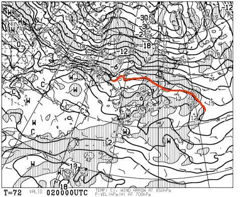
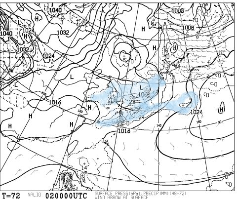
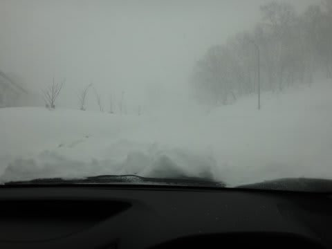
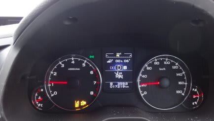
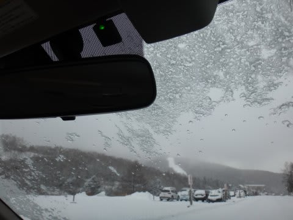
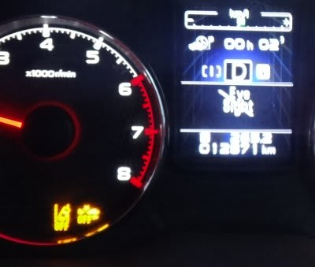

# うーむ．今週日曜はやっぱり雨か…(涙)．．．そして真冬のアイサイト様の弱点とは？？

📅 投稿日時: 2014-01-31 01:04:18

🏷️ カテゴリ: [スキー雑談](c1f9d2cb7478308da16419928ea3945e9.md)

どうやら．

今日は降り始めが比較的夕方遅く.

気温が下がってから降り始めたので．

志賀高原はなんとか雨にはならずに済んだみたい

ですね…(ほっと一息)

でも．

日曜朝9時の予想天気図は．

850hpa気温図の0度線，こんな北に上がっちゃって…

さらに，朝9時までの12時間に雨が降る範囲が．

こんな感じで，志賀高原に迫っています．

…これは．

日曜の朝9時か10時ごろには，雨が降り始めますね…(涙)．

うーーーーむ．

残念な感じ…

とりあえず．

祈れば何とかなるかもしれないので←ならないって

スキーヤーのみんな，祈るのだっ！！

…ってことで．

ここで終わろうかと思ったけど．

2日連続で天気予想だけで終わると，ちょっとあれなので．

ちょいとコネタを…

えー．

わがBRレガシィ君に鎮座ましますアイサイト様．

これまで数回，豪雨とか西日とかでご機嫌を損ねることがあったんですが．

先日，かなり激しい吹雪の志賀高原を走ったとき．

…アイサイト様，ご機嫌を損ねてしまい．

機能をご停止あそばされました…

(EyeSightに×マークが出てる)

普通の吹雪では機能停止まで行かないんですがね～．

いやー．さすがに，このときの吹雪は，半端なく．

どこが道か全く分からなくなるほどのすごさだったので．

「やっぱりアイサイト様も，止まるよな～」

と，納得のレベルでした．

しかし．こんな吹雪では止まっても仕方ないなー，と思うけど．

…意外な盲点として．

こんな感じでガラスの水滴が凍ったのが残っていた場合…

やはり，アイサイト様はへそを曲げてしまうのだ．

がちがちにフロントガラスが凍り付いてしまっているときは．

ヒーターをガンガンに効かせて，氷が溶けるまで．

アイサイト様のお手伝いなしに走らねばならぬのだった…
