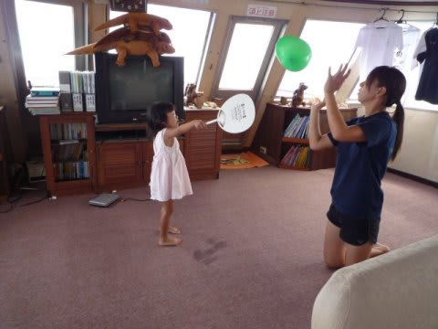
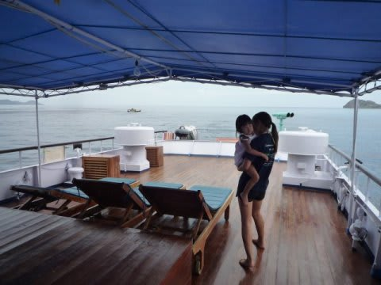
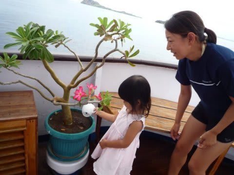
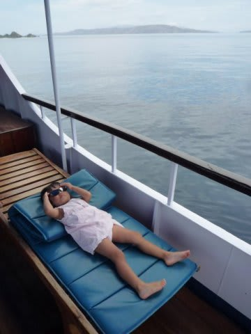
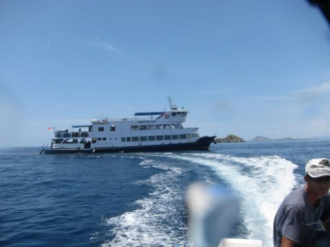
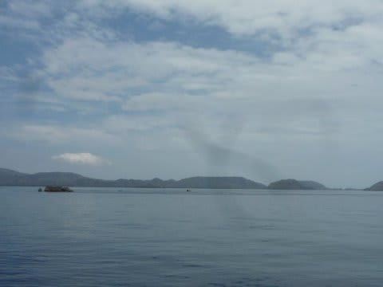
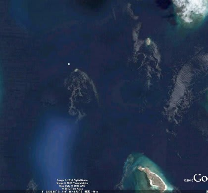
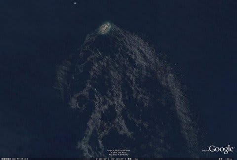

# コドモとコモド！子連れダイブクルーズ25　幸せの貸しきりダイブ！

📅 投稿日時: 2011-07-29 00:14:02

朝食中．

船は2本目のポイントへ向けて移動を続けています．

今日の予定は…移動が終わって2本目ダイビング終了後，

さらに移動してコモドドラゴンを見に行く予定になってます．

ということで．今日は移動が続くので，

昨日までのように各ダイビングの間，スペシャル貸切ボートを

出してもらうのは無理だろうなぁ…

と思っていたところ．

K澤さん「2本目終了後，スペシャルボート出しますよ」

えええええ！！！

いいんですか？

コモドドラゴン見に行くの，間に合うんですか？

K澤さん「大丈夫でしょう」

ををを！

ありがたや！

というわけで．

本来なら，2本目終了後直ちに移動せねばならぬところを，

スペシャルボートを出してくれることに！！

で…

今回は．

次のダイビング…つまり，みんなが2本目を潜りに行く時に

妻が潜りにいき，

その後の貸切スペシャルボートは私が潜りに行くことに．

やったー！

一人貸切ダイブだー！

10時前に2本目のポイント近辺に到着しました．

みんな，ダイビングの準備に向かいます．

娘がK村さんと遊んでいるうちに…

妻もこっそりダイビングデッキに抜け出すことに成功．

そう．いつもは妻が木村さんとマンツーで潜りに

いってたけど，今回は私が貸切ダイブなので，

K村さんと私が船に留守番．

娘はK村さんと遊んでもらってご機嫌．

楽しそうに過ごしてます．

いろいろ船の中を巡って…

ご機嫌のまま，妻がダイビングから戻ってくるまで

すごしてました．

妻が戻ってきたので，すぐ入れ替わりで私がダイビングへ．

K村さんと二人でボートへ乗り込み，二人っきりでのダイビング！！

このポイント．

Batu bolong．

コモド島とリンチャ島に挟まれた海峡の中にぽつんと

浮かんだ島で．

ものすごい流れがぶつかります．

島の周りに，船の航跡のように波が広がってます…

島の右側に，流れがぶつかった波が流れているのがわかるでしょうか？

ちなみに，Google Earthで見るとこんな感じ．

上空から見てもすさまじい流れがわかるという，

すげー恐ろしいポイントです．

んで．

さすがにこの流れの上流には入れないので，

（二度と浮上しなくていい覚悟なら潜れるかも…）

命が惜しい一般人は流れの下流側に潜ります．

流れによって，スロープが急な北側，

ゆるい南側のどちらかに入るわけですが．

私はゆるい側が好きなんですけど…

今回は北側にエントリー．

とりあえず．

幸せの貸切ダイブへ，Go！
