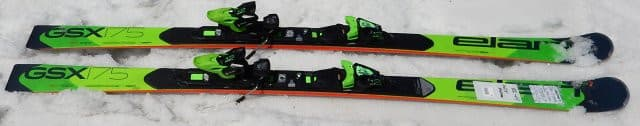
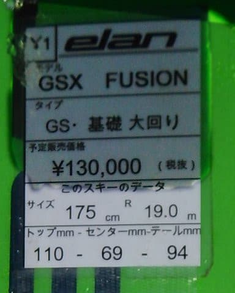
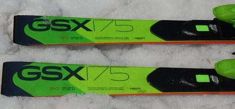

# 2019シーズンのスキー板，試乗レポート最終回…ELAN編その２

📅 投稿日時: 2018-06-22 00:43:51

🏷️ カテゴリ: [スキー板試乗](c0bd8048615710cee890e403a36cc9a2b.md)

という感じで．

この週末の月山をもって，

私の2018スキーシーズンは終了したわけですが．

…このBlogは，あくまで「徒然スキーヤー日記」であり．

決して，「徒然ドライバー日記」や

「徒然ダイバー日記」ではないので．

まだスキーネタが続きますよ～！

…「徒然ドライバー日記」の方が人気が出そうな気配があるけど…（ちょっと涙）

ってなわけで．

本日はスキー試乗レポート．

今回が，2019年シーズンのスキー板試乗レポートの

最終回になります…

ラストはエラン編．

ELANのGS板です．

では，どうぞ～！

--

○ELAN GSX FUSION 175cm

GS競技＆基礎大回り用

ELANのGS用セカンドモデルで．

基礎用大回りとしても使える，この板．

175cmでR=19mと，ゲレンデ大回りとして

ちょうどいいくらいのRの板ですね…

履いてみたところ．

結構柔らかく感じます．

良くたわむし，軽くて動かしやすい．

柔らかくたわんでいくので，R=19という印象より

ラディウスが小さく感じ，

比較的小さめの中回りまで行けます．

そこそこグリップはするものの，

ガッツリグリップ系には感じないです．

エッジの仕上げのせいかな？

固い斜面でちょっと板が流されるように

感じることも…

谷回りの捉えも優しめで，谷回りは

ガッツリとらえて自動で回り始める…というより，

谷回りで動かしていく板のように感じます．

ガチのGS競技用板と比べると，そんなに重くないし，

競技用GS板とは思えないほど，荒れた斜面でも

優しく感じる板で．

比較的穏やかなロングクルーズ板としても

使えそうな板でした．
