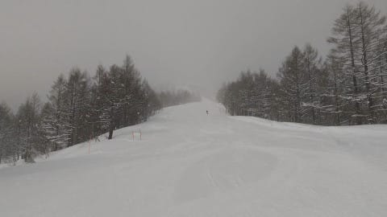

# 2月27，28日の週末の志賀高原スキー場の天気は…土日とも雨にはならずに済みそうな予感

📅 投稿日時: 2021-02-25 03:44:41

ということで．

本日は貴重な特派員である，レインボーさんが

お休みで．

もう一組の平日志賀特派員も長期不在という

危機的状況なのですが．

本日も志賀高原には，運よく他の特派員が

参戦していたようです！

ってなことで．

本日の志賀高原特派員レポートから

参りましょう！

えー．

雪予想だった本日．

意外なことに，焼額は朝は青空も

覗くほどの天気で…

気温も-11℃と冷え冷え！

そして，圧雪コースも10cmほどの

積雪があったようで…

それも，冷え冷え気温なので，気持ちいい

軽い雪がゲレンデ全面を覆っていたようです！

だもんで，月曜までの高温で融けた雪が

固まった，硬い下地も隠れてくれて…

なんとも気持ちいいバーンだったようです！

写真だけ見ていると，なんともうらやましい

バーン状況に見えますね…

意外と人は多かった…ということですが．

写真を見ると誰も写っておらず．

こんなバーンを貸し切りで滑れるなんて，

うらやましすぎる…

結局，昼間になっても-10℃近い冷え冷え

気温が続き．

そのせいで雪質は良かったようですが…

午後になると，GSコースはちょっと荒れて

来たようです…

まぁ，それでも雪は軽そうだし．コブコブに

なるほどではなかったようで…

むしろそれより，午後になると日が隠れ，

また雪が降り始め，結構寒かったらしく．

この日の午後は，

根性の無いスキーヤーふるい落とし機能

が起動したようです…

とはいえ．

根性にあふれる某特派員は，

「雪が良すぎて帰れない」

という，どこかで聞いたことがあるような

迷言に近い言葉を残し，ラストリフトまで

滑っていたようです…

ってなことで．

この特派員からは，

「明日の木曜はねらい目！」

ということでしたので．

今日までの雪で，日・月の高温でやられた

状況から，一気にゲレンデは回復してくれた

ようです…！

…ということなので．

この回復してくれたゲレンデが，果たして

27，28日の週末までもってくれるのか？？

水曜定番の，週末までの天気予想を

やってみましょうか…

まずは25日(木)の850hpa図を見ると．

志賀高原には水色の-6℃線がかかるほど

なので．

朝は-10℃程度のスタート．昼間も-5℃程度

までしか上がらない，いい感じの冷え冷え

デーになりそう．

そして，この日の地上天気図を見ると．

うん．

高気圧に覆われるので，朝はちょっと

雪がぱらつくかもしれないけど，

この日はいい感じで晴れそう！

…これは，25日はかなりのねらい目

の一日ですね…！

そして，翌26日(金)の850hpa図を見ると…

この日は志賀にかかっているのは水色の-3℃線．

前日の25日ほどは冷えなさそうだけど…

この日は最高気温もしっかりマイナスを

キープして，冷えてくれますね．

そして，地上天気図を見ると…

降水域は志賀の東西，中国～近畿と

東北～北海道にかかっているものの，

志賀高原にはギリギリかかっておらず．

この日は雲が多いものの，降らずに

済みそうな予感…

で，肝心な27日(土)の850hpa図を見ると…

おっと．この日は水色の-9℃線が志賀高原に

かかってるのかな？結構冷えそう！

そして，地上天気図を見ると…

うーむ．

降水域は志賀高原にギリギリかかってない

感じですかね…

27日土曜は朝は曇り空かな？

でも，高気圧に覆われて昼間は晴れそう．

そして，28日(日)ですが．

850hpa気温は…なんだか微妙ですね．

赤い0℃線が，北海道の北まで上がって

ますが，関東近辺が0℃線のエリアに

囲まれてます…

そして，地上天気図は．

ギリギリ降水域が志賀にかかる程度．

うーん．

でも，この天気図の形なら，この日は

志賀高原は降らないんじゃないかなぁ…

ってなことで．

まとめると．

25日(木)：朝は曇り～もしかしたら雪が

　ぱらついてる？

　でも，すぐに晴れて，この日は

　基本的に晴れそう．

　朝の気温は-10℃くらい．昼間も

　-5℃程度と結構冷え冷え．

　あさイチは前日の雪が圧雪された，

　最高のシマシマバーン．

　昼間も雪は緩まず，冷えてるのに

　晴れている，かなりいい感じの

　一日になりそう

26日(金)：終日曇り空かな？

　朝は-8℃程度，昼間も気温が上がらず，

　-5℃以下をキープしそう．

　この日も一日冷え冷え，雪質は

　良さそう．

　ガスさえ出なければ，曇り空

　ながらも冷え冷えで雪も良く，

　楽しめそうな一日．

27日(土)：朝は曇りかな？

　でも，昼間は晴れそうな感じ．

　朝は-10℃近く，朝イチはいい感じに

　締まった冷え冷えシマシマ！

　昼間も晴れているのに-5℃程度

　までしか上がらず，しっかり

　締まったいい感じの冷え冷え

　バーンを晴天のもと滑れる，

　いい感じの一日になりそう…！

28日(日)：この日の天気は…

　まだ読みにくい．これから予想天気図は

　かなり変わりそうな予感．

　今のところの予想では，朝は-5℃．

　朝のうちは晴れそう．

　あさイチはこの日も締まった感じの，

　スピードが出そうな冷え冷えバーン！

　昼間に向かって気温が上がり…

　雲が増えていくかな？

　最高気温は0℃をちょっと上回る

　くらいか…

　でも，この日も終日雪質はよく，

　締まった感じのいいバーンを滑れそう．

…って感じでしょうか．

これから週末まで，ほとんど

積雪はなさそうですが，

これから週末まで冷え冷えは

続いてくれるので，週末もいい雪で

滑れそうです！

…とりあえず．

槍やミサイルは降らなさそうなので．

今週末，志賀に行ける方はお楽しみ

ください…

PS.今の予想だと，週明けの1日も

液体が降る危機はなさそうな

感じになってきました

## 💬 コメント一覧

### 💬 コメント by (レインボー73)
**タイトル**: Unknown
**投稿日**: 2021-02-25 16:51:23

木曜日の湯田中情報？

湯田中の川沿いにある、保険診療でも長く揉んでくれる『いくたま整骨院』でしっかりマッサージを受け、温泉でゆっくり温め、円筒型のピラティスポールで背筋を伸ばしたおかげで、日常生活ができるようになりました。

槍やミサイルが降るなら、明日までにお願いします。

今日滑った友人によると、全く良かったとのこと。

エス様のお気持ちが、はじめてわかりました。たったの２日でも耐えられないのに。

### 💬 コメント by (Skier_S)
**タイトル**: ＞レインボー73さま
**投稿日**: 2021-02-26 00:06:28

腰，落ち着いてきたようで良かったです…

明後日からゲレンデ復活ですね！

…こちらは1か月を大きく超えるスキー禁断期間，人間ダメになっていくのが

良く分かりました…

