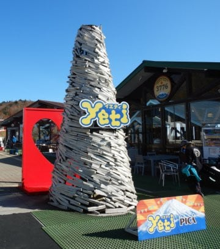

# 2021シーズンスタート！オープン翌日のイエティの状況＆コース動画

📅 投稿日時: 2020-11-01 02:08:54

ということで．

今日，無事イエティで

2021シーズンのシーズンイン

を果たしてきました～！！

いや…ついにシーズンインです！

ってなことで．

今日も帰宅が遅いので．

コース動画と速報レポートで，行ってみよう！

今シーズンから営業開始が1時間遅くなり．

休日は9時オープンになりましたが…

リフト券売り場は結構混むので，

早めに行くことをおススメ…

今日は15分ほど待ちました（涙）

そして…

あさイチのゲレンデはガラガラ！

うはーーー！

雪だ！

久々の雪だ！

朝のうち，1時間ほどはリフトも

それほど混まず，待ち時間も短く．

コースも適度に飛ばせる，

快適な人口密度で．

例年のオープンより2週間ほど遅めで，

気温も低め．

かつ，コースも作りたてなので…

雪も厚く，滑りいい感じ！

だけど，営業開始から1時間もたつと．

人も増えてきて…

コース上の人口密度も上がって，

滑りにくくなっていき…

そして．10時過ぎには…

リフト待ちが，ラストの急斜面の中間

くらいまで伸びるという混雑状況…（泣）

まぁ，密を避けるために

なるべくグループ外の乗り合いを

避けるため，搬器の乗車率が低いので，

人がそれほど多くないうちから

混んじゃう感じ…

（グループ外の乗り合いは絶対禁止！

　というほどの制限ではなかったですが…）

でも．

10時半過ぎにクワッドと並行するペアリフトが動き出して，

リフト2台体制になったので．．

クワッドの待ち時間は，終日大体こんな

感じでした…

ブルーのペアリフトは，

終日待ち時間なしで乗れましたよ！

とはいえ，コースの人口密度は

だんだん上がっていき…

なんだか，滑るのが厳しい感じに（涙）

でも．

シーズンオープン時にしっかりとした厚みで

雪が作られていて，まだそれほど雪は

蹴散らされて無い感じなので．

コース上で土が出ていたのは，

最後の急斜面のこの1か所だけで，

あとは穴が開いているところは無く．

ちょっと凸凹していたものの，

雪はまともだったのが良かったかな．

あ，今日は気温が低めだったので，

雪は終日結構良く滑りました．

…そうそう，日が射すと暖かいけど，

日が陰ると寒い感じなので．

昼間は，薄手のジャケットでもいい感じ．

ナイターはしっかり防寒の効いたウェアの

ジャケット着た方が良い寒さです．

そして…午後の方が人が増えていく，

このスキー場．

15時にブルーのペアリフトが営業終了に

なったのですが．

そのあとがリフト待ちが最高になり，

待ち時間10分ほど…（涙）

相変わらず，夕方の営業終了直前が

一番混む，謎のスキー場だな…

そして．

初日からいきなり，ナイターも参戦！

最初の2本は気持ちよかったけど…

夕方と変わらないレベルの超絶

リフト待ちだったので，今日は

早々に退散しました…（泣）

気温が低めなので，雪自体はドロドロの

穴だらけ…ってことは無いのですが．

やっぱりコースが狭くて，混んだ一日でした（泣）

明日日曜も混むと思います…

コースの混雑状況＆雪の状態が分かるよう，

いつも通りコースの動画を載せておきます！

…そして．

今日は午後6時から，なぜかYetiで花火を

打ち上げるというイベントがあり．

30分程度の結構長くて本格的な

花火を堪能できました…！

ここ数年で見た，一番本格的な

花火だったなぁ…

余力があれば，明日詳細レポート

やります～！

## 💬 コメント一覧

### 💬 コメント by (ゆーき)
**タイトル**: Unknown
**投稿日**: 2020-11-01 08:27:01

乙でした

見てて、いきたいなーと思いつつ、

動画を見る限り、

ボーダーばかり、

とくにその中でも、

クソみたいな滑り方するやつらばかりで、

やっぱヤメってかんじになりましたｗ

### 💬 コメント by (西舘)
**タイトル**: Unknown
**投稿日**: 2020-11-01 09:18:53

おめでとう、おめでとうございます、ついに、ついにオープン開幕ですね！苦節180日頑張りましたね、良かった、ほんとーに良かった\(°∀°)/

息子が狭山へ行くのはスキー＆スノボ人工増計画でして、友人知人を誘って誘って、安くて質の悪いスキーツアーへ未体験者を誘い出してせっせと教えた昨シーズン、その中の1人が志賀高原へも連れ出せたのですが、その彼が楽しかった、ご飯も美味しかった、幸せ！と口コミしてくれたおかげて今シーズンは7名連れ出せそうなのです。凄いでしょ

で、11月中旬にいきなり志賀高原へ誘っても誰も連れ出せないけど狭山なら関東圏の新たな友人が行ってくれそうで、それが刺激になって志賀高原へ連れ出せるかも。

ね、ね、凄いでしょ頑張ってるでしよ、ほめてやって

### 💬 コメント by (アリス)
**タイトル**: 初滑走
**投稿日**: 2020-11-01 15:15:34

Skier_S様

シーズン初滑走おめでとうございます。

動画拝見しました。

ほとんどがボーダーばかりなんですね。

それにしても、あの狭いコースでターンのスイッチを頻繁にやってるボーダー・・・・危険極まりないですね。

### 💬 コメント by (Goku)
**タイトル**: Unknown
**投稿日**: 2020-11-01 20:52:59

シーズンインおめでとうございます。

Sさんにしたら、やたら長いシーズンオフだっただけに、うれしさもいつもより倍増ですね(^^♪

私も3日の軽井沢でシーズンインです。

再来週には横手、熊がオープン予定ですので、志賀でお会いできるのを楽しみにしています。

### 💬 コメント by (しんちゃん)
**タイトル**: 祝！シーズンイン
**投稿日**: 2020-11-02 00:07:46

シーズンインおめでとうございます。

withコロナの今シーズン、ゴンドラやリフト待ちは覚悟しなきゃいけなさそうですね（涙）

今シーズン、けが・事故なくいきましょう!!

### 💬 コメント by (レインボー73)
**タイトル**: Unknown
**投稿日**: 2020-11-02 11:33:34

イエティって恐ろしいですね。あれだけ狭いコースで、ボーダーがあんなにいて、怖くて私には無理。一瞬心が動かされかけたけど、よかった、遠くて。気をつけて楽しんでくださいね。

### 💬 コメント by (Skier_S)
**タイトル**: 回答遅くなりました．昼休みに更新！
**投稿日**: 2020-11-02 12:41:10

＞西舘さま

ついにシーズンスタートです～！

息子さん，すごい！着実にスキーファンを増やしてますね．偉い！！

その勢いで志賀高原ツアーを開催してください！

＞アリスさま

いやー．

ボーダーはああいうグラトリを楽しむ遊びだと思って，

暖かい目で見守ることにしています．

上手く共存しないとやっていけないですから…

なるべくボーダーとは距離をとるのがお互いのための安全策です(笑)．

＞Gokuさま

やたら長い分，なんだか逆にもう少し長くても

誤差だな…と思っちゃうほどです(笑)．

もう，志賀オープンまで2週間切りましたね！

また志賀でお会いしましょう～！

＞しんちゃんさま

リフト待ちは，やっぱりこれまでより長くなる覚悟が要りそうです．

イエティは年齢層が若いからか，コロナの影響で外出を控える

人も少ないのかな…？

年齢層が高いスキー場だと，外出や宿泊を避けるため，

人出に影響しそうですが…

＞レインボー73さま

いや…

志賀に慣れている人は，おそらくイエティは耐えられないと思います．

あそこは，いろいろ終わった中毒患者が行くところで，

健全なスキーヤーは行かない方がシアワセです…

