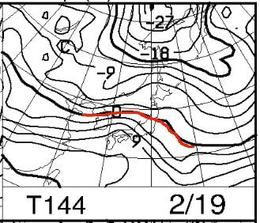

# 2月16，17日の週末の志賀高原スキー場の天気は…土曜は終日雪がぱらつく冷え冷え，日曜は朝は雪がぱらつくものの，終日曇りで，時折晴れ間も

📅 投稿日時: 2019-02-15 02:39:56

🏷️ カテゴリ: [スキー天気予想](c6554f5c3c106093b511a8daae23757e8.md)

ってなことで．

昨日は帰宅後死んだように寝てしまったので．

本日は一日遅れの天気予想，行ってみよう！

…とりあえず．

週末の予想の前に，15日の金曜の天気ですが．

この日は，冷え冷えの晴れになりそうな予感…！！

あさイチはトップシーズンの最高雪質の圧雪で，

冷え冷え晴天＆ガラガラだから．

終日最高のコンディションをキープして．

…で，天気も晴れるので．

最高だろうなぁ…

あぁ…金曜に滑れる人がうらやましい…

ってことで．

15日の金曜は積雪の積み増しはありませんが．

14日までに，そこそこの積雪の積み増しが

あったので．

この週末は，一部急斜面を除いては，

それほど致命的なカリカリアイスバーンに

なることは無いかと思います…

という感じで．

まずは，16日土曜日の850hpa気温を見てみると…

ふむ．

志賀高原には，水色の-6℃線が近づきつつ

あるので．

朝は-7～8℃程度でスタートかな？

地上天気図は…

水色の降水域が志賀にかかっているっぽいので．

この日は，朝から終日雪がぱらつく一日かな…

ただ，本格的な降りにはならず．

朝までの積雪は，せいぜい5cm程度．

昼間も降り続けますが，昼間だけで

5cmくらい積もるかも…

そして．

17日日曜の850hpa図を見てみますが．

この日は，水色に塗った-9℃線が近づくので．

朝の気温は-10℃を下回りますね…！

昼間も-5℃を上回らない，冷え冷えの一日に

なりそうです！

で．

この日の地上天気図は…

うーむ．

かすかに降水域が日本海側に

かかっていますが．

雪が降るのは朝だけかな…

リフト営業が始まるころには

雪が止んでいて．

昼間は曇り空．

昼ごろには，時折晴れ間も見えて．

それから曇ったり時折晴れたりだけど，

午後には晴れの率が上がっていく感じかな～．

ってことで．

まとめると．

16日土曜：朝までに，うっすら5cm程度の積雪があるかな．

　朝の気温は-7～8℃程度でスタート．

　圧雪バーンはトップシーズンらしい柔らかめの圧雪．

　朝は圧雪の上に，うっすらかすかに新雪が乗っているか…

　この日は終日雪が降ったりやんだり．

　お日様は拝めない．

　昼間もほとんど気温が上がらず，最高気温も-5℃程度．

　昼間も雪がうっすら積もるほど降りそうなので．

　トップシーズンの冷え冷えのいい雪が午後まで続き．

　いい感じの一日かも…

　ただ，夕方は，急斜面だけはちょっと凸凹してきて，

　下地の硬いのが出てくるかもしれないけど．

　急斜面以外は終日いい感じの雪が続きそう！

17日日曜：朝までは雪がちらついているけど，積雪はほとんどなさそう．

　朝の気温は-10℃を下回る，冷え冷えの朝！

　リフト営業が始まるころには雪が止み，朝イチは

　最高冷え冷えフラットバーン！

　昼間は曇り空だけど，

　昼前から，時折晴れ間も見えてはじめ．

　それから曇ったり時折晴れたりを繰り返すけど，

　午後には晴れの率が上がっていく．

　午後までゲレンデはフラットだし．

　午後は日も射しそうだし．

　日曜はかなり恵まれたコンディションになりそう…

ってな感じで．

この週末も，トップシーズンの志賀らしい，

冷え冷えのいいコンディションになりそうですが．

…ですが．

…

…

…何じゃこりゃぁ！！！？？？

赤矢印で示した，16日以降．

高温が続き．

…22日以降は，平年比+5℃の日が2週間くらい

続きそうなんですけど！？？？

平年比+5℃が2週間続くって…

異常気象レベルなんですけど！！？？？

この図の赤く丸をしたところを見ると．

平年比+8℃を超えるところにまで

線が引かれているので．

…平年比+8℃を超える可能性もあるってことですね…（泣）．

そして．

2月23日から3月1日までの一週間平均を見てみると．

赤い0℃線が志賀高原近辺にいますよ！？？

2月下旬の一週間平均で，こんな0℃線が北に

あったのは，見たことないですね…．

これは…志賀高原でも降れば雨の可能性が

高いんですが！？？

そして．水色で塗った，平年比+5℃のエリア．

ここに志賀高原がすっぽり入っているので．

志賀高原，平年比+5℃くらいに気温が上がっちゃいますね…（涙）

でも．

とはいえ

先々週の予報がこんな形で．

先週の予報がこんな形．

そして，今週はこんな形で…

全然予想が違います．

例えば．

全ての図の9日から16日までの部分を

見比べると，まったく形が違ってます．

だもんで．

…この予想，精度があんまり高くない

感じですね…

しかし．

冷え冷え祭りは17日までで終わりそうな

感じではあります…（涙）

例えば．

19日の予想図を見てみると．

うむ？？0℃線は志賀より北まで上がっちゃった！？？？

そして，西から降水域がひたひたと迫っているので…

…19日，また雨か…！？？（涙）

うーーーむ．

この週末が終わったら．

しばらくいい雪で滑れる週末は，来ないのかも…（心配）

## 💬 コメント一覧

### 💬 コメント by (金曜に（も)滑れる人)
**タイトル**: Unknown
**投稿日**: 2019-02-15 16:36:26

いよいよ週末が近づきましたね。今日は（いつものことだけど)絶好のスキー日和でしたよ。そしてPP争いも制したはずだったんですが、安心して大回りを楽しんだのがいけない。掛け声とともに、ちょっかりの青い物体に抜きさられました。恐るべし本多ご夫妻。

加藤ご夫妻とも、つーちゃんさんともご一緒できました。でも今は珍しく幸せではありません。歯を抜かれてぐったりしています。明日は都合で奥志賀二時間でエンドです。道中お気をつけて。

### 💬 コメント by (Skier_S)
**タイトル**: ＞金曜に（も)滑れる人さま
**投稿日**: 2019-02-15 22:32:41

おそらく，今日は天気も雪も良くて最高だったんじゃないでしょうか．

明日は奥志賀スタートで，奥志賀オンリーなのですね．

こちらは焼額滑ってますので…

お会いできたとしても日曜でしょうか．

明日は雪降りっぽいですが，今週末も雪は良さそうです．

