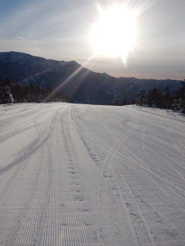
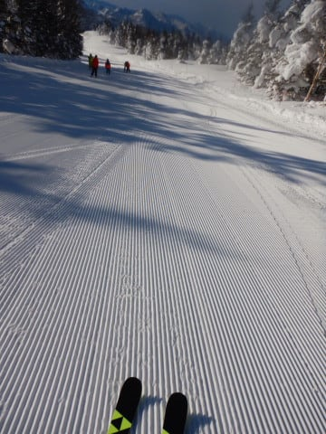
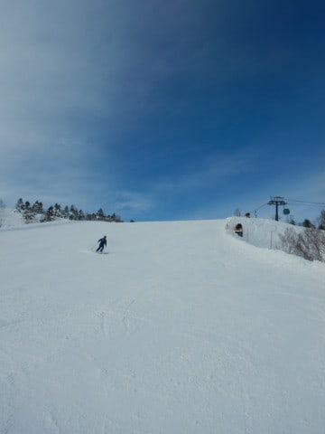
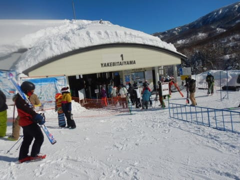
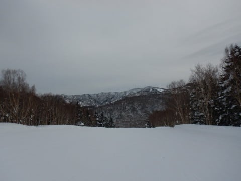
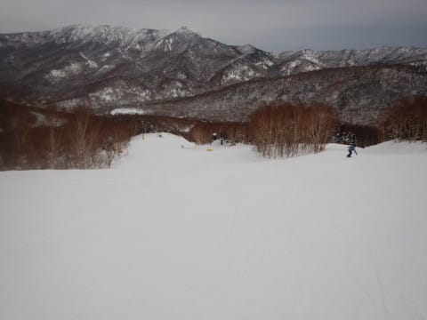
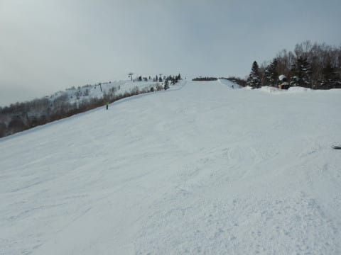
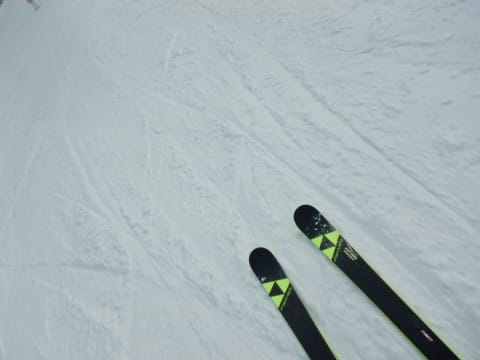

# 2022/1/23(日)の志賀高原焼額山スキー場速報レポート！…朝は最高晴天ピカピカバーン！午後は曇り空．それほど混まず雪もいい感じ！

📅 投稿日時: 2022-01-24 01:39:30

えー．

誰かさんはこの記事を投稿したつもりだったのに．，

下書きのままにしていて，投稿されて

いなかったという事態だったようで…

ちょっと遅れて投稿！

せっかく頑張って昨日の夜2時前に

書き上げてたのに…(涙)

以下，昨日の夜中に書いてた記事です~！！

ーー

ってなことで．

本日も当然のごとく，しっかり営業終了まで

滑ってきたので．

洗車やらなにやらして帰宅したのは，

もう深夜12時すぎ…(涙)

土曜は睡眠3時間で出発し．

昨日も6時間ほどしか寝ておらず．

そして，しがない勤め人としては，

明日も朝から仕事をしなくては

ならず．

今日は早く寝たいので…

本日の志賀高原レポート，日曜恒例の

速報モードにて！！

えー．

予想通りのすっきり晴れで始まった本日．

今日も朝イチは，見事な焼額クオリティの

フラットぴかぴかシマシマバーン！！

昨日はかなり柔らかい圧雪だったけど，

積雪が無かった本日は，締まり気味の

スピードが乗るシマシマで．

今シーズン間違いなく最高クラスの

シアワセ圧雪！！！

そして，朝のうちは人も少なく，

日が射す明るいゲレンデを思う存分

かっ飛ばせる，快楽バーン！

今日もゴンドラ待ちは少なく，

最高でこのくらい．

ゲート外まで並ぶのは，午前11時台に数回

あったかな？

昼を過ぎると，タイミングによっては

搬器1-2台待ちで乗れるくらいのガラガラさ…

いやーー！！

今日も天気最高だねっ！！

と，晴天のバーンを滑っていたら…

残念なことに，午後2時ごろには曇り

空になってしまいました(涙）

でも，午後になるとさらに人口密度も

低くなり，バーンはスキーヤーで凸凹に

されることもなく，午前中と同じ

フラットバーンをキープし続けて

くれました…！

いや．

しかし．

ホントに人がいない…

ってなことで．

今日もラストまでいい雪質をキープしてくれて．

凸凹になってないので，最後まで大回り

板で滑り続けたのでした…

いやー．しかし．

午後は惜しくも曇り空だったけど．

昨日に引き続いて今日も，雪が良くて，

人も少なくて，バーンがあれていない

という3拍子揃った，いい一日だったのでした…

良かった．

今週末も良かった…

そして，明日は南岸低気圧が近づいてきますが．

志賀高原はほとんど雪が降らなさそうです…

これからしばらく，あんまり雪は降らなさそう．

また明日，日曜の詳細レポートやります～！

## 💬 コメント一覧

### 💬 コメント by (ikkun)
**タイトル**: Unknown
**投稿日**: 2022-01-24 12:36:22

お久しぶりです❗またまたコロナが😢団体さんヤバいです😢査定二日間久しぶりの晴れでした富士山も見れた二日間でした「どんな講習でも受けられる様にって言われてどぎまぎしたのですが「当てにされているかも？」と思えるのはとりあえずです

収まり始めて団体さんもと願うばかりです

大雪を忘れる………青空にはなりませんよ

毎日雪と闘っています」

### 💬 コメント by (新米パパ)
**タイトル**: Unknown
**投稿日**: 2022-01-24 13:54:41

お疲れ様でした。

四時過ぎにイチゴン駐車場の○南ナンバーのスバルをお見かけしましたが、御本体を拝む事はありませんでしたね。

奥志賀と唐松メインでチビが回してました。最高の二日間でした。

帰路で洗車しちゃうんですね。ふむふむ。

キャリアー付きでもやれる洗車機を探すところから始めないと。

### 💬 コメント by (northfox)
**タイトル**: Unknown
**投稿日**: 2022-01-24 15:12:11

今シーズンは午後になっても驚くほどバーンコンディションの良い日が多いですね。

昨日は体調が崩れて早上がりせざるを得なかったのが無念です。ご馳走様を食べ残したようで勿体無いオバケがでますね。。。😅

（一晩寝たら体調はスッキリ回復したのて、尚更勿体無かったです）

### 💬 コメント by (レインボー74)
**タイトル**: Unknown
**投稿日**: 2022-01-24 20:51:31

月曜日の志賀高原情報

朝の上林-1℃　蓮池-6℃。

だんだんと晴れてきて、気温は全く上がらないスキー日和。

やけびをひたすら回し続けたけど、ずーーーっと、快適維持の一日でしたよ。

幸せすぎて、レインボーぎりぎりまで働いてしまいました。こんな日のために生きているんだと、実感できた一日でした。幸せすぎます。

### 💬 コメント by (Skier_S)
**タイトル**: これから一週間はドカ雪もないけど一日すっきり晴れもなさそう
**投稿日**: 2022-01-25 00:42:57

＞ikkunさま

そうなんです…コロナが怖い．

今シーズンの志賀高原，修学旅行生が戻ってきていたのに，

またキャンセル続出のようで…経営が心配です．

＞新米パパさま

この週末も最高の週末でしたね！

私は帰り道の途中のセルフ洗車機のガソリンスタンドで洗ってます…

ルーフボックス乗せたまま入ってますが，屋根は洗えないものの

なんとかなってます．

＞northfoxさま

週末はいろいろお疲れ様でした～！

昨日は夕方は曇ってきたので，まぁあの時間で上がっても

良かったのかも…

＞レインボー74さま

今日まで晴れましたが，明日から曇り～雪がぱらつく日が続きそうです．

でも，最近はコンディションがいい日が続きますね…

