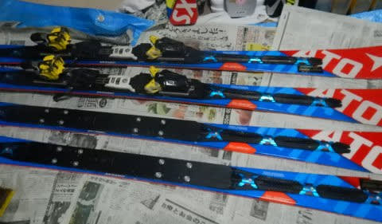

# あれ？ATOMIC Bluester SXの三郎君が…早くも，来たか！？？？

📅 投稿日時: 2020-01-17 02:25:25

えー．

本日朝，志賀高原は20cmの積雪があり．

さらに天気も良かったみたいで．

焼額特派員からもレポートを受け取って

いますが．

今日の焼額．

すごく良かったようですね…

あぁ…こんな日に私もすべりたかった…

まぁ．

これから雪が降らないながらも，

週末まではそこそこ冷える日が続くので．

この週末は，コンディション結構良さそう

です…！

ってなことで，本題へ．

えー．

数年前からこのBlogを読んでいる方は

知っていると思うのですが．

ATOMIC Bluester SXをかなり気に入った私は，

一体何をとち狂ったのか，[保険金](ed868696918a40419c43706429d5d8193.md)や，

[値段間違い](e8f6f10c51443780808e48b1f54c3ed5b.md)による超バーゲンプライス

など，いくつかのトラップにはまってしまい．

気が付くと，'16モデルと'17モデルのSXを

合わせて4セットも買ってしまっていたわけですが．

…いや．

間違えました．

同じ板を物置に置いておいたら，

[勝手に増殖した](e8a53c5e38b2ebcf1a084dc391aaad69d.md)わけですが．←違うから

一郎君はすでにドナドナされており，

二郎君はYetiなどで使う，石ころ踏み用の

板として頑張ってもらっていて．

今，トップシーズン用として現役で

活躍しているのは，’16SXの三郎君．

昨シーズンの2月に，メインマシンの座を

二郎君から奪った三郎君．

今シーズンは，11月末の熊の湯から

三郎君に出動してもらっています．

で．

雪が少なかった今シーズン．

あさイチをロング板でかっ飛ばせるような

機会がなく．

ずっと小回り用のSXばっかり

履いていたのですが．

…正月休みの12月31日になって，

ようやっと，大回り板でかっ飛ばせる

コンディションになってくれたので．

やっとロング用のX-RACEを，

今シーズン初出動！！

いやーー．

175cmのR17のX-RACE．

ガッツリしっかりグリップして，

強い横Gが来るロングターンが楽しめるわ…

と，

あさイチのシマシマ快感大回りタイムを満喫して．

しばらく経って，雪も荒れ始め．

さらにゲレンデの人口密度が上がってきて．

…この状態で大回り板を履いていると，

殺人マシーンと化してしまうので．

小回り用SXに履き替えるわけですが．

で．

SX三郎君に履きかえて滑り始めたところ…

「うむ？？」

…こ，これは…っ！！！

なんだ？

X-RACEと，比べると，

この，マイルドなグリップ．

どこまでも頑張らない感じ．

そして，どうしようもなく板が

流れていき，板が全くこらえない

この感じは…っ！？？

いや．

SXってこんな板だった…

訳はない．

エッジも，しっかりギンギンに立ててきた

ばかりだし…

この板，[本来は](e27e2a7149d362e76794896614d0f18f3.md)

急斜面のオリンピックコースでも．

何の問題もなくX-RACEと同じスピードで

落ちて行ける板

のはず！！

…どうやら．

このSX三郎君．

みとめたくはないけど．

早くも，どうしようもないほど

マイルド化が進行していたようです（涙）

昨シーズンの1月末にデビューさせて，

昨シーズンは2月～GWまでの，実質3か月ちょい．

このシーズンも12月の1か月，

まだ，計4か月しか履いてないのに…っ！！

まさか，こんなに早く，三郎君がヘタるとは…っ！！！！（泣）．

やはり，[一郎君が4か月もたずして
逝ってしまいました](e27e2a7149d362e76794896614d0f18f3.md)が．

この三郎君も，まさか1シーズンもたずに

逝ってしまうとは…（流れ落ちる涙）

とりあえず．

まだ一度も履いてないSX四朗君．

今週末から出動要請ということで．

二郎君からの臓器移植（ビンディングつけかえ）を

行いました…

ってなことで．

今週末から，SX四朗君がデビューすることに

なりそうですが．

うーむ．

しかし，X-RACEから履き替えるまで，

ここまでヘタっているとは全く気付かなかった…

知らない方が幸せだった…

とりあえず．

相変わらず，私はスキー板をわずか4か月で

ヘタらせる，特殊能力を持っているようです…（涙）

こんな能力，いらんわ…

## 💬 コメント一覧

### 💬 コメント by (まーくん)
**タイトル**: Unknown
**投稿日**: 2020-01-17 07:14:18

そして4郎君に乗るとX-RACEに異変を感じるのであった...

なんてオチにはならないですよね！

### 💬 コメント by (Hide)
**タイトル**: Unknown
**投稿日**: 2020-01-17 07:42:14

S 様

さすがの能力です（笑）

青四郎君が出動したということは・・・

来シーズンは赤一郎君だ！

### 💬 コメント by (Goku)
**タイトル**: Unknown
**投稿日**: 2020-01-17 20:31:45

まーくん、鋭い！

絶対そのパターンですね（笑）

そして物欲選手権で大敗決定！

### 💬 コメント by (西館)
**タイトル**: 自分探しの旅の途中
**投稿日**: 2020-01-17 23:51:19

色々と教えていただいてありがとうございます。

慣れているSkier_S様でもお手入れは1時間以上掛かるのですね。

睡眠時間を削ってエッジを削る...ふへぇぇぇ流石でございます。

そして青四郎君出動ともうすぐ青五郎君が増殖すると。なるほどなるほど。

私が今履いている板は相棒君が10年くらい前に１シーズンだけ履いた板で、レディースの初～中級用なんです。もうね、今では無くなったタイプのビンディング着用してるんですよ。

昨シーズンまでの10年間ほどスピード重視の中級用板を履いていて、私でも80km/ｈ以上は出していました。

ですが、あまりにも重くてしんどくなってきたのと、テクニックを確認するのにゆっくり滑った方が良いかと思い、押し入れから引っ張り出してきて使い始めたのですが、なんだか飽きてきて、このままではずっと変化が無いような気がして。

しかも遅い、遅いのです今や60km/ｈ未満の人になってしまいました。

相方くんは昨シーズンからツインチップの板にして、今は飛んだり回ったりの練習中なのですが、さて、私はどんな滑りがしたいのであろうか。

板買う、買っちゃうもん！とまでは決心したもののどんな板が欲しいのかが分からない。

ショップへ行けばはっきりするのでしょうけどスキー代稼ぐのと志賀高原へ行くのに忙しくてショップへ行く余裕が無い。

飛ぶのは楽しいですが、相棒くんほどくるくる回ったり後ろ向き走行してみたいとは思っていないんじゃないかな、オールマウンテンタイプのオールラウンドが楽そうかな、とまでは思っているんですけど。

私は一体どうしたいんだ－、だぁ、だぁだぁ･･･（山に向かって叫びたい）。

ダイアモンドのレンタルで、板のタイプをチェンジするサービスがあるようなので、色々試してみようかな、と考え始めたところでした。

また色々と教えてくださいね。ヾ(*T▽T*)

### 💬 コメント by (Skier_S)
**タイトル**: 今晩志賀へ行くけど…あと2時間しか寝られない（涙）
**投稿日**: 2020-01-18 00:33:52

＞まーくんさま

…あ，その可能性があったか…

でも，X-Raceも3世代目のX-race Masterが，まだ

ほとんど履いてない状態でスタンバイしています．

今履いているのは，もう4シーズン目に突入する

2台目のX-Race.

もう1台バックアップがあるので，ヘタっても大丈夫…なはず←ホントか？

＞Hideさま

四朗君がいまデビューしたということは．

来シーズンいっぱい，四朗君がもつわけがないので．

やっぱり来シーズンは板を買わないと行けないのかも…

でも，来シーズン何を買うのかはまだ決めてません（笑）．

赤い板になるのかな？？

＞Gokuさま

いや．

やらない．

今シーズンは，物欲選手権はやらないぞ～（棒読みで）

＞西館さま

青五郎君はありませんから…（笑）．

とりあえず，どんな板がいいのか…というところについては，

試乗会に行くのがベストじゃないでしょうか．

志賀高原では，今シーズンも4月18，19日に一の瀬ファミリーでアルペンの試乗会をやるみたいです．

試乗会でいろんな板に乗って，ぜひ自分に向いている

板を探してみてください！

### 💬 コメント by (いちと)
**タイトル**: Unknown
**投稿日**: 2020-01-18 09:41:45

いつも拝見しています

今回は、面白過ぎでした！

### 💬 コメント by (べー)
**タイトル**: Unknown
**投稿日**: 2020-01-18 20:16:44

書きためてある物欲選手権はいつ頃UPされるのですか？(笑)

### 💬 コメント by (いか)
**タイトル**: Unknown
**投稿日**: 2020-01-18 21:21:07

ご無沙汰しています〜

私のSX三郎君も去年の2月頃に投入ですが、滑っている日数も少なく、今日XTと比べた感じではまだ大丈夫そうでした(笑) やはり黄色の16くんのほうがヘタるのが早そうですね。 

なお、こちら白馬村は雪も少なく、私の四郎くんの登板は来シーズンということに、、、。何シーズン、SXを履き続けることになるのでしょう？笑

### 💬 コメント by (Skier_S)
**タイトル**: 何かを期待されている気がする…
**投稿日**: 2020-01-18 22:44:48

＞いちとさま

コメントありがとうございます～！

そして，いつも読んでくださって感謝です！

…面白く読んでもらえたなら良かったです．

引き続きご愛読のほどを～！

＞べーさま

いや…書きためてません．

物欲選手権，開催されていませんから！！

＞いかさま

やはり，16SXは，17SXの半分くらいしか持たない感じです…

16SXの三郎君は，全然ダメです．

こわいくらいヘロヘロになりました．

17SXの次郎君は，そこまでへたらなかったのに…

そちらの四朗君投入はまだですか(笑)．

志賀は雪がたっぷりとは言いませんが，ブッシュなく

快適に滑れるほどはありますよ～！！

