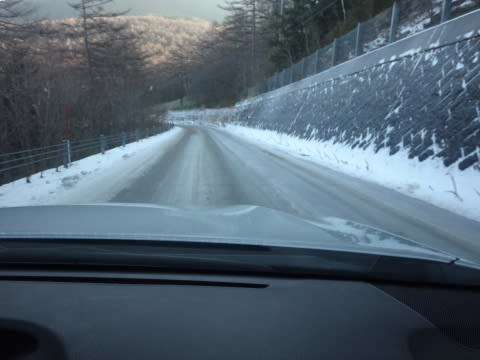
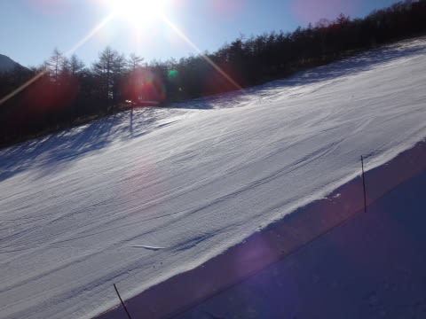
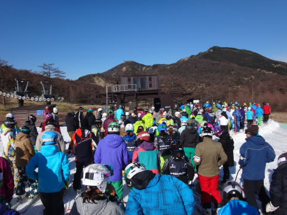
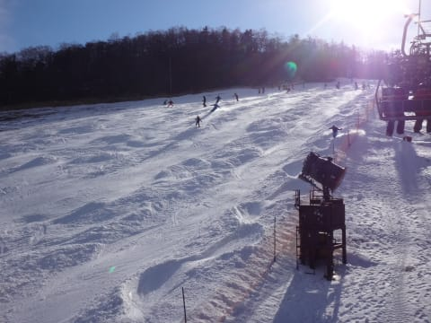

# 3連休最終日…11月24日のアサマ2000の速報

📅 投稿日時: 2014-11-25 00:22:01

えー．

今日もいろいろあって．

ちょっと夜遅くなったので，速報モードで…

一昨日から中1日で，今日も再びアサマ2000に舞い戻ったわけですが．

…道路は相変わらずの積雪状態です．

んで．

朝から天気も良く．

朝イチは…

うほほほ！

シマシマ！

…でも．

なぜか今日は．

初日よりも，かなり混みました…

朝9時から昼前まで，5分から，最大10分近い待ちが続いたでしょうか…

さらに．

天然雪がない3日間だったので．

雪はだんだん固くなっており…

昼には，小回り道が完成です…

午後はこんな感じの荒れ荒れのゲレンデでした…（涙）

でも，さすがにこんな楽しくないコンディションの

午後は，リフト待ちほぼ0になりましたけどね～．

また明日，詳細レポートしますので！
