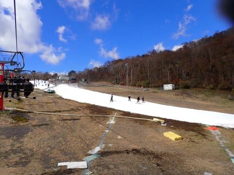
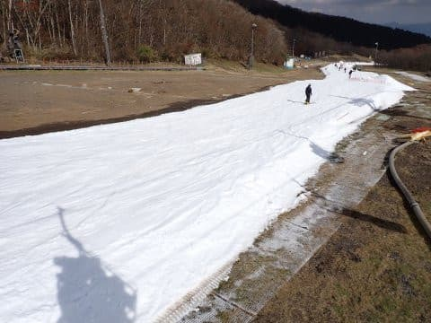
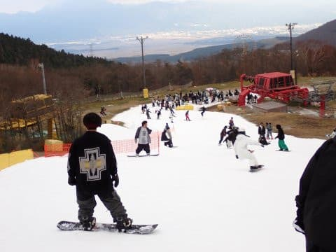
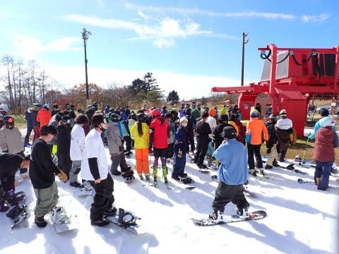

# 2022/11/6(日)のイエティのゲレンデ状況動画…コース幅は広がったけど，かなりの混雑(涙)

📅 投稿日時: 2022-11-07 01:20:09

ってなことで．

今日は予告通り，イエティで滑ってきました～！

いつも通り，今日も帰宅が遅めで．

さらにこれからやっつけなきゃいけない仕事も

あるので，今日はいつも通り速報モードにて…

まず．

今日のイエティはあさイチはいい感じの晴天！

でも，天気は晴れたり曇ったりで

終日すっきり晴天ではなかったけど…

晴れたら雪が緩んで滑りが悪くなるので，

ちょっと曇りくらいの，今日の感じが

ちょうどいい天気だったかも．

気温はちょい寒め．午後曇ったら，

ウェアのジャケットを着たほうが

良いくらいの寒さでした…

で．

コース幅はオープンから2週間たったので，

結構広がったんですが…

コース上はいつも通り混みました…(涙)

というか，今日はクワッドリフトは

平均5分待ち，ペアリフトにも時折

待ちが出る程度で，結構人が多かった

です…

オープンから3度目の週末ですが．

週末に天気がいい日が続いているので，

毎週毎週，徐々に人が増えていってる

感じですね…

とりあえず，いつものゲレンデ状況の動画を

貼り付けておきます．

午後1時40分くらいのコース状況です．
