# 2026シーズンモデルのスキー板，試乗レポートその1…FISCHER RC4 NOIZE LT PRO

📅 投稿日時: 2025-05-20 04:29:48

🏷️ カテゴリ: [スキー板試乗](c0bd8048615710cee890e403a36cc9a2b.md)

久しぶりにスキーに行かない週末を過ごした

というのに．

睡眠不足解消のために1日12時間以上寝て，

娘に勉強を教えていたら，それ以外に何も

できずに2日間が終わってしまった，

Skier_Sです．

うーん．

同じ2日間でも，スキーをする2日間との

充実度が違いすぎる…

スキーしない土日だから，あれもやって

これもやって…って思っていたのに（泣）

そして，週明けの今日も帰宅は深夜12時近く，

いつもならこのまま床で寝てしまう

魔の月曜だけど．

土日にゆっくり寝たから今日はあんまり

眠くない…

そうか！！

普通に寝てる人は，知らぬ間に床に倒れて

寝たりしないで済むんだ！！

…と，当たり前のことに気づいた月曜日．

そんな月曜も相変わらず，おこみん特派員は

今日も渋・横手を滑っていたようです…！！

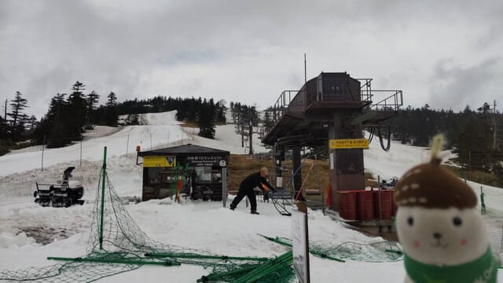

一見，まだ雪がいっぱいあるように見えますが．

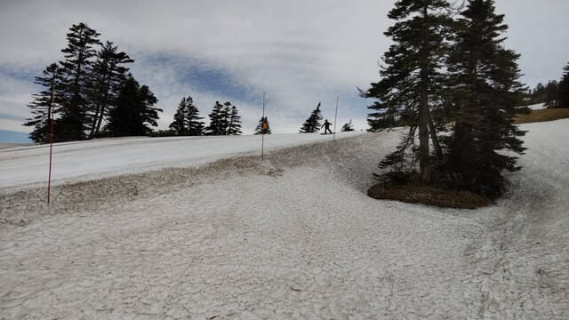

うーん．そろそろ雪が減ってきたかな…

でも，パークアイテムはまだ残ってますね．

そして…リフト降り場付近のこのあたりも

幅が狭くなってきましたね…（涙）

でも，まだ渋峠は周りから雪を運んでこれる

から，もう少しもつかな…

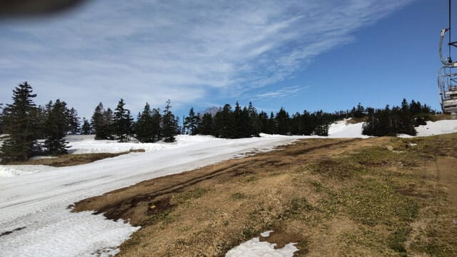

でも，ヤバいのは横手第4．

そろそろちょっと幅が狭いところが

出てきましたね…（泣）

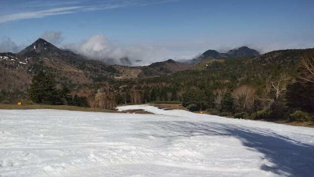

まぁ，まだこのあたりは雪の厚みも

ちょっとありますが．

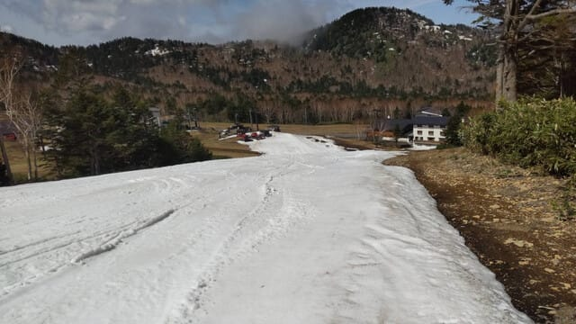

うーん．乗り場付近，そろそろやばいか…

ここは雪山とかも作ってないから，

ゲレンデから雪をもってきて埋めるしか

ないから…

うーん．これからひどい雨が降ったりしたら，

横手山も今週いっぱいがギリギリくらいかも…

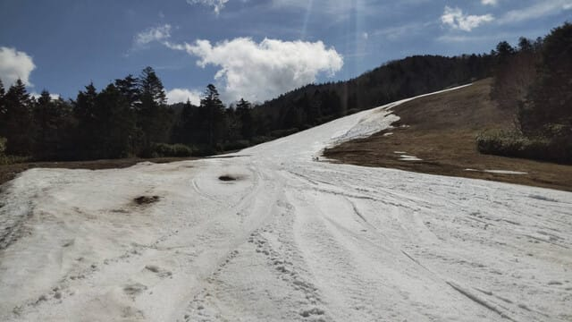

ってな感じで，本題へ．

今日は中1日空きましたが，[前回予告した](e8ca9d6ef5b5480ead8d31f4cc2e0c55b.md)通り，

2026シーズンのスキー試乗レポートの開始です！！

まず第1回目はフィッシャー編．

では，どうぞ～！！

〇FISCHER RC4 NOIZE LT PRO 178cm

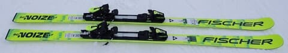

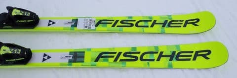

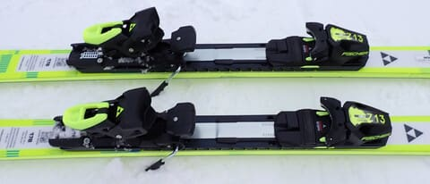

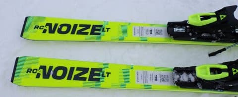

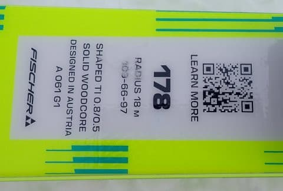

基礎大回り

来シーズンから競技・基礎モデルが

NOIZEシリーズとしてほぼすべてモデル

チェンジするFISCHER．

まずは基礎大回り用のNOIZE LTです．

この板は，これまでのRC PROの

後継機になりますね…

従来のRCとRC PROの違いと同様に，

プレートなしのLTとM-Plateがついた

LT PROの2種類があるうちの，プレート

付きのLT PROになります．

ちなみに長さは，今シーズンのRCは

170．175，180…と，キレのいい5cm刻み

だったのが．LT PROでは168，173，178，183cm

という長さになるようです．

今回試乗したのは，178cmになりますね．

…しかし，大回り板なのに168cmの設定が

あるんだ…

で．

滑ってみると…うわ！これ，良くたわむ！！

良くたわむので，R=18 という半径よりは

小さめに回ってきます．

今年のRCよりもフレックスが優しくなった

感じ！

フレックスが優しくてたわみが出やすい

といっても，決して弱い板ではなく，

グリップはしっかり強め．

スピードを出してもズリズリ逃げてしまう

ようなことはなく，ハイスピードの中で

しっかりがっちりグリップして，

グリップした中でかなりいい感じの大きな

たわみが出ます！

たわみに沿ってトップからテールまで

しっかりエッジが効いてキレイに丸く

回る板！！

たわみは大きく出てそこそこのバネ感は

あるものの，たわみを開放した際に板が

返ってくる速さは穏やかなので，大回りの

板らしいゆっくりめの返りに乗って，

ゆったりと切り返していけます．

大きくたわんで比較的小さめの半径で

回れるけど，この返りのゆったり感で

忙しい切り替えにならずに済み，

やっぱり小回り板ではなく大回り板

なんだなぁ…と思わせるところ．

しっかりしたグリップ感があるのに

たわみが出しやすく，強い横Gをかければ

比較的小さめの半径で回ることもできるし，

返りがゆったりしているので縦目に

落としていけばカービングでゆったり

クルーズできる感じで，大回りだけじゃなく

ある程度の小回りまで行ける板なので．

小回り板を持っているけど，カービングで

クルーズする用の長めの板が欲しい人や，

長めの板を履いて練習しようという人には，

結構い板だと思います…
