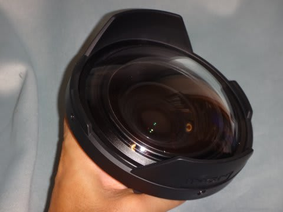

# 水中カメラ買い替え計画，Canon S120でのシステム完成っ！

📅 投稿日時: 2015-08-08 00:07:16

🏷️ カテゴリ: [PC,カメラ&小物](c0d8caed13e597efe97b661a8ae56bed0.md)

ということで．

昨日フィリピンに到着し．

今日は2本潜ってきました…

台風の影響がフィリピンにも来ており．

今朝は潜れるかどうか微妙…というところ，

何とか潜りに行けましたが．

…だけど．

なんだか．

潜れるポイント，かなり限られています…（涙）

…今晩もまだ，風が強いので．

明日も波が高そうだな～（悲）．

明後日までしかいないのに，天気が

それまでに回復してくれるのか？

このままペスカドール島にも行けず，イワシの群れも

見れないまま終わるのかっ！？？←そうなったほうがが，

旅行記がトラブル報告になって面白いんでは？…というみんなの声が聞こえるっ！！！

…とりあえず．

帰国後のレポート，楽しみにしていてください…（泣）

ってことで．

フィリピンに来ている今日も．

なぜか，フィリピンレポートではなく，カメラ買い替えレポートへ，Go!

---

で．

…結局，安く上げるどころか，とんでもない散財をもって

購入した，いろいろな一式．

まずは，カメラ用のマウントアダプタ．

こいつをハウジングに固定して，

外付けレンズをハウジングに

取り付けられるようにするのですが…

…S120用のマウントアダプタと，古いS90用のマウントアダプタと並べると，

その違いは一目瞭然．

左がS90用，右がS120用ですが…

新しいS120用のLDマウント．

古いS90用のADマウントより，直径がかなり大きいです．

…こんな感じで，AD→LDと，マウントが変わってしまったせいで

S90用のADレンズ群が，S120で使えなくなってしまったのだ…（涙）．

ただ，ロックが無いために，レンズが緩んで

落ちそうになることがあったADに対して．

＃自分も何度か海底にレンズを落としそうになったこと，数回…

新しいLDは，しっかりしたロック機構があって，

ロックレバーを操作しないとレンズが外れないので．

そこは進化かなぁ…

カメラから取り外したレンズを取り付けておくレンズホルダーも，

当然LD用に買い替えです（涙）．

AD用と並べると，大きさが全然違いますね…

そして，LD用ワイドコンバージョンレンズ．

あれ？フィッシュアイじゃないの？

…と思うでしょうが．

今回は，このワイドコンバージョンレンズに，

こんな感じの，別売りのドームレンズキットを外付けして…

こーゆー風に，フィッシュアイレンズ化します．

このフィッシュアイレンズ．

これまでS90で使っていた，AD用フィッシュアイに比べると…

やっぱり，LD用レンズは大きい…

並べるとこんな感じ．

大きいだけでなく，ドームレンズも，プラスチック→ガラスになったので，

しっかり重いよ…

という感じで．

これらすべてを取り付けて．

以前からあるアームとフラッシュと組み合わせて…

新しい，S120システムの完成だっ！！！

ドームレンズをアームのホルダにつけてみると…

すごくデカく感じる…

ということで．

フィリピンでは，このシステムて写真を撮影するのだっ！

…どんな仕上がりになるのか，楽しみ…

＃いや，この記事が掲載される今日．

＃ついさっき，試写結果をじっくり見たばっかりなんだけど…
