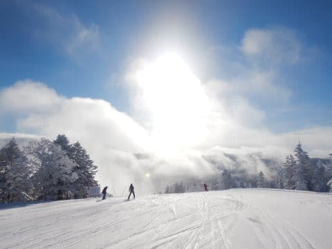
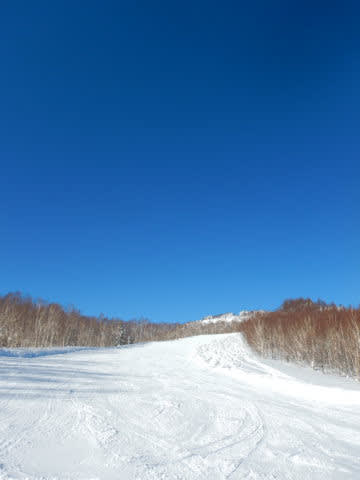
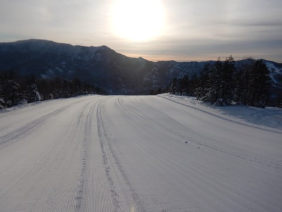
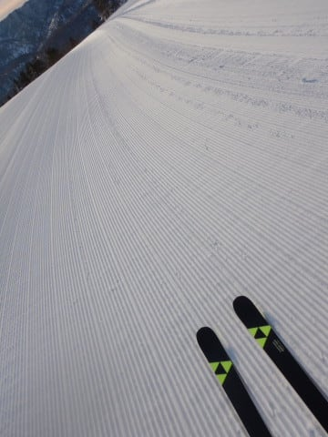
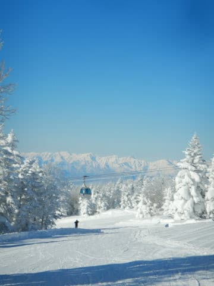

# スキー中毒度判定テスト…あなたのスキー中毒度はレベルいくつ？

📅 投稿日時: 2022-08-12 00:55:22

🏷️ カテゴリ: [スキー雑談](c1f9d2cb7478308da16419928ea3945e9.md)

ということで．

世の中はお盆休み期間に突入してるようですが．

今日も一日どこにも行かずPCの前でひたすら

書き物をして．

そして，明日も会社に行くSkier_Sです…

あぁ…世の中はお盆休みというのに．

結局山にも登れない休みになりそう…

とりあえず．

最近Garminと登山ネタばかりですっかり

忘れていたのですが

このBlogはスキーブログだった

という事実を久しぶりに思い出したので．

スキーネタを期待している皆さんのために，

今日は久々のスキーネタを行ってみましょうか…

ってなことで，

いきなりのスキー中毒度判定テスト～！！

あなたはレベルいくつ？？

レベル1．

このレベルならスキー中毒入門者！

1シーズンでどのくらいスキーに行ったかを，

回数じゃなく日数で答える

レベル2．

スキー中毒初級レベル

別に誰かとスキーに来たわけでないのに，

スキー場で知り合いに会うことが多い．

レベル3．

そろそろヤバくなり始めてきてます

春が嫌い．春が来ると憂鬱になる．

スキー板を2セット以上スキー場にもっていき

状況で履き分けている．

レベル4．

このレベルの人だと，普通の人と一緒に行くと引かれちゃって，

一緒にスキーに行く人が限られるように…

ほぼ毎週末スキーに行っている．

スキー場のシーズン券をもっている．

当然のように車の中にスキー用具が

いつも置かれている．

あるいは定宿に自分の道具があたりまえの

ように置きっぱなしになっている．

レベル5．

完全にヤバいレベルに突入です

スキー場に行くと知り合いが多数いる．

または，スキー場に行って，見ず知らずの人に

「いつもいますね」と言われたことがある．

リフトスタッフに完全に覚えられている．

レベル6．

スキー中毒の典型，金銭感覚中枢が麻痺してくるレベルです

スキーのお金は食費と同じ必要経費だと思っている

なぜかスキー板が5-6セット家に並んでいるが，

それが不思議だと思わない．

スキーブーツやウェアも当然のごとく

複数持っている．

レベル7．

このレベルになると…ダメですね．

終わりの始まりです

食費とスキー代のどちらを削るかと問われたら

食費を削ると答えてしまう．

滑走標高差1日20000mを超えたことがある．

レベル8．

もう救済不能なレベルまで中毒が進んでいます．

一般世間に戻れるとは思わない方がいいでしょう

滑走標高差1日20000mを複数回超えたことがある．

スキー場のシーズン券を2枚以上もっている．

7月や8月まで雪を求めて滑り続ける．

レベル9．

ここまで来ると，ある意味すがすがしい中毒っぷりです

スキー場のどのリフトは乗車時間何分で，

何分あれば1サイクル回せて，

1時間で何本乗れるかを正確に把握している．

一日でどのリフトが最大何本乗れるかを

計算して知っている．

リフトが減速しているかどうかを敏感に

察知し，遅いリフトは回避する

レベル10．

このレベルは，もう健康に悪い状態です．

スキーは自然の中でやる健全なスポーツという

常識を打ち破ってるし，中毒というより

伝説としていいレベルです

リフトが動いていると帰れない．

お昼休みや休憩をとるのがもったいなくて

できない．

休んだら滑る本数が減ってもったいないと

思っている．

トイレに行ったら負け．

疲れたから休み時間だと言っても休むのではなく

ちょっと緩めなコースを滑りに行くだけで，

滑るのをやめない．

営業時間が残り1時間を切ったあたりで，

1本あたりあと○秒詰めればあと1本行けそう…

と，計算してしまい，リフト乗り降りで全漕ぎ

してスピードアップを図る．

さぁ，あなたはどのレベルだ！？？

レベル10の人，この世にこんな人いるのか？？

と思っちゃいますが…

志賀高原には，レベル10のつわものが数名います（笑）

というか，レベル10は，

20000mクラブのレジェンド（四天王？）たちの

行動パターンを記述しただけ

のような気が…

うん．

志賀高原．

終わってる人多いよね…

　

　

　

　

　

## 💬 コメント一覧

### 💬 コメント by (横須賀のウルトラセブン)
**タイトル**: Unknown
**投稿日**: 2022-08-12 08:27:18

お～素晴らしい判定！これはS〇Ｊ 公認でしょうか？

僕の判定結果はレベル５で、「ごく普通のスキー大好

き人間」であることが公的に笑明されました～で更に

スキー回数じゃなかった日数を増やすべく精進します

＼(^o^)／因みに昨シーズン３８日で職場や家族には

完全に徒然さんレベルで見られてます(;^_^A

### 💬 コメント by (yumi)
**タイトル**: Unknown
**投稿日**: 2022-08-12 12:01:34

Sさぁ～ん⛷️🎿🎵

この 判定基準でいくと・・・🤔

ワタシは level ２ かなぁ～❓️🙄

スキー場に 板を２セットも 持って行かないモン⤴️

🍀🥰🍀

### 💬 コメント by (大阪のK)
**タイトル**: Unknown
**投稿日**: 2022-08-12 17:12:27

良かった。

まだレベル6だ。

### 💬 コメント by (metabo-joker)
**タイトル**: Unknown
**投稿日**: 2022-08-12 17:27:08

いつも楽しく拝見してます。

スキーにハマってた頃は、レベル7くらいまで行ってたです。

### 💬 コメント by (ダウンヒル)
**タイトル**: Unknown
**投稿日**: 2022-08-12 22:27:57

コンプリートしたのは「レベル３.」でしたぁ!

でも...定宿に道具が置きっぱ、「いつも居ますね」と言われたり、朝食ガッツリ派なので昼しっかりの必要がなくなって滑ってたり、リフト止まる間際まで滑る...とかは該当します。へなちょこな私には、レベル１０.コンプリートなど難しいですぅー‼️

### 💬 コメント by (アツシ)
**タイトル**: Unknown
**投稿日**: 2022-08-12 23:40:52

良かった。私もまだレベル６です😋

### 💬 コメント by (Skier_S)
**タイトル**: コメント欄にスキー中毒者が集まっている…
**投稿日**: 2022-08-13 01:35:33

＞横須賀のウルトラセブンさま

これはSA○非公認，純粋な基礎や競技スキーヤーには当てはまらない，

非○AJな人をあぶりだすテストです（笑）．

ちなみに，レベル5だと完全にヤバい人突入認定レベルなので，普通のスキー好きだなんて

甘いことを言っていてはいけない，危ないレベルです…

＞yumiさま

確かに，スキー板は2セットもっていってないけど…

yumiさんはシーズン券2枚以上もっているし，7月や8月まで滑りに行くし，レベル8認定です．

低いレベルで当てはまらないものがあっても，その上のレベルで自分に合致するものがあれば，

そのレベルにあてはまるというルールを今作りました（笑）．

＞大阪のKさま

残念ながら，「良かった」ではないです…

金銭感覚中枢が麻痺してくるレベルなので，もう終わってます．

レベル6以上は，どのくらい終わっているかの比較でしかなく，

レベル6でもすでに終わっていることは間違いないです（笑）．

＞metabo-jokerさま

レベル7は…ヤバいです．かなりの終わりっぷりです．

普通はこのレベルにはまるともう脱出できないのですが…

そのレベルから良く脱出できましたね…

＞ダウンヒルさま

レベルの低いところで合致しないものがあっても，それより高いレベルで合致するものがあれば

そのレベルと認定しますので，ダウンヒルさんはレベル5を超えているかと…（笑）

＞アツシさま

いや…レベル6はもう終わってるので，残念ながら「よかった」というレベルじゃないです…

しかし．

終わってる人が多いですね…このBlog読者は（ある意味感動）

