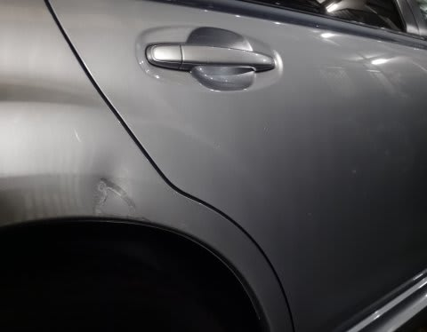

# うがーー！なんてこった！また，我がレガシィ君に悲劇が…（激涙）

📅 投稿日時: 2014-10-30 01:33:22

なんてこった．

どーしたこったっ！！！

…まだ，購入後1年と4か月の，わがBRレガシィ君．

去年12月，購入半年の新車のときに[ドアガッツンされ](ed056db8d26491cb9856247d5baa9c33c.md)，

悲しいへこみ傷がついて，車も人もかなり凹んだのですが．

…Yetiから戻ってきた，翌日．

車のリアフェンダーを見たところ．

「なんじゃこりゃぁ」（いつも通り，松田優作になりきって）

リアフェンダーが．

リアフェンダーが．

ぶつけて凹まされてるっ！！！！！

これ，車がシルバーだからわかりにくいけど．

塗装がかなりの範囲で剥げて，グレーの下地塗りが

見えちゃってるよ！！

（わかりやすくなるよう，ライトを当ててみた）

な，なんだ，こりゃあっ…！！！！！！！（震える声）

えーっと．

自分でぶつけた思い出は，全く無い．

自分で運転してこんなところをこんな風に

ぶつけるのは難しい．

それ以前に．

こんなに凹むほどぶつかったら，いくら何でも，

気づく．

間違いなく，自分でぶつけたわけでは，ない．

で．

ちょっとやそっとのモノをぶつけたくらいでは．

こんなに凹まないし，

こんなに広範囲に塗装が削られたりはしない．

…これは．

きっと．

たぶん．

Yetiの駐車場で．

隣に入れようと思った車に，リヤバンパーで

「ガツン」

されたに，違いない！！

…Yetiから帰るとき．

隣に車はいなかったので．

ぶつけた車は，そのまま

逃げたに違いないっ！！！

うがーーーー！！

なぜ．

なぜ，新車1年ちょいで，2回もぶつけられるかな～（涙）．

以前に乗っていたオデッセイ，23万km走って，一度も

ぶつけられたことがなかったのに．

…このレガシィ，もしかすると．

隣の車を引きつける魔力でも

持ってるのかな～（泣）．

ダメだ．

自分でぶつけたわけじゃないのに，

車がつぎつぎボコボコにされていく悲劇…

お祓い受けないとダメかな～（涙）．

このペースで行ったら．

3年後には，自分で一度もぶつけないのに．

そこらじゅうボコボコにされちゃうに違いない…（涙）

## 💬 コメント一覧

### 💬 コメント by (はなげ親分)
**タイトル**: 同情いたします
**投稿日**: 2014-10-30 13:45:54

凹み加減が半端ないのはよくわかります。

私も１シーズン終わると大小問わずあちこちにキズやら凹みが見つかります。

溜息とともに

こんな事した奴らが滑る時はいつも豪雨に違いない！

と確信しておりうます。

それにしても人の車を傷つけて逃げてしまうなんていったいどういう神経してるんだろ？

### 💬 コメント by (Skier_S)
**タイトル**: はなげ親分さま
**投稿日**: 2014-10-31 02:12:45

いやー．

もう，見つけた瞬間．

半端ない凹み方に，私もしばらく再起不能なほど

凹みましたよ…

逃げたやつには，天罰が下るはずだ！

…でも．

滑るときにいつも雨…って呪いだと．

私もかなりの高確率で巻き込まれそうなので（＾＾；

「スキー板が1シーズンもたずにヘタる呪い」

をかけておきたいと思います…

＃この呪い，自分にかかっている気がしますが

### 💬 コメント by (miya)
**タイトル**: こちらも…
**投稿日**: 2014-11-02 10:37:12

ご無沙汰してます。

前回の悲劇の際にもこちらの30万の悲劇のことを

コメントしましたが、その後こちらも再悲劇が。

またまたカミさんが運転中にどこぞの駐車場に

入れる際、何かのでっぱりにバンパーをガツン！

マフラーの上部辺りがぺっこりへこんでしまいました。

下地の金具？までいってしまったしバンパーなので、

通常は交換かなと思いましたが、知り合いに相談して

補修・塗装で切り抜けました。

ただ下地の金具を補修すると高くなるので、

見えないところは補修せずにそのまま…。

こんなことがあったので、気を楽にしてくださいー。

お互いついてないですねー。

厄落としにBS買いましょうか。

こちらは来週シーズンイン予定です！

### 💬 コメント by (Skier_S)
**タイトル**: miyaさま
**投稿日**: 2014-11-02 20:51:40

お久しぶりです！

そちらも悲劇だったのですね…

修理金額はそれほどでもなかったのでしょうか？

こちらの悲劇は，自分が知らぬうちに

傷つけられてしまうことです…（涙）

しかし，BS買うって，厄落としどころじゃないですね（笑）．

来週は，軽井沢ですか？？

