# 今シーズンの月山は，どれだけ雪が多いか比較してみた

📅 投稿日時: 2013-06-19 02:35:12

ってことで．

昨日．

月山は[今シーズンは雪が多いよ！](e503aa02d2c90624281dafa505275e0f5.md)

…って，話をしたわけですが．

んじゃ，どのくらい雪が多いのかしらん？

…ってのを，比較してみましょう～←暇人だとお思いでしょうが…

とりあえず，大斜面が一番分かりやすいので．

過去数年の，大斜面の写真を引っ張り出してきました．

PCで見てる方は，ブラウザの幅をいっぱいに広げて

2枚の写真が横に並ぶようにすると見やすいです…

まずは，今シーズン．

2013/6/16

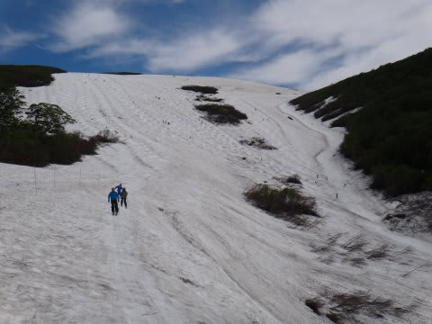

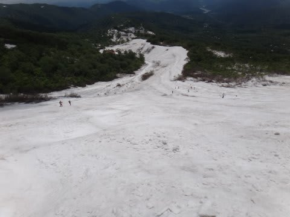

雪が多いですね～．

2012シーズン

2012/6/16

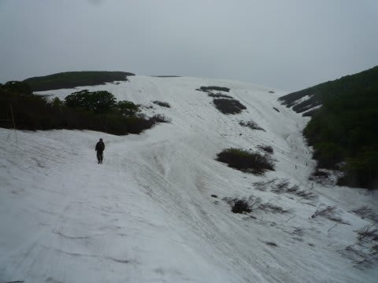

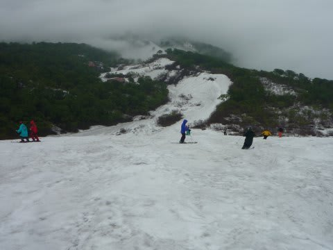

この年も雪が多く，まだリフト前まで滑りこめ，リフト降りてすぐ板履けたんですよね…

2011シーズン

2011/6/19

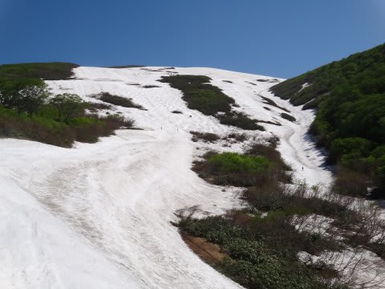

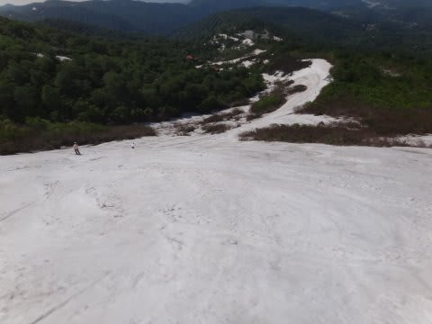

大斜面，まともそうに見えますが．地震の影響で，クレバスだらけでした…

沢コースも滑れたけど，ふもとはちょっと切れかけ．

2010シーズン．

2010/6/20

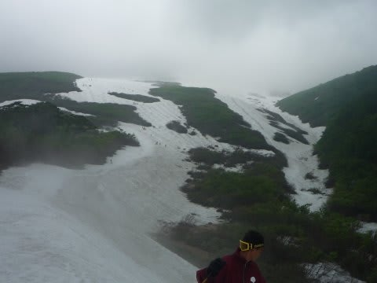

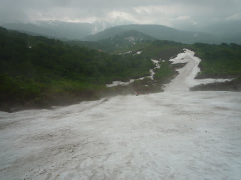

この年は悲惨でしたね～．大斜面も切れかけで，大斜面下は藪こぎ必須でした…

沢コースは完全アウトです．

2009，2008シーズンは無くて．

2007シーズン．

2007/6/17

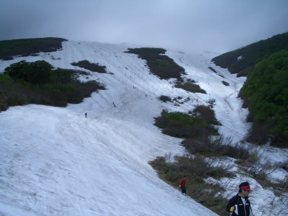

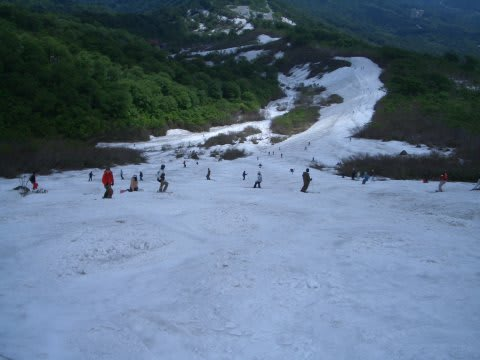

この年も，雪が多いと言われたシーズンでした…．ぎりぎりリフト乗り場まで雪があった感じ．

2006シーズン．

2006/6/17

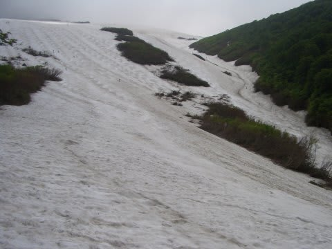

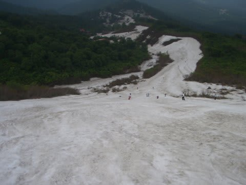

そこそこ雪が多いシーズンでした．

2005シーズン

2005/6/26．この年だけ，6月最終週で，他より1週間くらい遅い写真です．

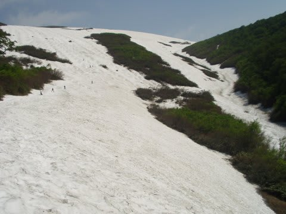

この年は，奇跡の年だったんですよね…志賀もGWまでほぼ全面可能で，

月山も6月最終週でこれですから…

ってことで．

これらの写真を見比べると．

沢コースの上のほうの土の出方とか，大斜面の向かって左側のコースの穴のあき具合や

コース幅を見ると．

今年の写真が，一番幅が広いのが分かるかと…

今年は，まだリフトまで滑り込めるし．

3月ごろのダメダメさを考えると，この雪の量は，驚異の状況ですなっ！
