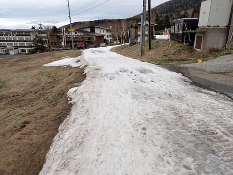
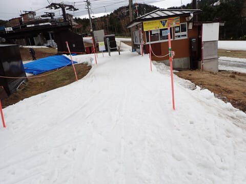
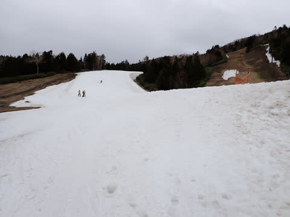
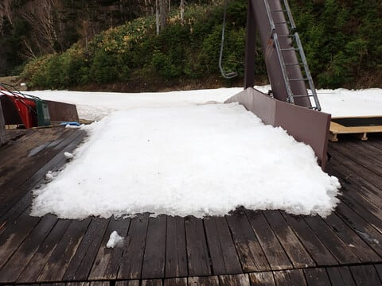
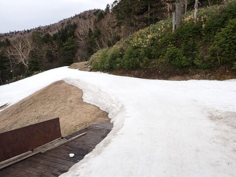
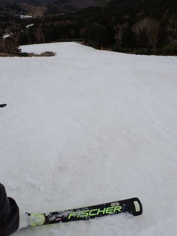
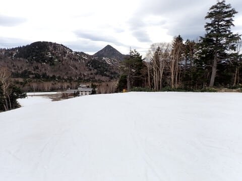

# 5月6日，GW最後の横手山スキー場の海和ゲレンデのゲレンデ状況！

📅 投稿日時: 2024-05-09 07:27:02

えー．

今日も仕事でクリティカルな状況が続いてます…

だのに．

また寝るつもりがないのにさっきまで床で

倒れてました．

ということで．

今日は手短に更新！

実はGW最終日，焼額が午後2時までの営業

だったので，そのあと横手山で滑ってきて

ました～！

ただ，強風で第2，第3，渋が動いて

無かったので，海和ゲレンデだけ滑って

ましたが…

ってなことで，5月6日の午後3時ごろの

海和ゲレンデの状況です！

第2ゲレンデから海和ゲレンデへの連絡路は

もう悲惨な感じでしたが…

リフト乗り場はしっかり雪がついてます！

そして…

ゲレンデ下半分は，まだ結構雪がついて

ます！

リフト降り場から…

ゲレンデに向かうところも

まだしばらく雪はもちそうな感じ．

ゲレンデ上部も…

中間部もしっかりまだ雪が残ってます！

ってな感じで．

海和ゲレンデは，今週末までくらいは

もちそうな感じ…

…でも，あと2週間は厳しいか．

というところで．

そろそろ仕事に行かねば…

あぁ…GW明けで仕事が溜まってて

ご無体が辛い．

ゆっくり寝たい…

## 💬 コメント一覧

### 💬 コメント by (まうちゅう)
**タイトル**: Unknown
**投稿日**: 2024-05-09 22:01:01

リフトが動いているのを横目にそのまま帰るはずがないですよね。

### 💬 コメント by (Skier_S)
**タイトル**: Unknown
**投稿日**: 2024-05-10 10:45:31

>まうちゅうさま

そうです…

草津超えで帰るときに、リフトが動いているのを見てついつい

引っかかってしまいました（笑）

