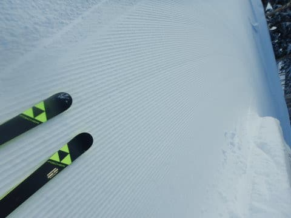

# 今シーズンデビューのスキー板，'20 FISCHER RC4 WC RCのインプレッション

📅 投稿日時: 2022-01-19 03:32:47

えー．

本日の志賀高原ですが．

予想通り-15℃近くまで冷え込み…

…この写真では分からないのですが．

非圧雪コースは，太ももパフの

かなり深くて軽い新雪だったようです…！

そして，昼間の5時間だけで

これほど積もったようで…

18日：朝は-15℃の激冷え．

　朝までに膝パフくらい．

　昼間も雪は降り続ける．

という予想．

膝パフではなく太ももパフだったけど，

概ね当たりましたね！…素晴らしい！←自画自賛

ただ，19，20日の積雪量の予想ですが．

こちらは昨日の予想より減ってきた

感じです…

　19日の朝の積雪は20cm程度，

　終日降り続けそう…

という予想はほぼ変わらないけど．

19日は，降り続けるというより

降ったりやんだりで，昼間の

積雪は5～10cm，それほど

積もらないかな．

そして，ドカ雪と予想した20日ですが．

どうも雪の降り始め時間が

昨日の予想より遅くなり，

本格的に降り始めるのは19日夜じゃなく，

20日朝からになりました…．

だもんで，20日朝にはそれほどの積雪は

なさそうです…（ちょい涙）

最新の予想だと，20日朝の積雪は

10～20cm程度ですね…

そんなドカ雪ではないです（泣）

20日の昼間も降り続けますが，

昼間の積雪も10～20cm程度ですね…

それほどのドカ雪予想ではなくなり

ましたが，それでも20日朝までと

昼間の合計で少なくとも30cm以上

積もりそうなので，そこそこの

積雪だと思います…

むしろ，雪の降り始めが遅れて，

21日も降り続ける予想に変わったので．

21日朝は30cm以上積もってるかも…？

とりあえず．

これから21日金曜日まで降り続けて，

22日の週末から晴れそうなので，

週末は期待していい感じです…！！

…ってなことで，本題へ．

今シーズン，[物欲選手権に負けていろいろ
ニューマテリアルを買ってしまった](e6a52cddc9fb3687dc986e6188d1a1b7a.md)わけですが．

それらのインプレッション第1弾として，

ロングターン板，

'20 FISCHER RC4 Worldcup RC Curv booster 180cm

のインプレッションをば…

まず，基本的スペックですが．

長さ180cm，R=18.5m．

まぁ，大回りベースのオールラウンド

というより，ある程度大回り専用の

つもりで買いましたが…

履いてみると．

こいつ，良く曲がる！！

スピードが出ない領域では，

サイドカーブ18mの板らしく，

そこそこまっすぐ進みますが…

ある程度のスピードを出していくと，

キャラが激変．

結構しっかりしたエッジグリップで

板がかなりたわんでくれて，

かなりの小回りでカービングする

ことができます！

いや，それも，スピードに負けて板が

たわんでしまって，どうしようもなく

小回りになっていく…という感じではなく．

スピードが出た中で，谷回りで板を

たわませに行くと．

そのたわみ量に従ってきれいに板が

回っていく感じ．

スピードに乗っていても，たわませなければ

まっすぐ目に落ちていけるし．

スピードが乗った中でグッとたわませに行けば，

強い横Gで大きなたわみが作られて，

180cmという板の長さから想像するより

かなり小さい回転弧で回ります！！

思いっきりたわませに行った場合，

私の後ろについていた人は，

「小回り板かと思った…」

というくらい回っていたようなので．

乗り手の操作によって作られる

たわみ量によって，大回りから

小回りっぽいミドルのターン弧まで，

自由に回転弧を作れます．

良く回る板とは言っても，板が勝手に

行きたい方向に回ってしまう板ではなく，

谷回りの角づけ量＆踏む量でたわみを

決められて，乗り手の思うように

回転弧が作れる操作性があって，

乗り手の意のままにターン弧を作れる

感じ…

ただ．

RC4 RCは，強めのCurv boosterがついている

モデルと，弱めのRacetrackがついている

モデルの2種類があるけど．

強いほうのCurv boosterがついているこのモデル．

板が求めるスピード域はちょい高め．

低速ではそれほどたわませられないので，

あまりスピードを出さない人は，

「まっすぐ進む…！」

と思うかも．

逆に言うと．

ゆっくり滑っても，そんなに楽しい板じゃ

無いです…

でも，ゆっくり滑った中のズラシの

コントロール性も悪くないし，

どうしようもなくガッツリグリップして，

勝手に行きたい方向に進むって板でも

ないので，ゆっくり滑ることも

できます…

が．

やっぱりこの板は，ある程度のスピードを

出していった方が楽しいです！！

スピードを出すと，板にしっかり圧が

溜まる感じもありますが，圧の返りは

大回り板らしく比較的ゆっくり目．

なので，多少荒れたバーンにつっこんでも，

凸凹に弾かれてビヨーンと飛ばされる

こともなく．

さらに，グリップは強めながらも

ある程度板を動かす自由度はあるので，

荒れ気味の斜面でもスピードを落とさず

突っ込めます…

あ，ホントのコブ斜面は厳しいです．

深い凸凹は，さすがに180cmの板だと

厳しい…

あと．

私のスピードだと，あさイチの焼額の

フラットシマシマバーンを滑ると，

ちょっと曲がりすぎる感じも…

朝イチ向けには，もう少し硬い板が

いいかな…

うーむ．

どうも最近，板が強く踏めるエキップさん

ブーツ，それもさらにフレックス140と

いう強烈なブーツを履くようになってから，

強い過激な板を求めるようになってきた気が…

でも．

とりあえず．

この板は，普通のゲレンデで出せる

かなり速めのスピードで滑っても，

スピード耐性も強いし，安定感も十分．

ある程度のスピードを出せば，

トップからテールまでのエッジが

しっかり効いて，すごく良く回るし．

それでいて回転弧も自由に作れる

操作性の高さもあるし．

うーん．やっぱりFISCHER，いい板

作るな～！！←だからどうしていつもそんなに上から目線なの…？

## 💬 コメント一覧

### 💬 コメント by (かず)
**タイトル**: Unknown
**投稿日**: 2022-01-19 11:31:26

若杉さん  自分はヒーターゴーグル使用してるんですが  最近雪降りの時レンズが凍結して感で滑ることが多く バッテリーが弱ってきたのかな？って思ったら内側で鼻から雪入ってました……昔やってたスポンジ着けてみようと思ってます

### 💬 コメント by (レインボー74)
**タイトル**: Unknown
**投稿日**: 2022-01-19 15:54:28

水曜日の志賀高原情報

湯田中はさらさら新雪4cm。上林-8℃　蓮池なんと-14℃。寒いけど晴れているので、さほど感じない(歳のせいで鈍ってるのかも？)。

パノラマ、カラマツは朝圧雪なので柔らかいシマシマ。

次のスーパーは50新雪でトップが気持ち良く浮きます。快楽快楽。

オリンピックの40新雪は既に賞味期限切れだけど、妙高より遥かに楽だし快適。

GSサイドは新雪30でこれまた快適。ああどうしましょう。幸せすぎまーす。

白樺は柔らかい圧雪バーン。もうこんなのどうでもいい。

ダイヤには踏まずのパウダーが。ごちそうさまでした。

パーフェクタ上部はパリパリ、中部は10cm、下部はぼこぼこ。危険ですね。一番に飛び込んだ仲間が転倒。それを見た私はいいとこ取りができました。

ファミリーは、上部は飛ばされた圧雪バーン、中部は30新雪ぼこぼこだけど、滑りやすいふわふわ雪。

高天でのピザ休憩もそこそこに、高天の非圧雪へ。これが本日のベスト。硬かったら敬遠するところなのに、夢のように勘違いできるふんわふわ。何本すべったかな？

寺子屋は「絶景かな」

だけど、新雪に飛び込んでも斜度がないので、あっかーん！

再びダイヤの新雪で遊ばせて頂いて、やけびに戻ってレインボー上がり。

もっと10時間でも滑っていたかった(うそ)

今日の快楽は、シーズンベストでしたよ。エス様、こんな日に来ないなんて！(ごめんなさい)

### 💬 コメント by (レインボー74)
**タイトル**: Unknown
**投稿日**: 2022-01-19 16:06:14

火曜日の志賀高原情報その2

高天のあとの東舘を忘れてました。とにかく柔らかいふかふかのまさに志賀の雪なので、ぼっこぼこだけど私でも関係ない感じ。あとに残るのは快感だけ。

迂回林道も近道すると楽しい！みーんな道具のおかげです。今日の板は、ヘッドコア99の180cm。

### 💬 コメント by (レインボー74)
**タイトル**: Unknown
**投稿日**: 2022-01-19 16:11:56

お借りします。

かず様、ゴーグルの中に雪が入らないように、今日からはベルトをきつく締めるようにしましたよ。次の悪天候杉ノ原には、予備をポケットにしのばせてチャレンジします。

また教えてください。なにしろ定年初心者ですので、当たり前のことが欠如していますから。

### 💬 コメント by (Skier_S)
**タイトル**: この週末も良さそう…
**投稿日**: 2022-01-20 00:47:20

＞かずさま

ヒーターゴーグルでも，隙間が空いてると凍結するんですね！！

そのくらいでも問題なく溶かすくらいのパワーがあると思ってました…

＞レインボー74さま

今日，SGSは50cmも積もってたんですか！！

晴れのパウダー，いいなぁ…

雪も軽かったみたいですね．

あぁ…早く私も仕事辞めたくなってきた…

