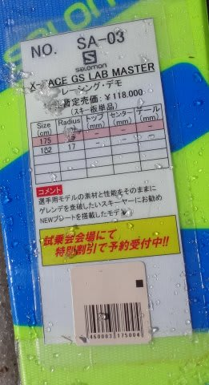

# 2017シーズンモデル，スキー試乗レポート第2回…SALOMON編その2

📅 投稿日時: 2016-05-14 02:54:48

🏷️ カテゴリ: [スキー板試乗](c0bd8048615710cee890e403a36cc9a2b.md)

ということで．

今週末も，かぐらが無事営業しているようですが．

私は都合により，今週末，土曜は行けず．

日曜に日帰りで行ってきます…

もしかすると，この週末がかぐらラストになるのか…？？？

ってことで．

明日はスキーに行かないので．

本日も，スキー試乗レポートが続くわけですが．

今日も昨日に引き続いて，サロモンのレース系モデル

2モデルのレポートです．

では，どうぞ～

○SALOMON X-RACE GS LAB MASTER 175cm

マスターズGS，基礎大回り用

昨年から登場した，マスターズ用（もともとはデュアルスラローム用

だったらしいけど…）のGS板です．

X-RACE SWがサンドイッチ化しましたが．

この板は構造はキャップ構造（下部にサイドウォールあり）

のまま変わっていないようです…

また，X-RACE SWと違い，この板はRACE PLATEがついており．

さらに，強いXビンディングが標準となります．

だもんで．

結構強い板です．

どっしり重く，フレックスも強いです．

そこそこスピードを出していかないと，

たわみが出ません．

そのため．

ザブザブになった昼近くにこの板を履いたのですが．

はっきり言って，板が使えるレベルまでたわませることができず．

…全くこの板の本領を発揮させるレベルで滑れませんでした（涙）．

しかし．

しっかりとした重さによる安定性，強いグリップ力は感じられ．

また，やっぱり荷重ポイントはSALOMONっぽいテール荷重で乗る

板だったので．

今年のX-RACEの大回り板を履いている人は，X-RACE SWより

こちらの方が今までの板に近いと感じるのではないかな…

X-RACE SWだとイマイチ物足りないけど，ラディウスが

異常に大きいGS LABを履くのはちょっと…

という人がチョイスするにちょうどいい，しっかりと

強い大回り板だと思います．

○SALOMON X-RACE SC 165cm

エキスパート小回り，SL入門用

来シーズンのX-RACEは，

上から

SL LAB & GS LAB

SW

SC

というグレード構成になっているのですが…

X-RACEシリーズのうち，最も優しいグレードのSCです．

この板は，ビンディングもSWのZ12 speedから，

XT12という，さらに軽量化されたマイルドなビンディングになり…

プレートもX trackとなっているので…

X-RACEではなく，X-Proの後継機では？？

…と思うのですが．

…なぜか，SALOMONは．

来シーズン，このモデルをX-RACEのラインナップとして

売るようですね…

とりあえず．

履いてみた感じは．

X-RACEシリーズとしては，圧倒的な軽さ．

…ってか，この板．

絶対にこれはレース用板ではありません．

ものすごく気楽に履けるゲレンデ板レベルです．

たわませようと思えば，ずぶずぶな春雪でも

簡単にたわませられるし，

グリップもそこそこなので，簡単にずらせます．

「レース用」と考えると拍子抜けします．

X-PROの後継機と考えると，ちょうどいいくらいの

感じです．

板の重さは異常に軽いX-MAX X12に比べると重いですが，

X-MAXと同じか，それよりも優しい板に感じます．

やはり，この板も荷重ポイントはテールで，

テールに乗るとすごく簡単にたわみます．

スピード域は，そこそこ．

簡単にずらせるし，ずれていくので．

それほど高速耐性は高くない感じ．

ゲレンデで気楽に履ける，中速域レベルが気持ちいい

小回りベースの板の感じです．

ただ，このような板なら．

物理的な軽さが圧倒的に軽いX-MAXのほうが

取り回しやすいし，

楽なので．

この板はX-MAXの陰に隠れてしまって，

あまり売れないんじゃないかなぁ…

と心配になってしまう板でした…←余計なお世話だな…

## 💬 コメント一覧

### 💬 コメント by (komu)
**タイトル**: かぐら行ってきました
**投稿日**: 2016-05-14 22:28:28

かなり雪薄いです。

今日の午後は地雷だらけでしたよ

でも空いていてそこそこ楽しめました。

いよいよ月山ですね

### 💬 コメント by (Skier_S)
**タイトル**: Komuさま
**投稿日**: 2016-05-15 08:58:24

こちらは今かぐらに来てます～！

コース幅が先週の半分になってますね…(泣)

う～ん

そろそろ月に行かないといけないのかな？

