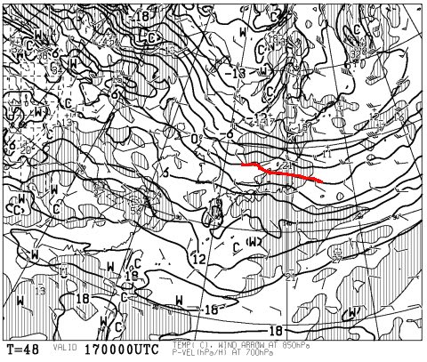

# 11月19日に，スキー場は予定通りオープンするのか？…天気図を読み解いてみた

📅 投稿日時: 2016-11-16 01:49:37

ということで．

ここしばらく気温が高い日が続き．

さらに，昨日から今日にかけては，

山でも雨だったようですね…（涙）

という感じのため．

アサマ2000も…

（[アサマ2000ツイッター](https://twitter.com/2000_info)より）

かぐらも…

（[かぐらHP](http://www.princehotels.co.jp/ski/kagura/)より）

…今週末のオープン，実はヤバいかな…？

と思える雰囲気を醸し出してきた今日この頃．

皆様いかがお過ごしでしょうか…

という時候のあいさつの後は．

そう．

今，みなさんが気になる．

19日にオープンする予定の，

志賀熊の湯，かぐら，アサマ2000などが．

無事にオープンできそうなのか…？

今週中にたっぷりと人工雪を打てそうなのか…？

…そういったあたりを，専門天気図から

読み解いてみましょう．

えー．

まず．

今後一週間の850hpa気温予想ですが…

うむ．

[今から5日ほど前の予想](ec941c6a1bb188fc01d6b291ea8da2029.md)に比べれば，

16，17日と．

かなり冷える予想になりましたね～．

そして，16日の850hpa気温を見ると…

ふむ！

赤くマークした0℃線，しっかり志賀高原くらいまで

下がってきてます…！！

そして，17日は…

うむ．

この日もぎりぎり，北信州は0℃線のエリア．

…地上天気図的には，この2日間は降水量がなさそうなため．

残念ながら，天然雪が積もる確率は望み薄

（…というか，ほとんどゼロ）

なのですが．

…とりあえず，この冷え込みなら．

15午後～17日朝にかけては，人工降雪機が動かせます！

それも，標高が高い志賀・アサマ2000は，16日は終日

人工雪が打てるかも？

…だけど．

そのあとの18日は…

あううーーん．

0℃線は東北にまで上がっちゃいます（涙）．

うーむ．

できれば，18日まで冷え込みが続いてほしかったんだけど…

そして．19日は…

なぬ！？？？

0℃線は，北海道より北まで上がっちゃってるじゃないですかっ！！

それどころか，+9℃線が信州に…（涙）

これだと，標高が高いアサマ2000や志賀高原でも．

昼間の気温は+10℃近くまで上がってしまいそう（泣）．

…そして．日曜20日は…

…

…ダメだ．

20日もおんなじ感じ…

こんな感じで，0℃線は北海道の北．

志賀は，+9℃線という，スキー場では

あるまじき高温になりそう（泣）．

で．

20日の地上天気図を見ると…

ううーーん．

…雨予想の網掛けが，日本全域に…

これは．

土曜の夜から日曜にかけて，雨かも…（涙）．

…

ということで．

今週末のスキー場オープンは．

冷え込みが期待される，明日，明後日．

水曜～木曜朝の期間にどれだけの雪を造れるか．

…ここに掛かってきます．

そのあとは，木曜から日曜まで．

スキー場では，昼間も+10℃に近い気温に上がり…

さらに，土曜の夜は雨っぽく．

…やばい．

今週末のオープン，かなりやばい状態…

ヤバいよ…

運よく土曜にオープンできたとしても．

土曜の高温＆雨で．

日曜はまたクローズになりかねない感じ…

とりあえず．

土日の天気は，また後程詳細に予想しますが…

うーーーむ．

このままだと，

今週末もYetiか…？？

それは避けたいっ！！

…みなさん．

今週末，天然雪でも滑れるような寒気＆雪の到来となるべく．

必死に，真剣に．全力で．

祈りましょう…．
