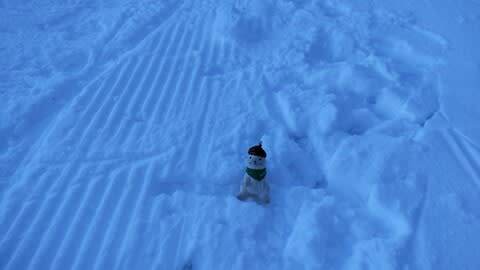

# 2021/11/19(金)，2022シーズンオープンの横手山，特派員からのコース状況動画！

📅 投稿日時: 2021-11-20 02:22:39

🏷️ カテゴリ: [日記](cc4b5682fb7b8b144980957a978653fb0.md)

ということで．

本日，当初予定の11月6日から2週間

遅れで横手山がオープンしましたが．

…2週間遅れたとはいえ．

この天気の状態で19日にオープン

出来たのはすごいと思います…

ちなみに，朝のコースはかなり固かった

ようです…

簡単に解けないように，

まずは下地にするための硬い氷のような

雪をしっかりつけているんだと思います．

で．

雪の厚みも予想よりしっかりあって．

昨シーズンのように，オープン翌日には

石だらけになるような感じでは

なさそうです！

ってことで．

いつものおこみん特派員が，コース状況の

動画を送ってくださったので，

横手山のシーズンオープン日のコース状況です．

おこみん特派員，ありがとうございます！

…コース中盤はちょっと狭いところも

あるけど，終盤は十分広いですね～．

よくここまで雪を付けたものだ…

でも．

明日は横手山，混むんだろうなぁ…

11月は志賀高原のシーズン券も

使えないので．

私は明日もYetiで滑ります～！

…ってか．

今日は終電帰りでもうこんな時間．

いつものパターンだけど．

あと3時間後に出発なので，

また2時間半ほどしか寝られない…(涙)
