# 平日にスキーに行くとき，高速道路代が安くなる割引プラン…信州以外も，群馬方面，新潟方面も割引があるよ！

📅 投稿日時: 2024-09-29 03:22:04

🏷️ カテゴリ: [日記](cc4b5682fb7b8b144980957a978653fb0.md)

えー．

[以前の記事](ee418d71d598e247b034f7575db2da66c.md)で，首都圏から長野方面に

お得な高速料金でスキーへ行ける，

信州めぐりフリーパス2024って記事を書き

ましたが…

今回は，それ以外の高速割引について

記事にしてみました～！

その前に．以前記事にした信州巡りフリーパスを

ざっくり振り返りましょう…

このエリアがスタート・帰着で

（[NEXCO中日本・信州巡りフリーパスページ](https://hayatabi.c-nexco.co.jp/drive/detail.html?id=154)より）

このエリアで高速を2~3日間，好きなだけ

乗り降りできるフリーパスが，信州巡り

フリーパスです！

（[NEXCO中日本・信州巡りフリーパスページ](https://hayatabi.c-nexco.co.jp/drive/detail.html?id=154)より）

来年3月31日までは，正月期間を除き

こんな料金で利用できる…

というものだったんですが．

（[NEXCO中日本・信州巡りフリーパスページ](https://hayatabi.c-nexco.co.jp/drive/detail.html?id=154)より）

首都圏エリアがかなり広く設定されているので，

志賀高原に行く場合，藤沢やつくばの人であれば，

休日割引よりも安く行けてお得です！！

そのほか，軽井沢ショッピングセンターの

駐車場も無料サービス付きとか，いろいろ

特典があります…

…軽井沢スキー場の駐車場は割引にならないのが

残念…

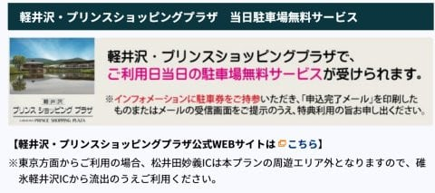

（[NEXCO中日本・信州巡りフリーパスページ](https://hayatabi.c-nexco.co.jp/drive/detail.html?id=154)より）

という，なかなか使えそうな割引なわけ

ですが．

信州方面意外にも，似たような割引があるので，

紹介してみましょうか…

まず最初は．

新潟観光ドライブパス～！！！

（[NEXCO東日本［ドラ割］新潟観光ドライブパス新潟周遊プランページ](https://www.driveplaza.com/etc/drawari/niigata/ofuku.html)より，以下同じ）

これは，新潟の下図のエリア．

上信越道なら妙高高原から北，

関越道なら湯沢ICから北の，

新潟県内で3日間好きなだけ乗り放題

になるというもので…

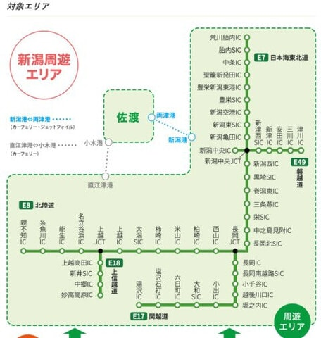

首都圏往復プランであれば，

下図のエリア，川越～花園エリアか，

首都圏エリア出発が選べます．

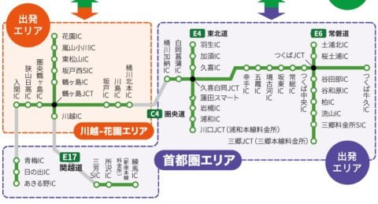

そして…

お値段は，首都圏出発なら3日間11000円，

川越～花園なら3日間10000円．

うーん．

これだと，妙高や湯沢・六日町往復は

土日割引の往復の方が安いです…

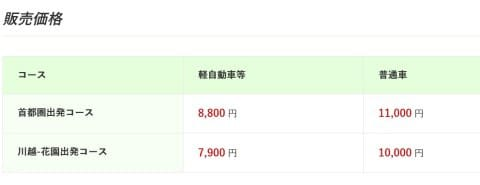

ただ，往復のどちらかが平日ならお得になるし．

さらに湯沢で滑って，宿泊は長岡で泊まって，

（そして[某スキーショップ](http://www.equipe.jp/)へ寄る）

その翌日は長岡から六日町へ移動し，

八海山で滑って…

という感じで，3日間で高速を使いまくる

パターンなら，かなりお得になります！！

ちなみに，そのほかの割引特典もいっぱいあって．

例えば，赤倉ホテルの日帰り温泉や，妙高・白馬

方面の日帰り温泉の割引，食事の割引サービス

等も結構あります！こういう細かい割引も

ありがたいかも…

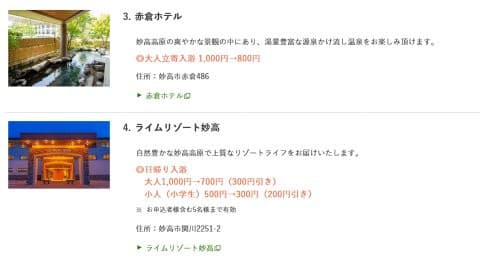

お正月休みやGWは使えませんが．

来年3月末までの期間限定商品の信州巡り

フリーパスと違って，今後ずっと提供される

商品のようです…

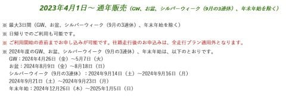

申し込みはWebでできて，

こちらのページから当日までに申し込めばOK．

使わなきゃ自動的にキャンセル扱いなので，

使うかどうかわからない時でも，事前に

申しこんでおけば良いです！

[申込ページはこちらから](https://www.driveplaza.com/etc/drawari/niigata/ofuku.html)たどれます！

そして…次に紹介するのは，

北関東周遊フリーパス～！！

（[NEXCO東日本［ドラ割］北関東周遊フリーパス首都圏出発プランページ](https://www.driveplaza.com/etc/drawari/kitakanto/shutoken.html)より，以下同じ）

このプランは．

北関東のこのエリア．

上信越道は碓氷軽井沢まで，

関越道は水上まで，

東北道は那須高原スマートまで，さらには

常磐道まで含んだ2日または3日使える券．

軽井沢スキー場や，群馬の沼田・水上エリアから

苗場方面，そして栃木の那須方面のスキー場まで

守備範囲に入ります！

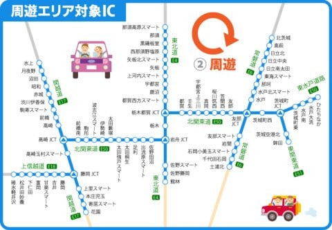

首都圏の出発エリアはあきる野，練馬，川口，

三郷あたりより北が対象エリア．

首都圏エリアの北側なので…

神奈川の南側はちょっと不利かも．

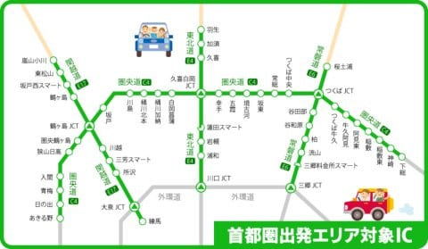

で，関東の出発エリアを出発点・帰着点として，

2日，または3日で北関東の対象エリアを好きなだけ

乗り降りし放題のこの券が，

2日間なら7500円，3日間なら8500円と

お得な割引価格です！！

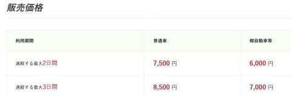

…ただ，単に軽井沢を往復するとか，

水上まで往復する…ってだけなら．

往復休日割引の方が安くなります．

これも往復片道が休日割引や深夜割引が

効かない時間に走る…って場合ならお得に

なるし．

さらに1日目は軽井沢，2日目は水上，

3日目は那須方面…という，気が狂った

移動をする人がいれば，ムチャクチャ割引に

なります！

この券も，期間限定ではなく通年の商品で．

年末年始やGW，お盆にシルバーウィークを

外せば年がら年中いつでも使えます…

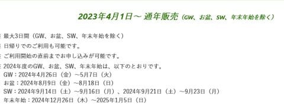

あ，この券も，軽井沢ショッピングセンターの

駐車場が無料になるとか，いくつかの

特典がありますね…

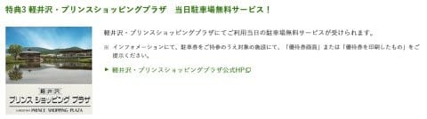

北関東周遊フリーパスの[申し込みはこちらから](https://www.driveplaza.com/etc/drawari/kitakanto/shutoken.html)！！！

…ってなことで．

信州に限らず．

首都圏から妙高や湯沢・六日町，長岡方面．

そして軽井沢から水上やら那須方面に行く場合の

高速割引もあるので．

これからのシーズン，スキーに行こうと

思う人や．

[長岡の某スキーショップ](http://www.equipe.jp/)に行こうと思う人は，

ぜひ使ってみてください…

## 💬 コメント一覧

### 💬 コメント by (はじめて)
**タイトル**: Unknown
**投稿日**: 2024-09-30 09:17:32

ブログというものを読んだ経験が10回以内の初心者です。楽しい記事だなと初めて思いました。

初めてコメント欄に記入していますがお返事は貰えるのでしょうか？

高速のサービスは湯沢発の逆往復でも利用できるのでしょうか？

今後も楽しい記事を見に来ます。

### 💬 コメント by (カンタロス)
**タイトル**: Unknown
**投稿日**: 2024-09-30 13:17:20

エスさま、こんにちは。

こういう割引てよく調べないで後からしって、メチャメチャ損した気分になることありますよね（笑）

こうやってまとめていただけるととてもありがたいです！

### 💬 コメント by (Skier_S)
**タイトル**: Unknown
**投稿日**: 2024-10-01 01:21:10

>はじめてさま

コメントありがとうございます～！

お返事しますよ～！

残念ながら，このサービスは首都圏発着のみで逆コースは利用できません…

よく考えると逆コースで利用できないのは不思議な割引ですよね…

またこれからもご愛読お願いします～！

＞カンタロスさま

そうなんですよ…この高速の割引は，自分で探さないと見落とすのでこまめに

チェックする必要があります

