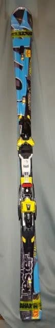
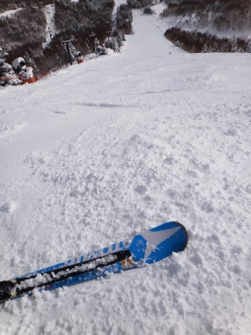
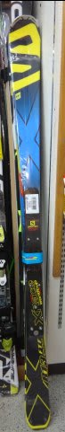
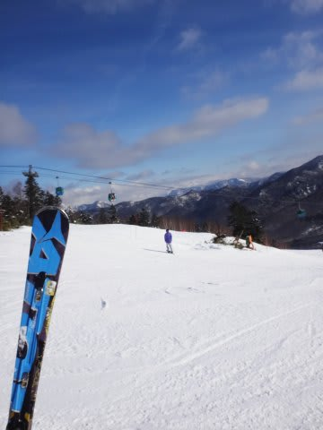
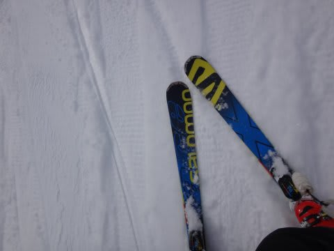

# Skier_Sはここ10年で何セット板をヘタらせたのか？ちょっと振り返ってみる…その2

📅 投稿日時: 2021-08-25 02:51:26

🏷️ カテゴリ: [スキー雑談](c1f9d2cb7478308da16419928ea3945e9.md)

ということで．

Skier_Sは果たして10シーズンで何セット板を

ヘタらせたのか？

それを明らかにする試み．

[前回](e1b41689e375309af18ba585df30d2526.md)に続き，第2回目です～！←一体何回続くんだろう…？

○2014シーズン

購入：1セット

○Atomic Bluester Demo SX2代目 

記念すべき[第1回物欲選手権](ebea1e9e359cc665d9cc2929e08045177.md)により購入した，

記憶に残る板ですね…

まだ初代SXがヘタっていないのに，

あまりにもSXが気に入りすぎて，

物欲に負けて2セット目を買ってしまった

という…

それがまた後に悲劇を生むとは知らずに…

死亡：1セット

○’13 Atomic Bluester Demo SX…1シーズンちょいで劣化

ものすごく気に入っていた初代SX．

だけど．

新しい2代目の'14SXと履き比べてしまうと…

この初代'13SXは，かなりマイルドじゃない！？

まぁ，[初代の方，たまたまマイルド版を
買ってしまったのか，
2代目がたまたま強化版を買ってしまったのか](ef429e6264e79c420fc0cb4dc41634d6c.md)

どっちかだろう…

なんてわけが無く．

昨シーズン買った初代が，1シーズン

ちょいでヘタってしまったことが判明．

このころから1年で板がヘタるように…(涙）

○2015シーズン

購入：1セット

○Salomon X-race 165cm（初代）

3台続けて購入したX-raceのうち1代目．

165cmと短いけど，フレックスが異常に強く

大回りが十分行けたので，大回り用として利用．

昨シーズン途中でブーツを変えてから，

大回り用のVolkl Platinum CDがちょっと弱く

感じたので，強い板が欲しくて…

[第3回物欲選手権](efb7a35a863f49c11192814a01ff642c2.md)に負けたのでした．

死亡：0セット

なんと！

この年は，死亡した板は無かったのですが…

シーズン終了時に，石ころ踏み用として

復活させて履いてみた初代'13 Atomic SXと

比べると，

2代目の'14 Atomic SXも'13 SXと

同じマイルドさになっているのに気づき．

[ヘタっていた初代のフレックスが，
長いこと履いていなかったため復活した説
を信じたかった](e008505548fc9e9232bc5dabad89a19a6.md)けど．

そんなわけはないよね…

昨シーズン後半から履き始めたのに．

やはり1シーズンちょいでヘタるとは…

そして．この前のシーズンに新しいブーツ，

ATOMIC Redster Pro130を買って．

ブーツが強すぎるのか，

ブーツソールが硬すぎるのか，

’13 Volkl Platinum CDがあまりにも

たわみすぎてテール側のグリップが抜けて

しまうので．

このシーズンに大回り用としてSalomon

 X-raceを購入したこともあり，Volklは

ドナドナされていったのでした…

ただ．

今から考えると．

当時は「ブーツに板が負けている」と思って

たけど，そうじゃなくて．

板がヘタっていた可能性も否定できない…

○2016シーズン

購入：1セット

○Atomic Bluester DD SX（一郎君）

記念すべき，SX四兄弟の長男，一郎君ですね…

'13，'14SXがあまりにも良すぎたけど．

モデルチェンジしちゃったので，どうしよう

かと悩んでいたところ．

前のSXからビンディングを移植すれば

安くなるという誘い言葉に乗って

[第5回物欲選手権で完敗した](e6abe5073a6309ba96beb83bbb4b9aa25.md)という…

この時点で，ATOMICのSXシリーズ

すでに3台目．

まさか今シーズン終わりまでSXを履き続ける

とは，この時はまだ思ってなかったなぁ…

死亡：2セット

○'14 Atomic Bluester Demo SX2代目…1シーズンちょいでヘタリ，2シーズン弱で引退

いや．

ホントは昨シーズン終盤にはヘタってたんだけど．

このシーズンは記録に残る雪不足により，

1月が終わるころまでゲレンデが石ころ

だらけだったため，新しい一郎君が履けず．

もう，完全にベロンベロンになって

いながらも，このシーズンの2月初めまで

延命を図ったのでした…

○'15 Salomon X-race 初代…2シーズンでヘタる

2月にSX2代目を引退させて，

SX一郎君をデビューさせた結果．

大体の予想通り，一郎君と履き比べると，

[初代のX-raceもヘタリ始めている
ことに気づいた](e0da6507b6f2c05b90f486279e94fcead.md)という…（涙）

昨シーズン買ったばかりなのに…

とりあえず，このシーズンの最後までは

なんとかこの板で乗り切りました．

（まだ続く）

## 💬 コメント一覧

### 💬 コメント by (大阪のK)
**タイトル**: Unknown
**投稿日**: 2021-08-25 12:21:24

焼額山1ゴン前にX-raceかSXが立て掛けてあると、Sさん居るなとなっていました。

おそらく二郎くんの頃にご本人を発見したと思います。

それ以前の戦績も凄まじいものがありますね😅

そろそろメーカーから耐用年数の加速度試験を依頼されるんじゃないですか(笑)

### 💬 コメント by (Skier_S)
**タイトル**: ＞大阪のKさま
**投稿日**: 2021-08-26 01:08:29

二郎君の頃でしたっけ…

2017~2018シーズンですね！

それから小回り板は二郎，三郎，四朗君がヘタリ．

大回り板も，X-race二代目がヘタり…

前も後も，かなり激しいペースで板が死んでます(涙)

確かに，メーカーから加速度試験依頼されて，

次々家に板が送られてくると嬉しいですね…(笑)

