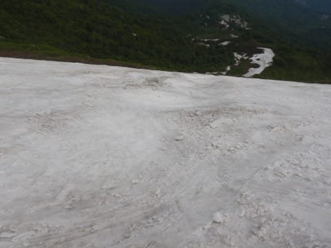

# 2021/6/13(日)の月山スキー場の詳細レポート！…リフトは何とか滑れるけど，乗り場降り場は歩くし修行モード．混んでは無かったよ

📅 投稿日時: 2021-06-17 01:10:21

ということで．

ここ2日ほどかなり致命的に死ぬほど

クリティカルな状況だったので，

まともに更新できませんでしたが…

今日は何とか復活して，

今さらながら感にあふれる

日曜の月山の詳細レポートです！

…でも．

ホントなら今日も更新せずに早く寝たい…

ってなことで．

日曜の月山．

8時のリフト営業開始に間に合うよう，

駐車場にやってきますが…

駐車場は7:30の段階で6割くらいの埋まり方．

昨日よりずっと人が少ない！

まぁ，昨日はまだリフト降り場のすぐ前

から板を履いてゲレンデに出られたし，

数m板を脱いで歩けばゲレンデから

リフト乗り場へ出れたけど，

昨日の最後にはリフト乗り場目の前まで

滑りこめなくなったので，

一気に人が減ったみたい…

でも，リフト券売り場と．

営業開始を待つリフトには，

列がつく程度の人は来てましたが…

でも，リフト待ちがあったのは，朝の

この1本目だけでした．

ってなことで．

天気は晴天～うす曇り．

気温は朝から20度を超えるような，

スキー場としては「暑いよ」と

言いたくなる，まさに夏スキーの天気．

で．山頂に到着すると…

あさイチは，まだリフト乗り場横から

ゲレンデに出られる道がギリギリ

残ってました！

この写真では分かりにくいけど…

もうちょっと先に進むと，こんな

感じで雪道の残りがありますが…

昨日は普通に滑れたこの部分．

今日はところどころ笹をかきわけ，

木の枝を乗り越えて行かないと

ゲレンデに出られなくなってます(涙）

でも，一旦沢コースに出ちゃえば，

そこにはまだ雪がついてます！

沢コース真ん中には，延々1本のコブラインが

続いてますね…

ただ．

コース下部の，前日の土曜日はまだ板を

履いてギリギリ乗り越えられた部分も，

今日は朝からアウトな感じ…(涙）

途中2カ所，完全に板を脱いで

歩いて行かないといけなくなりました…

うーん．

ここは昨日までギリギリ滑って

行けたんだけどなぁ…

さらに．

山頂のリフト降り場から沢コースへ出る

ショートカットパス．

昼前には，真ん中の笹薮が現れ始め…

笹藪をかき分けて行かないと向こうに

抜けられないという．

スキー場なのに探検隊気分を味わえるコース

となってしまったため．

残念ながら，10時ごろにはクローズと

なってしまいました(涙）

しかし．

土曜はこんな感じでまだ滑れたコースが…

翌日にはこんなになってしまう

とは…！！(泣）

だもんで．

ゲレンデに出るには，リフトを降りてから

この道を歩いていくしかなく…

リフトを降りてからゲレンデまで，

徒歩5分コースとなりました(涙）

乗り場の方も，昨日昼にショートカット

パスが閉鎖されたので．

こちらも土曜のレポートに書いたように，

リフト乗り場のかなり下のここで

板を脱いで…

こういうところを歩いていくことになります．

乗り場も，板を脱いでからリフトに乗るまで，

徒歩5分コース…

ってなことで．

月山のリフト，この最終形態になると．

リフトに乗るのに5分．

リフト10分．

リフト降りてゲレンデに出るのに5分．

そして，大斜面までトラバースするのに5分．

これだけの時間をかけて．

滑って楽しいの5分…

リフト1本30分．

1時間で2本．

それも，楽しい5分のために

残り25分の修行タイム…

だもんで．

月山リフトがこの最終形態になると，

ここまで苦労して滑ろうという人は少なく．

当然のごとく，リフト待ちは全く無い

スカスカガラガラになります．

うむ．

リフト待ちが無いのはありがたい！

そして．

25分苦労しても，5分楽しく滑れる

だけマシ！

雪質がとやかく言えるレベルじゃ

ないけど．

滑れるだけシアワセなのだ！

なんだかんだ言って，

大斜面まで出てしまえば．

この時期でも雪がこれだけあって…

そこそこのコブ斜面を滑れるのだ！

…逆に，大斜面はコブしか滑れないん

だけど…

でも，5月中旬のかぐらよりいい感じの，

コブ好きにはたまらないコブが，

この時期にまだたくさんあるのだ！

ちなみに．

これが月山のリフトで滑れる

コースのだいたい全景になり．

まだ一見，雪がいっぱいあるように

みえますが…

大斜面を拡大すると．

赤丸で記した部分，もうすぐ切れそうです…

昨日から今日にかけての雪の消えっぷり

を見るに，もってあと数日．

今週末は厳しいかな…

ただ．

月山はリフトが滑れなくなっても．

リフトの上のこの部分に架かっている

Tバーが滑れます．

月山のシーズンは，リフトが滑れなく

なっても，まだまだ続きます！

（結局この土日，私はTバーを1本も

　滑らなかったけど…)

ってな感じで．

リフトの乗り降りで，板を担いで

坂道を登る苦労はあるものの．

それでも滑れる幸せを嚙みしめつつ．

この日もリフト営業終了の16:30近く

まで，しっかり滑り倒したのでした…

…そして．

この日のラストリフトをもって．

私の2021シーズンのスキーも

終わりました…

無事，怪我なくシーズンを終えられた

ことに，感謝！！

