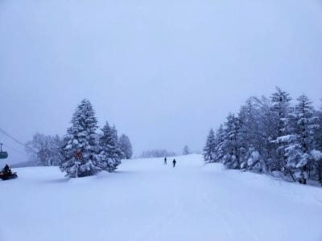

# 今日の志賀高原は午後から雪がかなり積もったみたい…明日も大量に積もるのか？積もらないのか？天気図が矛盾してて難しい…

📅 投稿日時: 2022-01-21 01:12:38

えー．

本日も，志賀高原特派員から情報が

送られてきましたが．

今日の志賀高原．昨日予想した，

　朝は-12℃程度．

という予想がほぼ当たりの-13℃！！

さらに，

　朝までにうっすら積雪．

というところも予想通り！

そのうえ，

　朝は曇り，午前中は時折雪が

　ぱらつく程度だけど，

というところも概ね当たったようです…

そして，最後の

　午後から雪が強くなる．

というところも当てたんですが…

でも，午後からの雪が，予想以上に

強かったようで，

なんと，夜7時までで，焼額に40~50cmも

積もったようです…！！！

いや．

雪が強くなるとは思っていたけど．

ここまで積もるとは思ってなかった…

([焼額山スキー場Facebook](https://ja-jp.facebook.com/yakebitaiyama/)より）

そして．

夜になった今も，かなりの勢いで降り続けて

いるようです…！！

（[北信建設事務所道路状況ページ](http://hokushin.pref-nagano-roadcamera.jp/)より）

うーむ．

昨日の記事では，明日金曜21日の予想を

　朝までの積雪は20cmくらい．

　（略）

　この日は終日雪がぱらつくが，

　ドサドサ積もるほどじゃない．

と書いてましたが…

明日の朝まで，20cm以上より積もって

そうだから．

…積雪量の予想，外したな…（涙）

でも．

だって．

今の最新の，金曜21日の朝9時の

予想天気図を見ても．

水色で描いた降水域，すなわち雪雲が

日本海全体を覆うほどではなく，

日本海の日本列島近辺にちょろっと

あるだけなので，そんなに強い雪に

なりそうにない天気図だし…

さらにこの天気図を拡大すると．

赤く括った+11の数字．

これは，21日夜9時から22日朝9時までの

12時間での降水量が11mm…

雪の量で言えば11cmって予想なので．

そんなに積もらないって天気図なんだ

けど…？？？

でも，実際は．

すでにそれ以上降ってそう．

うん．

私が予想を外したのは，気象庁の天気図が

悪い！！←責任転嫁

…でも．

FXFEシリーズの天気図から，

21日の500hpa図を見てみると．

これ，500hpaの気温だけじゃなく，

湿数も書かれてるんだけど…

私の経験上，湿数が0の領域…

この図での網掛け領域が日本の

東西を挟むように位置して

（図で赤く塗ったところ），

その間に湿数が高い領域がある場合．

この湿数が高いところは，冷えた

空気が水色の矢印のように北から南に

吹き抜けていることを示していて．

…これ，経験則的に志賀高原では

結構雪が積もるパターンなんですよね…

地上天気図では積雪がそんなにないと

読み取れる図面になっていて．

でも，500hpa図の湿数のパターンからは

そこそこの積雪…というか，エンドレス

パウダーになりそうに見える，

この場合．

果たして，積もるのか？

積もらないのか？？？

うーん…

難しいところ…

とりあえず．

明日，21日の予想は．

21日(金)：朝までの積雪は50cm？

　非圧雪は太ももパフのパウダー！

　朝の気温は-15℃くらいの冷え冷え．

　この日は終日雪が激しく降り続け，

　昼間も20cm以上積もるか？

と，訂正してみます…

うーん．

明日の昼間，雪がガシガシ積もって

エンドレスパウダーになるほどの

積雪があるのか？

あるいは，雪は降ってもせいぜい

パラパラしか無いのか？

地上天気図と500hpa図が違う主張を

している場合，どっちが正しいのか？？

明日の天気を楽しみに待ちましょう…！！←すでに当てようという気を失っている

私としては，地上天気図の

「降水量が少ない」

って予想が外れてる気がするなぁ…

PS．

そして，23日の日曜は，すっきり晴天から

ちょっと雲が多そうな予想天気図に

変わっている…（がっくし）

## 💬 コメント一覧

### 💬 コメント by (地元民)
**タイトル**: Unknown
**投稿日**: 2022-01-21 06:24:16

午後からの平地の降り方はすさまじくて、普段、注意報は出ても警報にはまずならない須坂市、小布施町も大雪警報が出され、朝までに30〜40㌢。

中野市内は雪が壁になって道が狭いので、事故には気をつけてください。

### 💬 コメント by (レインボー74)
**タイトル**: Unknown
**投稿日**: 2022-01-21 12:38:43

金曜日の志賀高原情報

湯田中の車に35cm。上林-5℃　蓮池-8℃。上は吹雪いている。

ゲレンデ整備が間に合わないため20分遅れの営業。

すぐにGSサイドに入るも、深すぎて動けない。なんとか脱出してGSを滑るも、ここでも十分なパウダー。20cm位かなあ。最後の壁を終えて力を抜いたとたんに、足をとられて転倒。お腹をストックで打ってから後頭部をガツン。お腹にはよろいが。頭にはヘルメットが。備えあれば、です。

そのあと、どうも見にくい。緩斜面での転倒は危ないですよね。物が二重に見える。数年前と同じ症状です。これは時間薬なので様子をみるしかないみたい。

あとはパノラマを二本、ちんたらと滑っただけで早退しました。

### 💬 コメント by (Skier_S)
**タイトル**: 今週末も志賀高原
**投稿日**: 2022-01-21 23:30:23

＞地元民さま

昨晩はすごい降りだったようですね…！

志賀高原までの道もすごいみたいなので，気を付けていきます~！

＞レインボー74さま

あら！転倒ですか！！

ヘルメットとプロテクターしてて良かったですけど，くれぐれも

気を付けてください…

