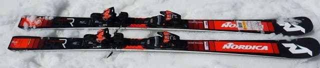
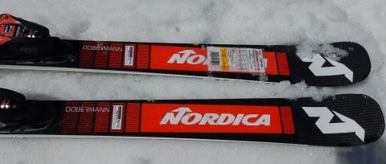
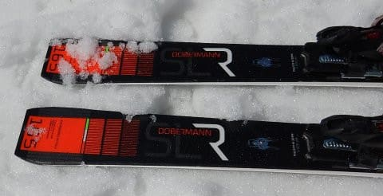
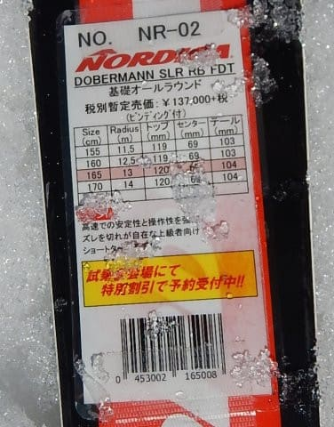

# 2020シーズンモデルのスキー板，試乗レポート…NORDICA編その2

📅 投稿日時: 2019-06-21 02:56:41

そうです．

何度も言うように，このBlogは

スキーヤーBlogなので．

今日もスキーネタなのだ！

車じゃなく，スキーの試乗レポートなのだ！

決してSkier_Sの仕事がご無体で，

帰宅が深夜になってしまい，

記事を書いている時間が無いから．

書きためておいたスキー試乗レポートを

載せてごまかしている…

なんて，ホントのことを推測しては

いけません．

ってなことで．

本日はノルディカ編です．

では，どうぞ～！！

○NORDICA DOBERMANN　SLR RB FDT 165cm

基礎小回り用

[前回のアサマ2000での試乗](e02d57cd1e020dd7a913c4155a46bf60e.md)に続き，

2回目の試乗になるこの板ですが．

前回の試乗は，硬く締まった斜面で．

かなりのハイスピード小回りを気持ちよく

決められたので．

次期主力戦闘機候補にしてもいいなぁ…

と思った，この板．←いや，買っちゃダメだから．

来シーズンは板買わないからっ！！

…4月のザクザクの志賀高原の雪では，

一体どんな感じなのか？

柔らかくて重い春雪でも，まともに

滑れる板なのか…？？

というところが気になり．

2回目の試乗に臨んでみました…

試乗したのはあさイチで，

まだ硬いところが残っていたので．

まずは硬い斜面をもう一度滑ってみると…

やっぱりいい！！

一の瀬正面バーンなので，アサマ2000の

Stage2より斜面は急．

ピュアなカービング小回りで滑るのは

厳しい斜度だけど，板が斜面に

しっかり張り付いてターンしていきます．

硬い雪面にトップからテールまでしっかり

板が張り付き，ぐっとたわんで鋭く

回っていきます．

かなり戦闘力の高い，攻撃的な滑りができます．

そして，荒れた重い春雪に突っ込んでみると…

なんだ．意外とズラシのコントロールも

いいじゃないですか！

荒れた急斜面でも，ズラしながら，

きれいにひねりを作って落ちていけます．

かなりの落差を取った，ズレの小回りが

きれいに決まります．

雪が荒れているのに，板の重さによって

荒れた雪面を押しのけながら，

ハイスピードで安定してずらして

落ちて行ける感じ．

…ただ．

板が重いので，動かしていくのに

パワーが必要です．

荒れた斜面でのズラしの小回りをする時．

安定感は高いですが，かなり体力を

消耗する感じ…

決して気楽に乗れて，簡単に振り回せる

板ではありません．

でも，体力があれば．

荒れた斜面でも安定して滑って行けるし，

硬い斜面では，かなりの筋力で強い横Gに

耐えていかないといけないような，

強烈小回りをキメることもできるし．

かなり高性能な小回り板です．

どうやっても小回りが強制される，小回り

スペシャルというわけでは無く．

まぁ，引っ張っていけばロングもできなくは

無い板ですけど．

やっぱり小回りで滑った方が気持ちいい板

ですね．

ってなことで．

この板，体力が必要とされますが．

一日この板を履いて滑ると疲れそうですが．

体力がある人なら，硬い斜面も柔らかい斜面も

攻撃的に滑れる，刺激的な板だと

思いました…

うん．

万人には薦められないけど．

私は気に入った！
