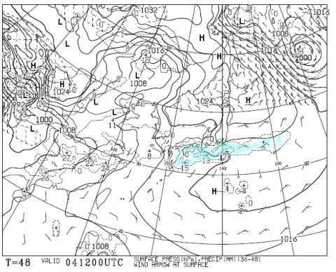
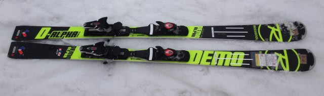
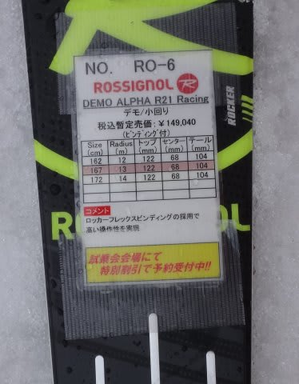
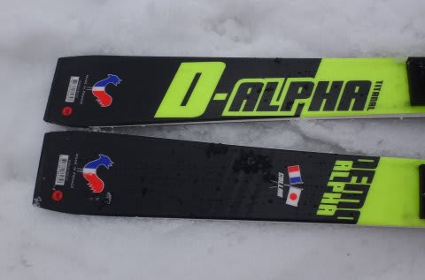
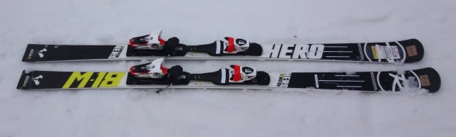
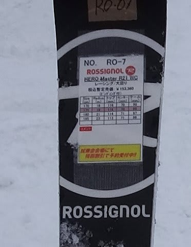
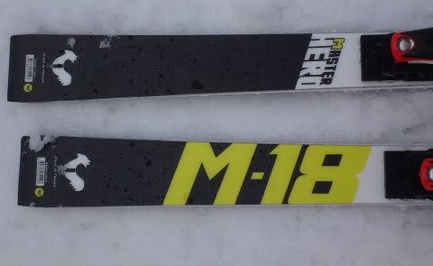
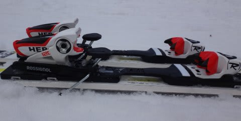

# 2016シーズンモデル，スキー試乗レポート第8回…ROSSIGNOL編

📅 投稿日時: 2015-04-03 01:17:05

🏷️ カテゴリ: [スキー板試乗](c0bd8048615710cee890e403a36cc9a2b.md)

あれれれ？

現在の最新の予想天気図を見ると．

4日土曜日の地上天気図は，昨日とは大きく変わって．

こんな感じになってるんですが…

これは．

昨日の予想では日本全土を覆っていた降水域が，

本州より南に下がっちゃってますが…！？？

…土曜日．この天気図どおりになるなら．

志賀高原，雨は降らなさそう！

曇り，時折日も射す…って程度かも！

…気温がすごい高いって予想は相変わらずですが．

…ただ．

まだ，正確な予想は難しいので．

また明日，最終予想をします…

ってことで．

まだ続く，2016シーズンモデルのスキー板，試乗インプレッション．

今日は，ロシニョール編です．

では，どうぞ～！

○ROSSIGNOL DEMO ALPHA R21 Racing 167cm

基礎小回り用．

今シーズンモデルの「R20」プレートから進化して，

来シーズンは「R21」プレートになるようですね…

やはり，今シーズンモデル同様，かなり固く，しっかり重めで．

全体的にちょっと手ごわい板です…．

かなりの体力，スピードがないと，板をたわませられない感じで，

さらに，かな～りグリップが強いです．

しっかりした重さとも相まって，ずらしてコントロールしようとは

思えません．カービングスペシャルな板です．

実用域のスピードはかなり高く，

しっかり力を使って抑えて行かないと，サイドカーブに乗って

板の行きたい方向に回されるだけの感じ…

でも，かなりのスピードを出して，割とトップ目荷重気味に

しっかり抑えて行けば，強力なグリップで板が回ってきます．

強烈なグリップによる板の旋回力で，板が反対側まで

回り込んで切り替わっていく感じ．

VolklのSDのように，返りの速さで板が反対にすっ飛んでいく…

という，強いばね感の返りがある板ではありません．

この重さ・強さと過度に早すぎない返りのおかげで，

高速で滑ると，しっかり雪面に張り付いたターンができます．

高速耐性はかなり強いです．

強烈なグリップ・高速耐性を持つSALOMONのX-RACEよりも，

さらにグリップが強く感じ，高速耐性も高い気がします…

体重・体力のある人が，技術選本番で，フラットなバーンを

超高速で強烈なカービング小回りする…って感じの，

気合いの入った滑りをするには，無敵の板かと思います．

ここ一番…ってときに，整地でガッツリグリップ小回りさせるには

すごいポテンシャルの高さを感じますが．

コブとかはつらいだろうし．

気楽に履いて，ゲレンデを一日中滑る板じゃないかな～．

○ROSSIGNOL HERO Master R21 WC 175cm

GSマスターズ用．

これは，DEMO ALPHA R21と同じ，R21プレートがついてます…

結構フレックスは柔らかめ．

割とテール荷重で，板を抑えるポイントはセンターからテールより

のような気がしたんですが…

なんだか，ATOMICブーツと相性が悪いのか？

かかと部分を押さえていくと，ヒールピース付近にたわみが

集中しすぎてしまい，板が窒息してトップとテールの

グリップが抜けていく感じ．

あまり強く板に仕掛けていく板ではなさそう．

また，リアルな高速域では，トップが多少ばたついて，

グリップが抜けていく感じが…．

ただ，優し目のフレックスとグリップのおかげで，ずらしで

動かしやすく，谷回りで板を動かして

板を好きなところにもっていける自由度は高いです．

いろんな小技が使えます．

体重が軽め・脚力がそれほどない人や，板にあまり仕掛けず

板なりに曲がっていく人の大回り用としては，適当に動かしやすく，

コントロール性も高いので，向くかも．
