# 今年の座間味ダイビングで，我が愛用カメラ，NIKON AW130がお亡くなりに…（涙）

📅 投稿日時: 2019-09-15 01:08:51

🏷️ カテゴリ: [PC,カメラ&小物](c0d8caed13e597efe97b661a8ae56bed0.md)

えー．

前回，この一年間でダイビング器材が

次々死に絶えていったのをネタに

しましたが．

…その記事の最後に書いたように．

もう一つの大事なパートナーが，

今年の座間味遠征で

息絶えました…

そう．

それは．

私がダイビングの時も．

スキーの時も．

常に肌身離さず持ち歩いていた，

30m防水カメラ，

AW130．

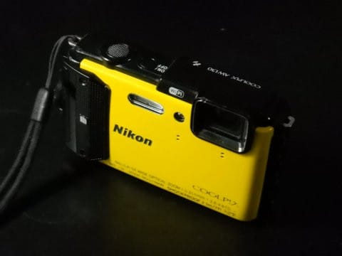

[このカメラを購入](e83af8293e4666f3a4598af174c1acedd.md)して以来．

このBlogに掲載する写真の

ほとんどを撮影してきた，

我が愛機が．

残念なことに，故障してしまい

ました…（涙）

今回，妻用のダイビングカメラに

不具合があったので．

「まぁ，購入後2年経ってるんで

　防水パッキンがヘタリ気味か

　もしれないけど．

　30m防水カメラだし，娘と潜れば

　12mまでしか行かないから，

　大丈夫だよね…」

と，ダイビングにもっていったところ．

そのダイビング中は問題が

無かったのですが．

ダイビング終了後に，

レンズや液晶画面が内部から

結露しだして．

こんなぼんやりした写真しか

撮れなくなったと思ったら…

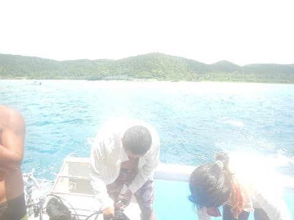

ついには，最後に謎の写真を残して

死に絶えてしまいました…

完全水没では無く，

内部に結露する程度の，

数滴レベルの浸水だったので．

乾燥させたら復活しないか…

と，乾燥剤を入れた容器に数日

密閉したりしていると．

一旦復活して，使えるように

なったのですが．

やはり，浸水したのが真水ではなく，

海水だったので．

塩分による内部腐食のため，ボタンに

反応しないなど，各部の操作が

徐々におかしくなっていってしまい．

残念ながら，完全蘇生とはならず．

死亡判定を下しました…（涙）

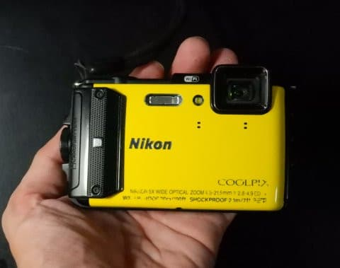

2年と3か月の短い間だったけど．

お世話になったね…

さようなら…

とはいえ．

私のメインカメラは，

-20度近い極寒から，

常夏の南の島まで．

さらに2000m越えの山頂から

海の中まで．

年間15000枚～20000枚撮影

と，かなり酷使される

宿命にあるので．

大体2年，もって3年というのが

平均的な値．

このAW130も，2年ちょいなら

私のメインカメラとしては，

平均的な寿命でしょうか…

私のカメラとして，4年近い

驚異の長寿命を誇ったカメラが

ありましたが．

そのカメラ，酷使しすぎて．

最後の方は，シャッターボタンやら

電源ボタンの接触がおかしく

なってきた…

というほどで．

だもんで．

おそらく，水没しなくても，

このカメラも，あと1年も使っていれば

いろいろ使い過ぎでガタが出てきていた

だろう…

と思って，今回は諦めました(涙）

なにしろ，

電池ブタ周りは，手で擦れた部分が

ツルツルになってきてたし．

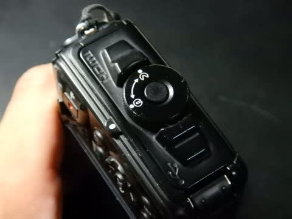

それ以外にも，いろいろな歴戦の

傷が，まるで名誉の負傷のように

そこらじゅうに残ってました…

かなり酷使していて，電池ブタの

開閉回数が半端ないので，

おそらく電池ブタのパッキンの水密が

甘くなってたんだと思います…

パッキンにはほこりなど挟まないよう，

パッキンの周りは，かなりきれいに

していたんですが…

しかし．

2年ちょいで，4万枚近く撮影したので．

コンパクトデジカメの設計寿命が，

1万枚程度と考えると．

かなり使い込んだ方かと．

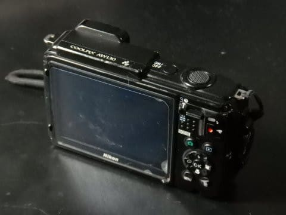

とりあえず．

約4万枚．

この2年間，Blogに掲載された，

水中以外のほとんどの写真を撮ってくれた，

このカメラに．

お疲れ様，と言っておきましょう…

ということで．

AW130がお亡くなりになったので．

…

…

…

後継機のW300を購入しました～！

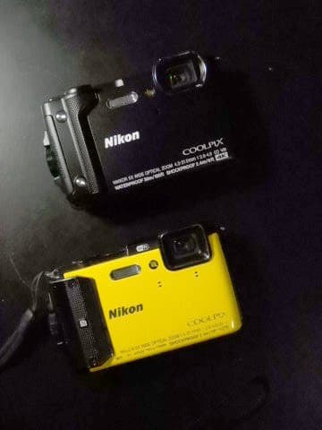

…いや．

やっぱり私は，かなりカメラを

過酷な条件で酷使するので．

防水がどうしても必須だし．

スキーで動画を撮ることも多いし．

防水で，スキーの動画が撮れて，

そこそこ安い…

となると，やっぱりこの機種しか

残りませんでした．

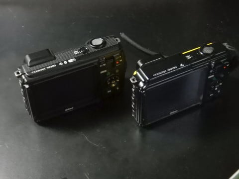

ってことで．

今年のモアルボアル旅行以降，

このBlogの写真は，新しい

カメラで撮ったものになります～！

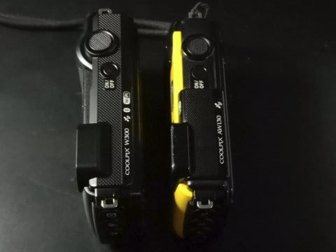

そして，今回．

このW300が，すごく安く投げ売りしていたのを

発見したので．

この際に，私のカメラだけじゃなく．

購入後10年が経過し，不具合を

だましだまし使っていた，

妻の水中カメラも買い替える

ことになり．

さらに，わが親戚からも

「防水カメラ買い変えるなら，

　私の分も買っておいてくれない？」

と言われたのもあり．

…なぜだか，こんなことに

なってしまいました…！！

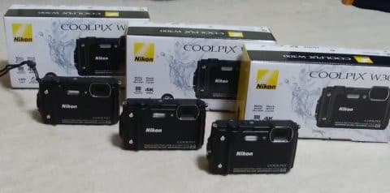

…いや．

我が家は，スキー板だけじゃなく．

カメラも勝手に増殖しちゃうみたいに

見えますね…

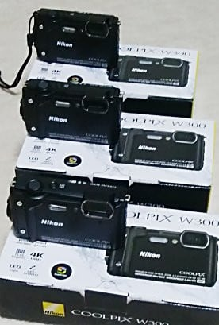

とりあえず，

W300をしばらく使ってみたら．

また使用レポートを書いてみようかと

思います～！

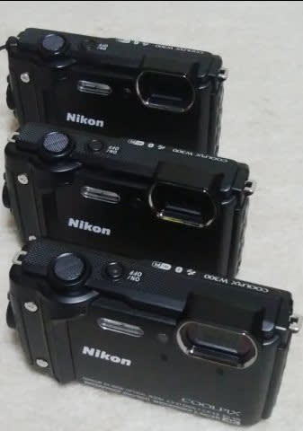

## 💬 コメント一覧

### 💬 コメント by (yumi)
**タイトル**: Unknown
**投稿日**: 2019-09-15 03:10:03

ぷっ❗️

・・・・・

### 💬 コメント by (Skier_S)
**タイトル**: ＞yumiさま
**投稿日**: 2019-09-15 04:00:50

あら…

こんな時間にコメントとは，かなり早くお目覚めなのでしょうか．

なかなか同じデジカメが3台並んでる絵は無いと思います（笑）

### 💬 コメント by (はなげ親分)
**タイトル**: Unknown
**投稿日**: 2019-09-15 14:29:41

同じデジカメ３台の写真

圧巻ですね～

次は何が増殖するのでしょう？

### 💬 コメント by (しんちゃん)
**タイトル**: ＳＸ増殖以来
**投稿日**: 2019-09-16 00:31:31

ＳＸ増殖以来、同機種カメラの増殖画像は驚愕ですね。

W300、防水カメラでは最もコスパいいんですね。

果たして次は何が増殖するのやら

ブーツ、グローブ、携帯電話、パソコン？お金だけは増殖しないものですね(笑)

### 💬 コメント by (KENKEN)
**タイトル**: Unknown
**投稿日**: 2019-09-16 02:07:31

うちも同じのを買いました。　

理由も同じです((T_T))。

保険申請中(^o^)。

### 💬 コメント by (Skier_S)
**タイトル**: 新カメラですでに1500枚ほど撮影
**投稿日**: 2019-09-17 03:58:26

＞はなげ親分さま

いろんなものが増殖していきます．

次は車が増殖したりしたら危ないですね…（笑）

＞しんちゃんさま

そうか！！

お金が増殖してくれればいいですね…

上手くお金が増殖してくれる方法は無いでしょうか（笑）．

＞KENKENさま

やっぱり，このカメラの電池ブタパッキンは

そうそう長くもつものじゃないですよね…

Oリング用グリス塗ったらもつでしょうか…？？

ダイビングで結構使っている人を見ますが，

みんな水没しないんでしょうか？？

