# 2月12日，3連休最終日の志賀高原速報モード…激冷え！終日雪がちらつく一日．天気悪いからか混まなかったよ

📅 投稿日時: 2018-02-13 04:10:23

えー．

今日も最終リフトまで滑ったうえ．

娘と一緒に買い物やら夕食やら温泉やらで，

のんびりすごしていたら．

なぜか小布施の温泉を出るが夜9時近くという，

これから首都圏に帰る人間にとってあるまじき時間

になってしまった，Skier_Sです．

だもんで．

本日も帰宅は深夜…（泣）．

ってなわけで．

日曜深夜定番，速報モードにて

今日の志賀高原の状況をば…

本日．

宿泊地の関係と，娘のリクエストで．

焼額を生息地をする私にとって大変珍しいことに，

蓮池スタートとなった本日．

朝は，雪が吹き付けるすごい寒そうな

状況でスタートです…

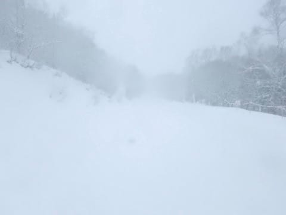

気温は-15度程度と，すごく寒く．

そのせいか，蓮池の朝イチは誰も滑ってません（笑）．

サンバレーも滑ってみましたが…

うーむ．

標高の低いサンバレーあたりは，ちょっと10日夜の

雪が湿っぽかったのか．

結構殺人コロコロがあって，下地が固めの

難し目のバーン…

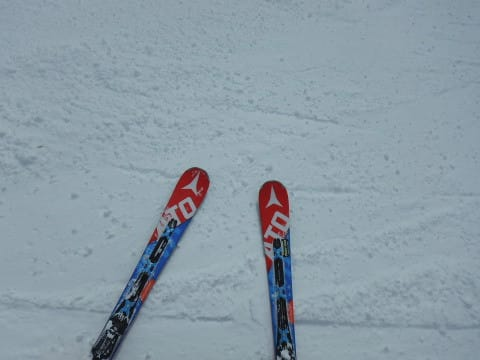

しかし．

激冷え＆雪降りの本日．

…こーゆー日は，寒い風をしのげる

焼額のゴンドラで滑りたいところですが．

なぜこんな日に限って，激寒リフトに

乗らなくてはならないのか…

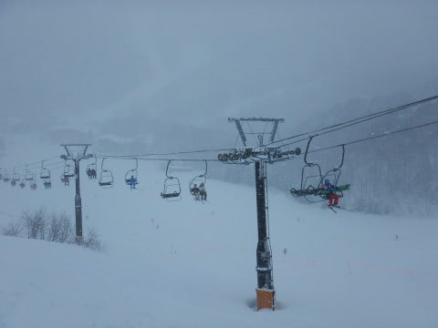

「焼額じゃないスキー場も滑りたい！！」という，

わが娘のリクエストを恨むばかり…←毎回志賀に来ても焼額しか滑らせてもらえないから，そのリクエストも分かる気もする…

寺子屋までくると，さすがに雪は良かったけど．

昼間の気温も-10℃以下で，風も吹きつけて．

死ぬほど寒かったです…（涙）．

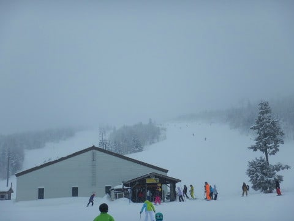

寒かったからか，風がしのげる

西館フーディーリフトは結構混んでたし…

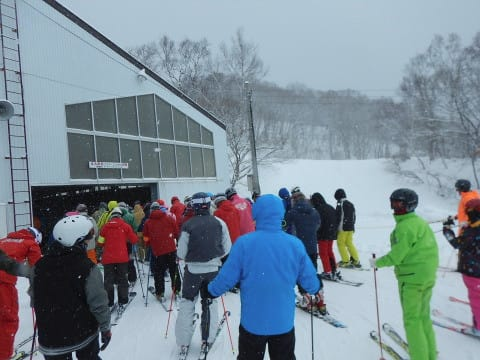

そして，一の瀬ファミリーも修学旅行生で

結構混雑してたけど．

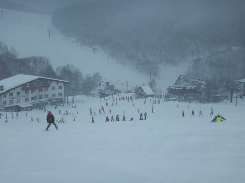

それ以外は，高天ヶ原も…

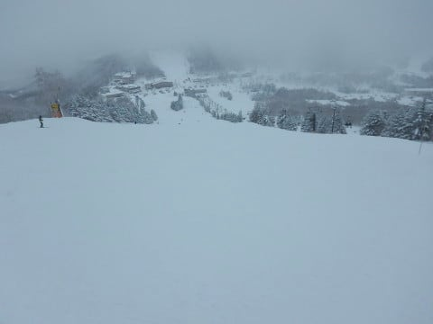

東館山もコース上に人が少なく．

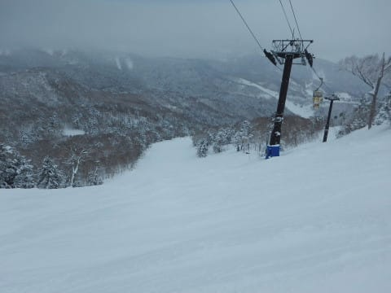

大体のリフトが，悪天候のため

ガラガラでしたね～…

「寒いから，焼額のゴンドラで滑ろうよ～…」

という私の願いも虚しく．

午後はなぜか焼額ではなく，東館山ゴンドラを

グルグル滑ることになり．

全面銀色の搬器，銀さんと…

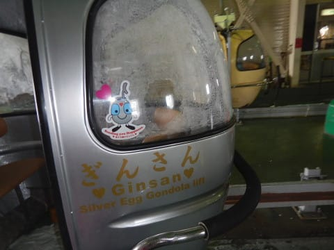

金さんの両方に乗るまで帰らない！

とか言っていた娘．

いやいや，数10台ある搬器の2台しかない

両方を狙って乗るなんて無理でしょ…っ！！！

このままでは，帰れない…（涙）

とか思っていたら．

ガラガラだったので，何とか

タイミングを合わせて上手く両方に

乗ることができ．

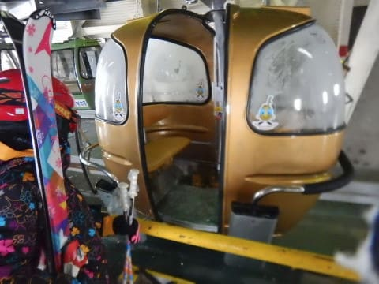

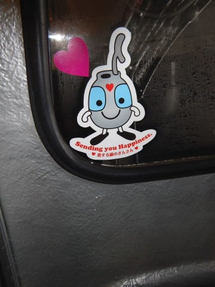

何とか帰ることができました…．

いやーー．

しかし．

昼間も-10℃を下回っていた本日．

寒かったにもかかわらず．

…雪はちらつく程度で，それほど積もらず（涙）．

いや，西館やサンバレーなんかは下地が固くなってきてるし．

東館山は雪が薄くなってきてるところもあるし．

そろそろ一降りほしいなぁ…

ってことで．

焼額を生息地とする私としてはありえないことに，

志賀高原にいながら焼額で滑らなかった本日．

おそらく，焼額のリフト係員の方に．

「今日はあの人，休みかな？」

と思われているに違いない…

と心配になった，Skier_Sなのでした．

## 💬 コメント一覧

### 💬 コメント by (michi)
**タイトル**: Unknown
**投稿日**: 2018-02-13 06:55:21

昨日はかなり寒かったようですね。

先日うちの息子も銀さんゴンドラに乗れて嬉しくて金さんにも乗りたいと言ってました。子供は同じこと考えるんですね（笑）

しかしさすがS様の娘さん。体力と根性が凄いです。うちのはたぶん寒さに負けて早々に帰ってると思います(^^;)

### 💬 コメント by (ちょく)
**タイトル**: しゅ
**投稿日**: 2018-02-13 07:53:56

首都圏へ帰る？！

てっきり長野県内の方だと思ってたので驚きです。

### 💬 コメント by (かず)
**タイトル**: Unknown
**投稿日**: 2018-02-13 11:58:09

かなり降ってますね　当たり連休明けでした　明日下地にあたらなければ最高そうですね

### 💬 コメント by (hiro)
**タイトル**: 朝一の丸池にSさんのお姿が？
**投稿日**: 2018-02-13 12:27:55

再会が果たせてとても嬉しかったです！

焼額でなく丸池で？とは自分の目を疑いましたが（驚）。ご家族の皆様ともご挨拶ができてラッキーでした。また、意表を突く場所で再会できそうな気がします。その時は、是非よろしくお願いします。ご丁寧なご配慮ありがとうございました。

### 💬 コメント by (yama)
**タイトル**: 代わりに
**投稿日**: 2018-02-13 21:03:21

ヤケビには代わりにgokuさんとコンスケさんが、行っていました。Sさんがヤケビにいないなんて、年に何度あるか。gokuさん、Sちゃん親子は毎日会いました。それもこんなところでと思う場所でした。来週はいつも通りに会いたいと思います。

### 💬 コメント by (いか)
**タイトル**: 等圧線が寝ると…？
**投稿日**: 2018-02-14 00:59:58

私も日月のみの滑走@八方でしたが、日曜日の混雑はすごかったですね…。リーゼンでなんどか進路のスペースを失って止まらざるを得ませんでした(笑) ただ、色々見ていますと、八方とか志賀高原とかはまだましだったのかと思います…。アクセスしやすいところは激混みだったようです。

月曜日は朝にはもさもさ雪降りで積もっていました。等圧線が縦縞から西に傾いたときの典型的な白馬パターンでした(ここで学んだ知識)。アルペンは動き出しが遅れましたが、先頭で突っ込むと30センチほどに増えてまして、雪浴びを堪能できました(*^^)v 月曜日は人も少なく、お昼からSXに変えても全く整地は滑りませんでした…！

### 💬 コメント by (Skier_S)
**タイトル**: 焼額朝礼・終礼に参加しないとちと寂しい…
**投稿日**: 2018-02-14 06:42:20

>michiさま

金さん銀さんは，ガラガラでしたので

狙って両方乗れました～！

乗り場に着いたころにゴンドラ見かけたら，

走ってゲートくぐれば待ちなしで乗れたので．

でも，日曜は寒かったので．

わが娘も3時ごろには上がりました…

＞ちょくさま

初コメントありがとうございます～！

某K奈川県民です←全然某になってない

毎週片道4時間半かけて通ってます…

長野県民で10月に毎週Yetiに行ったり，

月山に行ったりする方がいろいろ

伝説に残るかもしれません（笑）

＞hiroさま

日曜はどうもでした！

まさか丸池でお会いするとは…

今回はご家族一緒にご挨拶できて

良かったです．

奥さんもBlog読んでくださっているようで，

嬉しかったです～！

また志賀高原でお会いしましょう！

＞yamaさま

あれ！？？KonSukeさんも焼額だったんですか！

珍しいですね…

私も一日焼額に行かないのは，おそらく

シーズン1度あるかないかだと思います…

来週はガッツリ焼額で滑る予定です！

＞いかさま

動画見ましたが，結構積もったんですね…

いいなぁ…

志賀は積雪5cm．

標高が低いところは，下地の固いのが

結構出てきてます（涙）．

でも，月曜はガラガラで良かったかな！

