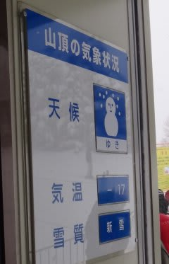
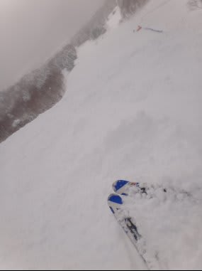
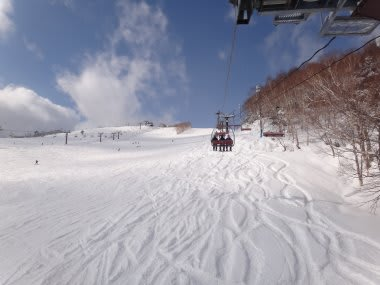
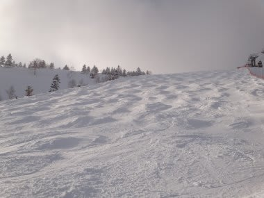
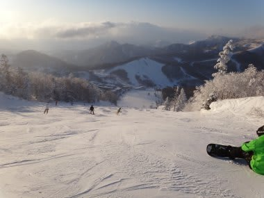
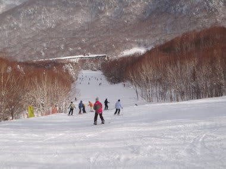

# 2月11日　土曜日の志賀高原は…

📅 投稿日時: 2012-02-11 21:51:36

🏷️ カテゴリ: [2012スキー滑走日記](cca3a0e9524e0203150f790b1fc3c71ad.md)

えー．

今週も来てます．

志賀高原へ．

あー．

今日の志賀高原．

午前中はかなり冷え込み，予想通りの雪でした．

朝の非圧雪コースは膝パフくらいのパウダー．

圧雪コースもブーツくらいの新雪…

でも，昼ごろに日がさし始め．

午後は時々雲が出て雪がちらつくものの．

日がさす絶好のスキー日よりになりました．

…でも，圧雪の上に積もっていた雪が蹴散らされ，

コースはかなりでこぼこに…

そして．

コースのところどころ，先週の雨でできたアイスバーンが

顔を出しているという…

特に，一の瀬メインバーン上側．

恐怖の全面アイスバーンと化してました…

そこ以外は，それほどひどいアイスバーンではなく，

ところどころに固い部分がちょっと顔を出してるかな，

という感じでしたが．

一の瀬メインバーンは殺人アイスバーンでしたね．

あ，そうそう．

2月に入ったからか．

ゲレンデの人は増えましたね～．

スキー活性化ということでうれしくはありますが．

ちょっと自由にラインを取りにくい人口密度でした．

あー．

でも．

焼額第1ゴンドラ待ちは最高2-3分．

それ以外のリフトはほとんど待ち0，って感じで．

待ち時間はそれほどでもなかったです．

…ゲレンデの人口密度が多かった感じ．

2月．シーズンのピークがやってきた感じですね～
