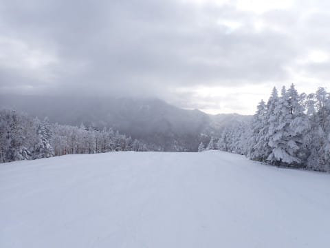
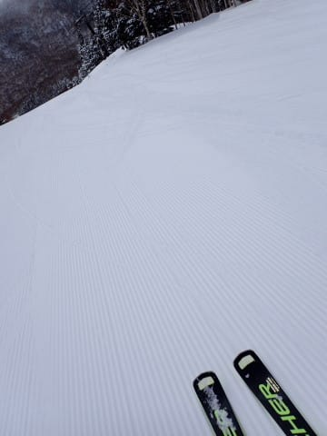
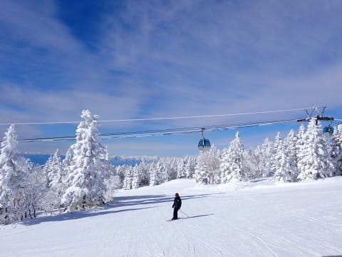
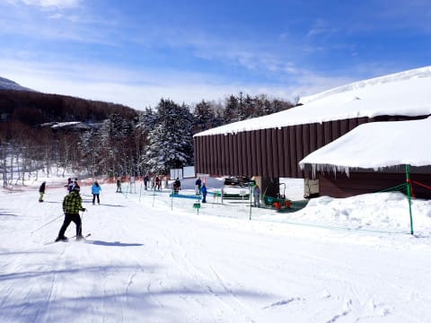
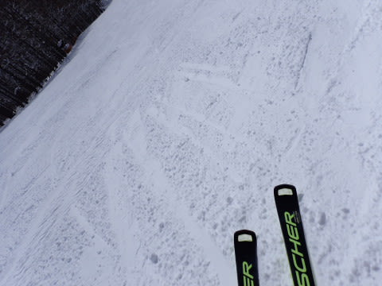
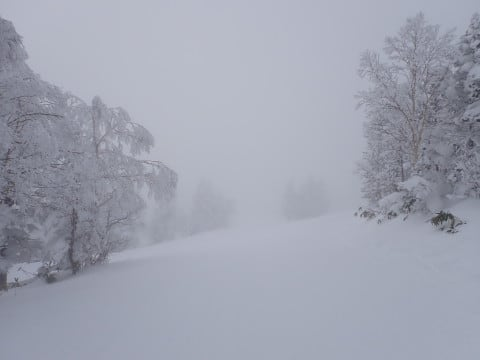

# 2024/1/28(日)の志賀高原焼額山スキー場，速報レポート！…曇り→晴れ→曇りで，昼間は晴れて冷え冷え最高雪，そしてそれほど混まず．こんな最高の日がシーズンに何度あるだろうか？？

📅 投稿日時: 2024-01-29 03:10:03

🏷️ カテゴリ: [2024スキー滑走日記](c453f687e8a0f05679e95831d0a02cd0c.md)

えー．

本日も志賀高原で滑っていたわけですが．

いつも通りラストリフトまでしっかり滑り．

そして，いつも通り帰宅が深夜だった

ため…

本日の志賀高原レポート，いつもの

速報モードにて！

…の前に．

これから1週間の天気ですが…

31日の朝ごろまで冷えて，

31日の夜から1日にかけて，ちょいと

ヤバい感じかな…

と思ってましたが．

今の最新天気図では，来週までに空から

液体が降る可能性はほぼない感じに

なってきました…！

そして，2月1日は雨じゃなく雪が降って

くれそうなので…

次の週末まではいいコンディションを

キープしてくれそうな感じです！

…今のところ．

とりあえず，今の予想図なら，次の週末も

結構いいコンディションで滑れそう…！

…ってなニュースの後で．

本題の今日の志賀高原，速報レポート！

まず．

あさイチは曇り空でスタートした志賀高原

でしたが…

昨晩からの積雪は1-2㎝程度でほとんどなく．

そのせいで，ゲレンデの雪質は思ったより

締まったスピードが出る圧雪で．

間違いなく今シーズンぴかいちの最高

シマシマバーン！！

柔らかすぎる荒れる雪じゃなく，冷え冷えで

しっかり締まった雪だったので，

今日は終日雪が荒れなかったです～！！

そして．

天気は，リフト営業開始から1時間後の

9：30ごろにはいい感じの晴天となり…

日差しの中，最高の雪質を滑れるという

超恵まれたコンディションになって

来ましたよ…！！

さらに．

今日はリフトは終日全く混まず…

そして，ゴンドラもゲートのぎりぎり外に

並んだのが数回あった程度．

ゴンドラも相乗りレーンに進めば，

搬器数台待ちで済んだし…

待ち時間のストレスなし！！

晴天なのに，最高気温はせいぜい-5℃程度と

気温は低く．

雪質は終日いい感じに締まった最高冷え冷え

ハイスピードバーンで，

締まっていたのと人が少なかったのもあり，

営業終了まで大回り板でかっ飛ばせる

フラットバーンの状態が続きました…！！

午後2時近くから日がかげりだし．

営業終了間近の午後3時半には完全

曇り空になちゃって，さらに山頂近くは

一瞬ガスっぽくなったりもしたけど．

でも，営業終了近くまでは晴れてたし．

雪質も終日良くて，ラスト1本までフラット

バーンを大回りし続けられたし．

リフトも混まず，コースの人口密度も低めの

最高な一日で．

1年毎日こうだったらいいのに…

と思わざるをえない，間違いなく今シーズン

No.1の，超絶快楽シアワセデーだったの

でした…！

あぁ…

良かった…

今日は良かった…

ってなことで．

明日また，（床で寝なければ）詳細レポートやります～！

## 💬 コメント一覧

### 💬 コメント by (ねも)
**タイトル**: Unknown
**投稿日**: 2024-01-29 08:24:53

Ｓさん

いやぁ、全く同感です、毎日こうだったら(笑、それじゃスキー場の雪が積もらない)

昨日コメントしたように全て良かったけど、一番意外だったのは、好天の日曜なのに混んでいない！

奥志賀も含めるとゴンドラ３機も大きい？

### 💬 コメント by (1kamakura)
**タイトル**: Unknown
**投稿日**: 2024-01-29 08:36:35

江戸の秋

三枚目の写真、きれいですね😍

いつも😭って感じのレポートだったから、今回はこちらも嬉しくなりました。

私もskiしたい！

### 💬 コメント by (レインボー76)
**タイトル**: Unknown
**投稿日**: 2024-01-29 14:47:04

月曜日の志賀高原情報

今日も朝から冷え込んで雪質良好、天気良し。旅に出かけることにしました。

ダイヤ上陸。うっすら新雪1cmをいただいてからヤケビヘ。

唐松、オリンピック、GSを経て奥志賀へ。

エキスパ、ダウンヒルのあと、ヤケビの白樺、ダイヤ経由でファミリーへ。

タンネ、高天、西舘からジャイアントへ。

更に蓮池から聖地サンバレーへシーズン初詣。湯田中の町が一望できるのが嬉しい。

ゴンドラで東舘を登って寺子屋からパーフェクタ経由でダイヤ着12時30分で終了。

どこもこれぞ志賀の雪って感じで、極上でしたが、我ら3爺、合わせて215歳には過酷な試練でございました。全員足は売り切れてましたが、心はご満悦でしたよ。

### 💬 コメント by (Skier_S)
**タイトル**: 今週末も意外といいコンディションで滑れそう
**投稿日**: 2024-01-30 00:18:43

>ねもさま

ほんとにこの週末はこまなかったですよね…！！

経営的には心配だけど，好きなラインで大回りしたい放題というこのシアワセ…

ゴンドラ3機でも混むときは混むので．うーん．リフト代値上がりで人が減ったのか？？

＞江戸の秋さま

この日は晴れて最高でしたよ～！

ようやくいい感じのレポートができました！

＞レインボー76さま

遠征の旅お疲れさまでした…

でも，12時半には寺小屋行含め一往復してこれたんですね…結構早い！

明日もコンディションいいと思います．楽しんできてください…！

