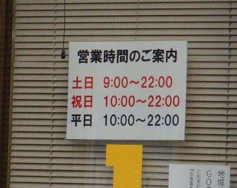
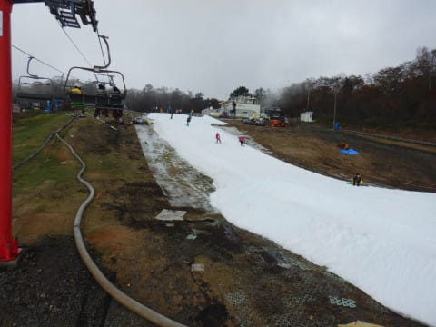
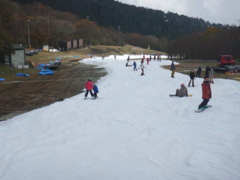
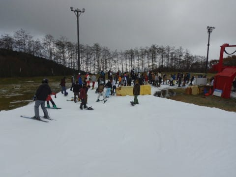
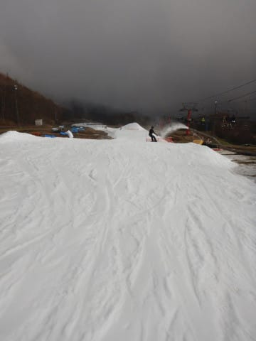
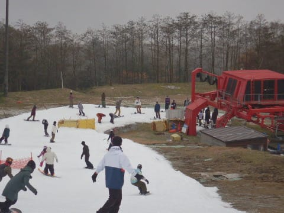
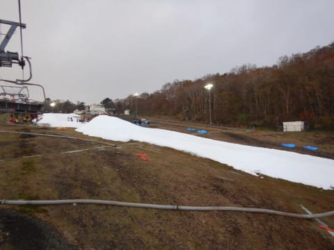
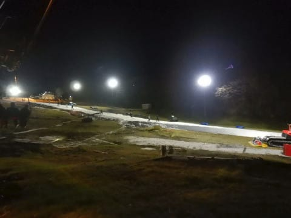
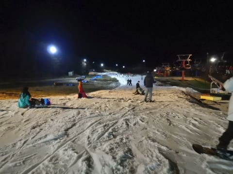
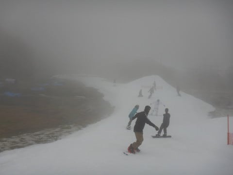

# 2020/11/3(火・祝）のYeti速報＆コース状況動画…終日曇り，それほど混まなかったよ

📅 投稿日時: 2020-11-04 02:12:32

ということで．

祭日だった本日．

予告通り，イエティで滑ってきました～！

ただ，いつものパターンで．

夜まで滑り，帰宅も遅いので，

今日は速報モードにて…

えー．

祭日の本日．

てっきり9時スタートかと思ったら．

なんと，予想外の

祝日は10時スタート（涙）

祝日はリフト料金は土日料金なのに，

営業時間が平日と同じ10時スタートとは…！

お値段高くてスタートが遅いって，

なんだかちょっと…（涙）

ただ，今日は朝9時からと思って

多数の人が来ていたので，実際には

朝9時半過ぎにはゲレンデオープンして

くれましたが．

ってことで．

ゲレンデに出てみますが…

今日は朝から，ほぼ曇り空の一日←だれか，今日はすっきり晴天って言ってなかったか？

おかげで，雪が緩まず．

朝のうちはいい感じ！

…でも．

午前10時半ごろには，

やっぱり混んできますね…（涙）

とはいえ，土曜日よりはマシですか．

隣のペアリフトが動いてないけど，

クワッド待ちは最大この程度．

コースも時折クリアラップが

とれる時もあり…

土日よりは空いてましたね！

いつもなら午後の方が混む，

このイエティですが．

今日はなぜか，昼を過ぎるとリフトの

列が短くなり．

午後2時半ごろには，そんなにリフト待ちも

なくて…

午後3時過ぎには，コースもリフトも，

結構ガラガラになってきました！

だもんで，ナイターも混まないに違いない！

と期待して，ナイターに繰り出しますが…

なぜか，ナイターの方がコースの

人口密度が高く．

…さらに，リフトの待ちも

そこそこあったので．

午後7時過ぎに，おとなしく帰宅したの

でした…

今日は土日ほど混まなかったので，

そこそこの本数が滑れて．

そして，天気が曇り空だった分，

日差しで雪が緩まず，板が走ったので．

まぁ，楽しめた一日だったかな～．

（午後1時ごろに，ちょっとガスった時もありました…）

最後に，定番の今日のコース状況の動画を

載せておきます！

詳細は明日！
